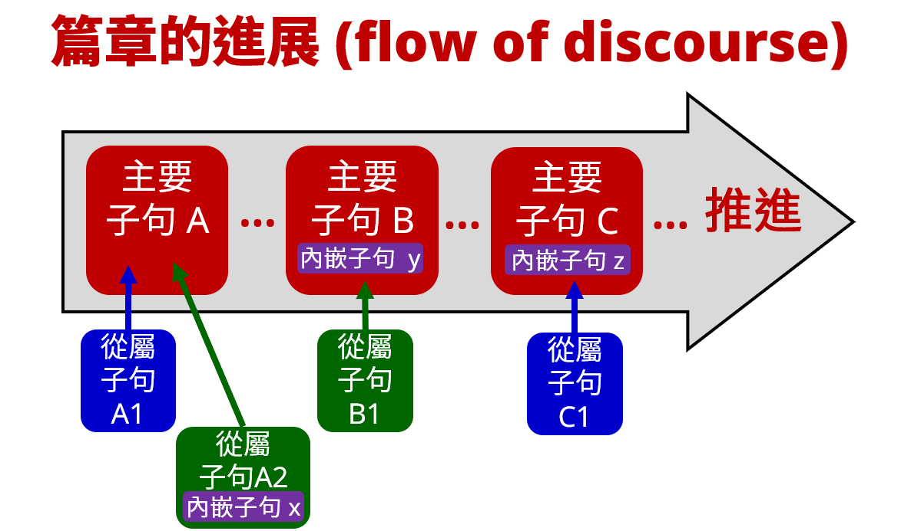

# 腓立比書 (Philippians) 子句結構綜覽

聖經希臘文的子句結構可以分成三種：(1) 主要 (primary)、獨立 (independent) 子句；(2) 次要 (secondary)、從屬 (dependent/subordinate) 子句；(3) 內嵌 (embedded) 子句。三者的功用並不相同。  

因為就人與人溝通的特質來說，不論是文字或口語，語言都是線性 (linear) 的傳輸過程。意思是：發送端 (說的人、寫的人)，是一個字、一個字地傳遞出去；而接收端 (聽的人、讀的人)，也是一個字、一個字地接收和理解。因此，思路的進展，或者說 Discourse (話語、篇章、論述) 推進的過程，會是類似水流一般的過程。

在這過程當中，三種子句扮演了不同的角色：

主要子句負責把思路推進，從 論點 A → 論點 B → 論點 C → ……。

從屬子句則是負責補充說明主要論點。例如：子句 A1, A2 補充說明論點 A；子句 B1 補充說明論點 B；子句 C1 補充說明論點 C。

而內嵌子句，則是扮演上一層子句裡面的某個元素。例如：內嵌子句 x，就可以是從屬子句 A2 裡的主語 (S)；而內嵌子句 y，就可以是主要子句 B 裡面的補語 (C)；而內嵌子句 z，就可以是主要子句 C 裡面的狀語 (A)。

以下就從腓立比書中列舉幾個常見的例子。

## (1) 主要子句 (Primary Clause)
### (1a) 對等連接詞 (coordinate conjunctive) 
用對等連接詞 καί 帶出主要子句。καί 可以翻譯成 and/but。

- καί 通常會放在句首——如果 καί 不是子句的第一個字，那麼很可能是當作副詞使用，意思是 also (也)、even (甚至)。

- <rt>腓1:9a</rt> <RUBY><ruby><ruby><mark>Καὶ</mark><rt>καί</rt></ruby><rt>And</rt></ruby><rt>CONJ</rt></RUBY> (<RUBY><ruby><ruby>τοῦτο<rt>οὗτος</rt></ruby><rt>this</rt></ruby><rt>D-ASN</rt></RUBY>)C (<RUBY><ruby><ruby><strong>προσεύχομαι,</strong><rt>προσεύχομαι</rt></ruby><rt>I pray,</rt></ruby><rt>V-PNI-1S</rt></RUBY>)P ⇒ 我禱告這個

用對等連接詞 δέ 帶出主要子句。δέ 也可以翻譯成 and/but，跟 καί 最大的差別是「把論述推進 (development) 到下一個論點」。

- δέ 是後置詞，不能放在句首，通常放在子句的第二個字，但也可能放在更後面。

- <rt>腓1:12a</rt> { <RUBY><ruby><ruby><em>Γινώσκειν</em><rt>γινώσκω</rt></ruby><rt>To know</rt></ruby><rt>V-PAN</rt></RUBY> }C- <RUBY><ruby><ruby><mark>δὲ</mark><rt>δέ</rt></ruby><rt>now</rt></ruby><rt>CONJ</rt></RUBY> -C{ <RUBY><ruby><ruby>ὑμᾶς<rt>σύ</rt></ruby><rt>you,</rt></ruby><rt>P-2AP</rt></RUBY> } (<RUBY><ruby><ruby><strong>βούλομαι,</strong><rt>βούλομαι</rt></ruby><rt>I want,</rt></ruby><rt>V-PNI-1S</rt></RUBY>)P <RUBY><ruby><ruby>ἀδελφοί,<rt>ἀδελφός</rt></ruby><rt>brothers,</rt></ruby><rt>N-VPM</rt></RUBY> ⇒ 弟兄們！我要你們知道

### (1b) 無連接詞 (asyndeton)
主要子句可以不需要連接詞，這在句法上叫做 Asyndeton (省略連接詞)，有些文法書用 Ø 符號來代表。在語意上，無連接詞<em>可能</em>是一個新段落的開始。

- <rt>腓1:3a</rt> (<RUBY><ruby><ruby><strong>Εὐχαριστῶ</strong><rt>εὐχαριστέω</rt></ruby><rt>I thank</rt></ruby><rt>V-PAI-1S</rt></RUBY>)P (<RUBY><ruby><ruby>τῷ<rt>ὁ</rt></ruby><rt>the</rt></ruby><rt>T-DSM</rt></RUBY> <RUBY><ruby><ruby>Θεῷ<rt>θεός</rt></ruby><rt>God</rt></ruby><rt>N-DSM</rt></RUBY> <RUBY><ruby><ruby>μου<rt>ἐγώ</rt></ruby><rt>of me</rt></ruby><rt>P-1GS</rt></RUBY>)C ⇒ 我感謝我的上帝

- <rt>腓3:2a</rt> (<RUBY><ruby><ruby><strong>Βλέπετε</strong><rt>βλέπω</rt></ruby><rt>Beware of</rt></ruby><rt>V-PAM-2P</rt></RUBY>)P (<RUBY><ruby><ruby>τοὺς<rt>ὁ</rt></ruby><rt>the</rt></ruby><rt>T-APM</rt></RUBY> <RUBY><ruby><ruby>κύνας,<rt>κύων</rt></ruby><rt>dogs;</rt></ruby><rt>N-APM</rt></RUBY>)C ⇒ 應當防備犬類！
- UBS/NA 編排時把這兩節經文的第一個字母大寫，表示新段落的開始。

## (2) 從屬子句 (Subordinate Clause)

### (2a) 從屬連接詞 (subordinate conjunctive)
用從屬連接詞 ἵνα 帶出來從屬子句，補充說明主要子句。

- <rt>腓2:28a</rt> (<RUBY><ruby><ruby><strong>ἔπεμψα</strong><rt>πέμπω</rt></ruby><rt>I have sent</rt></ruby><rt>V-AAI-1S</rt></RUBY>)P (<RUBY><ruby><ruby>αὐτὸν,<rt>αὐτός</rt></ruby><rt>him,</rt></ruby><rt>P-ASM</rt></RUBY>)C ⇒ 我打發他去 
	- <rt>腓2:28b</rt> <RUBY><ruby><ruby><mark>ἵνα</mark><rt>ἵνα</rt></ruby><rt>that</rt></ruby><rt>CONJ</rt></RUBY> 
		- { <rt>[</rt><RUBY><ruby><ruby><em>ἰδόντες</em><rt>εἴδω</rt></ruby><rt>having seen</rt></ruby><rt>V-2AAP-NPM</rt></RUBY><rt>)p</rt> <rt>[</rt><RUBY><ruby><ruby>αὐτὸν<rt>αὐτός</rt></ruby><rt>him</rt></ruby><rt>P-ASM</rt></RUBY><rt>]c</rt> <rt>[</rt><RUBY><ruby><ruby>πάλιν<rt>πάλιν</rt></ruby><rt>again,</rt></ruby><rt>ADV</rt></RUBY><rt>]a</rt>}A (<RUBY><ruby><ruby><strong>χαρῆτε</strong><rt>χαίρω</rt></ruby><rt>you may rejoice,</rt></ruby><rt>V-2AOS-2P</rt></RUBY>)P ⇒ 再看見他你們能喜樂

用從屬連接詞 ὅτι 帶出來從屬子句，補充說明主要子句。

- <rt>腓1:25a</rt> <RUBY><ruby><ruby>Καὶ<rt>καί</rt></ruby><rt>And</rt></ruby><rt>CONJ</rt></RUBY> { <RUBY><ruby><ruby>τοῦτο<rt>οὗτος</rt></ruby><rt>this</rt></ruby><rt>D-ASN</rt></RUBY> <RUBY><ruby><ruby><em>πεποιθὼς</em><rt>πείθω</rt></ruby><rt>having been persuaded of,</rt></ruby><rt>V-2RAP-NSM</rt></RUBY>}A (<RUBY><ruby><ruby><strong>οἶδα</strong><rt>εἴδω</rt></ruby><rt>I know</rt></ruby><rt>V-RAI-1S</rt></RUBY>)P ⇒ 如此相信，我知道
	- <rt>腓1:25b</rt> <RUBY><ruby><ruby><mark>ὅτι</mark><rt>ὅτι</rt></ruby><rt>that</rt></ruby><rt>CONJ</rt></RUBY> 
		- (<RUBY><ruby><ruby><strong>μενῶ</strong><rt>μένω</rt></ruby><rt>I will remain</rt></ruby><rt>V-FAI-1S</rt></RUBY>)P ⇒ 我將活著
		- <rt>腓1:25c</rt> <RUBY><ruby><ruby>καὶ<rt>καί</rt></ruby><rt>and</rt></ruby><rt>CONJ</rt></RUBY> (<RUBY><ruby><ruby><strong>παραμενῶ</strong><rt>παραμένω</rt></ruby><rt>will continue with</rt></ruby><rt>V-FAI-1S</rt></RUBY>)P (<RUBY><ruby><ruby>πᾶσιν<rt>πᾶς</rt></ruby><rt>all</rt></ruby><rt>A-DPM</rt></RUBY> <RUBY><ruby><ruby>ὑμῖν<rt>σύ</rt></ruby><rt>of you</rt></ruby><rt>P-2DP</rt></RUBY>)A ⇒ 我將繼續與你們同在

### (2b) 關係子句

用關係代名詞 ὅς 帶出關係子句，補充說明主要子句。一般情況下，關係代名詞的數 (number)、性 (gender) 要與先行詞 (antecedent) 一致；格 (case) 則要看在關係子句中的角色而定。

- <rt>腓3:18a</rt> (<RUBY><ruby><ruby>πολλοὶ<rt>πολύς</rt></ruby><rt>Many</rt></ruby><rt>A-NPM</rt></RUBY>)S <RUBY><ruby><ruby>γὰρ<rt>γάρ</rt></ruby><rt>for</rt></ruby><rt>CONJ</rt></RUBY> (<RUBY><ruby><ruby><strong>περιπατοῦσιν</strong><rt>περιπατέω</rt></ruby><rt>are walking -</rt></ruby><rt>V-PAI-3P</rt></RUBY>)P ⇒ 因為許多人行事
	- <rt>腓3:18b</rt> (<RUBY><ruby><ruby><mark>οὓς</mark><rt>ὅς, ἥ</rt></ruby><rt>[of] whom</rt></ruby><rt>R-APM</rt></RUBY>)C1 (<RUBY><ruby><ruby>πολλάκις<rt>πολλάκις</rt></ruby><rt>often</rt></ruby><rt>ADV</rt></RUBY>)A (<RUBY><ruby><ruby><strong>ἔλεγον</strong><rt>λέγω</rt></ruby><rt>I told</rt></ruby><rt>V-IAI-1S</rt></RUBY>)P (<RUBY><ruby><ruby>ὑμῖν,<rt>σύ</rt></ruby><rt>you,</rt></ruby><rt>P-2DP</rt></RUBY>)C2 ⇒ 那些人 (whom) 我常常告訴你們
	- 關係代名詞 οὓς 的先行詞是 πολλοὶ。

## (3) 內嵌子句 (Embedded Clause)

### (3a) 不定詞內嵌子句
不定詞是：動詞＋名詞的結合體。因為有名詞的特色，所以單獨一個不定詞，就可以當名詞使用，內嵌在其他子句裡面；因為有動詞的特色，所以可以有自己的主語 (通常是直接受格)、補語 (也是直接受格)、狀語，進而形成不定詞子句，內嵌在主要子句、從屬子句裡面，當成另外一個子句的元素。

- <rt>腓1:12a</rt> { <rt>[</rt><RUBY><ruby><ruby><em>Γινώσκειν</em><rt>γινώσκω</rt></ruby><rt>To know</rt></ruby><rt>V-PAN</rt></RUBY><rt>)p</rt> ... <rt>[</rt><RUBY><ruby><ruby>ὑμᾶς<rt>σύ</rt></ruby><rt>you,</rt></ruby><rt>P-2AP</rt></RUBY><rt>)s</rt> }C (<RUBY><ruby><ruby><strong>βούλομαι,</strong><rt>βούλομαι</rt></ruby><rt>I want,</rt></ruby><rt>V-PNI-1S</rt></RUBY>)P <RUBY><ruby><ruby>ἀδελφοί,<rt>ἀδελφός</rt></ruby><rt>brothers,</rt></ruby><rt>N-VPM</rt></RUBY> ⇒ 弟兄們！我要你們知道
	- 不定詞 Γινώσκειν 的主語是 ὑμᾶς，兩者結合形成不定詞子句，用大括號 { …… } 標示出來。
	- 整個不定詞子句內嵌在主要子句裡面，當作是主要動詞 βούλομαι 的補語(C)。

接著看一個比較複雜的例子：

- <rt>腓1:7a</rt> <RUBY><ruby><ruby>Καθώς<rt>καθώς</rt></ruby><rt>Accordingly,</rt></ruby><rt>CONJ</rt></RUBY> 
	- (<RUBY><ruby><ruby><strong>ἐστιν</strong><rt>εἰμί</rt></ruby><rt>it is</rt></ruby><rt>V-PAI-3S</rt></RUBY>)P (<RUBY><ruby><ruby>δίκαιον<rt>δίκαιος</rt></ruby><rt>right</rt></ruby><rt>A-NSN</rt></RUBY>)C (<RUBY><ruby><ruby>ἐμοὶ<rt>ἐγώ</rt></ruby><rt>for me</rt></ruby><rt>P-1DS</rt></RUBY>)A1 ⇒ 對我而言是正確的
	- { <rt>[</rt><RUBY><ruby><ruby>τοῦτο<rt>οὗτος</rt></ruby><rt>this</rt></ruby><rt>D-ASN</rt></RUBY><rt>]c</rt> <rt>[</rt><RUBY><ruby><ruby><em>φρονεῖν</em><rt>φρονέω</rt></ruby><rt>to feel</rt></ruby><rt>V-PAN</rt></RUBY><rt>)p</rt> <rt>[</rt><RUBY><ruby><ruby>ὑπὲρ<rt>ὑπέρ</rt></ruby><rt>about</rt></ruby><rt>PREP</rt></RUBY> <RUBY><ruby><ruby>πάντων<rt>πᾶς</rt></ruby><rt>all</rt></ruby><rt>A-GPM</rt></RUBY> <RUBY><ruby><ruby>ὑμῶν<rt>σύ</rt></ruby><rt>of you,</rt></ruby><rt>P-2GP</rt></RUBY><rt>]a</rt> }S ⇒ 為你們全體這樣想
	- (<RUBY><ruby><ruby>διὰ<rt>διά</rt></ruby><rt>since</rt></ruby><rt>PREP</rt></RUBY> <RUBY><ruby><ruby>τὸ<rt>ὁ</rt></ruby><rt>‑</rt></ruby><rt>T-ASN</rt></RUBY> { <rt>[</rt><RUBY><ruby><ruby><em>ἔχειν</em><rt>ἔχω</rt></ruby><rt>have</rt></ruby><rt>V-PAN</rt></RUBY><rt>)p</rt> <rt>[</rt><RUBY><ruby><ruby>με<rt>ἐγώ</rt></ruby><rt>I</rt></ruby><rt>P-1AS</rt></RUBY><rt>)s</rt> <rt>[</rt><RUBY><ruby><ruby>ἐν<rt>ἐν</rt></ruby><rt>in</rt></ruby><rt>PREP</rt></RUBY> <RUBY><ruby><ruby>τῇ<rt>ὁ</rt></ruby><rt>the</rt></ruby><rt>T-DSF</rt></RUBY> <RUBY><ruby><ruby>καρδίᾳ<rt>καρδία</rt></ruby><rt>heart</rt></ruby><rt>N-DSF</rt></RUBY><rt>]a</rt> <rt>[</rt><RUBY><ruby><ruby>ὑμᾶς,<rt>σύ</rt></ruby><rt>you;</rt></ruby><rt>P-2AP</rt></RUBY><rt>]c</rt> } )A2 ⇒ 因為我有你們在心裡
- 從屬連接詞 Καθώς 帶出從屬子句，主要動詞是 ἐστιν，補語是 δίκαιον，間接受格 ἐμοὶ 是狀語 (A1)，修飾主要動詞
- 第一個不定詞 φρονεῖν 有補語 (τοῦτο)、狀語 (ὑπὲρ πάντων ὑμῶν)，合起來形成不定詞內嵌子句，用大括號 { …… } 標示，當作 Καθώς 從屬子句的主語 (S)
- 第二個不定詞 ἔχειν 有主語 (με)、狀語 (ἐν τῇ καρδίᾳ)、補語 (ὑμᾶς)，合起來形成不定詞內嵌子句，用大括號 { …… } 標示，前面加上冠詞 (τὸ) 當作實名詞使用，再被前面的 διὰ 納入，成為介系詞片語，當作Καθώς 從屬子句的第二個狀語 (A2)。

### (3b) 分詞內嵌子句
分詞是：動詞＋形容詞的結合體。因為有形容詞的特色，所以可以當作形容詞用，跟冠詞、實名詞結合，內嵌在其他子句裡面；因為有動詞的特色，所以可以有自己的主語 (通常是所有格，形成分詞的獨立所有格)、補語、狀語，進而形成分詞子句，內嵌在主要子句、從屬子句裡面，當成另外一個子句的元素。

- <rt>腓2:28b</rt> <RUBY><ruby><ruby><mark>ἵνα</mark><rt>ἵνα</rt></ruby><rt>that</rt></ruby><rt>CONJ</rt></RUBY> 
	- { <rt>[</rt><RUBY><ruby><ruby><em>ἰδόντες</em><rt>εἴδω</rt></ruby><rt>having seen</rt></ruby><rt>V-2AAP-NPM</rt></RUBY><rt>)p</rt> <rt>[</rt><RUBY><ruby><ruby>αὐτὸν<rt>αὐτός</rt></ruby><rt>him</rt></ruby><rt>P-ASM</rt></RUBY><rt>]c</rt> <rt>[</rt><RUBY><ruby><ruby>πάλιν<rt>πάλιν</rt></ruby><rt>again,</rt></ruby><rt>ADV</rt></RUBY><rt>]a</rt>}A (<RUBY><ruby><ruby><strong>χαρῆτε</strong><rt>χαίρω</rt></ruby><rt>you may rejoice,</rt></ruby><rt>V-2AOS-2P</rt></RUBY>)P ⇒ 當你們再看見他的時候，你們能喜樂
- 分詞 ἰδόντες 的補語是 αὐτὸν，狀語是 πάλιν，三者結合形成分詞子句，用用大括號 { …… } 標示出來。
- 整個分詞子句內嵌在 ἵνα 從屬子句裡面，當作是主要動詞 χαρῆτε 的狀語(A)。

---
[Philippians-Notes](Philippians-Notes.md)