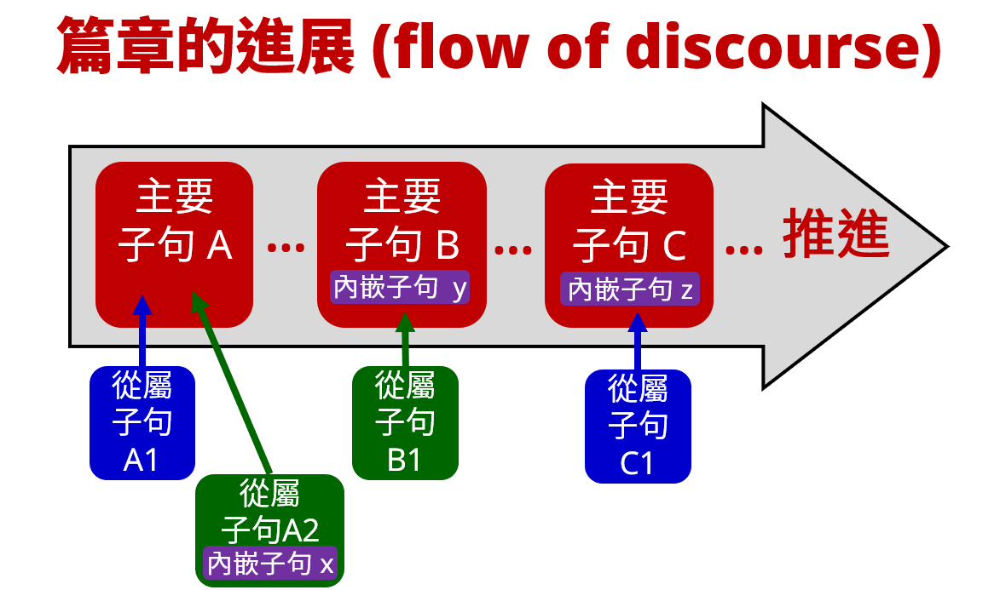

# 約翰書信 (123John) 子句結構

聖經希臘文的子句結構可以分成兩大類：(1) 主要 (primary) 子句；(2) 次要 (secondary) 子句。

主要子句表達一個完整的命題 (proposition)，可以單獨存在，因此又稱為獨立 (independent) 子句。

次要子句不能表達完整的命題，必須從屬於主要子句，因此又稱為依附 (dependent) 子句[^1]。

次要子句按照與主要子句的關係，又可以細分成：(2a) 從屬 (subordinate) 子句；(2b) 內嵌 (embedded) 子句。

顧名思義，從屬子句在「結構」上與主要子句分離 (i.e. 好像是兩個可以分開的子句)；但在「語意」上卻不能分離，必須依附於主要子句。

而內嵌子句不但「語意」上必須依附主要子句，在「結構」上也不能分離，反而整個子句好像是內嵌在主要子句裡面一樣，像是大俄羅斯娃娃裡面有小娃娃的概念。

綜合來看，主要子句、從屬子句、內嵌子句三者功用並不相同。因為就人與人的溝通來說，不論文字口語，語言都是線性 (linear) 的傳輸過程。換言之，發送端 (說的人、寫的人)，是一個字、一個字地傳遞出去；而接收端 (聽的人、讀的人)，也是一個字、一個字地接收和理解。

因此，思路的進展，或者說 Discourse (話語、篇章、論述) 的推進，就像是河水流動的過程，促成了人與人之間的溝通。而在這溝通的過程中，三種子句就扮演了不同的角色：
- 主要子句負責把思路推進，從論點 A 湍進到論點 B ... 論點 C ...。
- 從屬子句負責補充說明主要論點。例如：子句 A1, A2 補充說明論點 A；子句 B1 補充說明論點 B；子句 C1 補充說明論點 C。
- 內嵌子句，則是扮演主要子句或者從屬子句裡面的某個元素。例如：內嵌子句 x，就可以是從屬子句 A2 裡的主語 (s)；而內嵌子句 y，就可以是主要子句 B 裡面的補語 (C)；而內嵌子句 z，就可以是主要子句 C 裡面的狀語 (A)。

## 子句的分類

歸納起來，希臘文的子句可以分類如下：
- (1) 主要 (primary) 子句、獨立 (independent) 子句
	- (1a) 用對等連接詞帶出的子句
	- (1b) 無連接詞 (asyndeton) 的子句
- (2) 次要 (secondary) 子句、依附 (dependent) 子句
	- (2a) 從屬 (subordinate) 子句
		- (2a1) 從屬連接詞帶出的子句
		- (2a2) 用關係代名詞帶出的子句
	- (2b) 內嵌 (embedded) 子句
		- (2b1) 用不定詞帶出的內嵌子句
		- (2b2) 用分詞帶出的內嵌子句
		- (2b3) 用關係代名詞帶出的內嵌子句

以下就從約翰書信當中舉幾個常見的例子。

## (1) 主要子句 (Primary Clause)

### (1a) 用對等連接詞帶出的子句

用對等連接詞 καί 帶出主要子句。καί 可以翻譯成 and/but。

- 1Jo 1:5 <RUBY><ruby><ruby><mark>καὶ</mark><rt>And</rt></ruby><rt>καί</rt></ruby><rt>CONJ</rt></RUBY> (<RUBY><ruby><ruby><mark class='verb'>ἔστιν</mark><rt>is</rt></ruby><rt>εἰμί</rt></ruby><rt>V-PAI-3S</rt></RUBY>)P (<RUBY><ruby><ruby>αὕτη<rt>this</rt></ruby><rt>οὗτος</rt></ruby><rt>D-NSF</rt></RUBY>)S (<RUBY><ruby><ruby>ἡ<rt>the</rt></ruby><rt>ὁ</rt></ruby><rt>T-NSF</rt></RUBY> <RUBY><ruby><ruby>ἀγγελία<rt>message</rt></ruby><rt>ἀγγελία</rt></ruby><rt>N-NSF</rt></RUBY>)C
- 2Jo 1:5 <RUBY><ruby><ruby><mark>καὶ</mark><rt>And</rt></ruby><rt>καί</rt></ruby><rt>CONJ</rt></RUBY> (<RUBY><ruby><ruby>νῦν<rt>now</rt></ruby><rt>νῦν</rt></ruby><rt>ADV</rt></RUBY>)A (<RUBY><ruby><ruby><mark class='verb'>ἐρωτῶ</mark><rt>I implore</rt></ruby><rt>ἐρωτάω</rt></ruby><rt>V-PAI-1S</rt></RUBY>)P (<RUBY><ruby><ruby>σε,<rt>you,</rt></ruby><rt>σύ</rt></ruby><rt>P-2AS</rt></RUBY>)C <RUBY><ruby><ruby>κυρία,<rt>lady,</rt></ruby><rt>Κυρία</rt></ruby><rt>N-VSF</rt></RUBY> 
	- καί 通常會放在句首——如果 καί 不是子句的第一個字，那麼很可能是當作副詞使用，意思是 also (也)、even (甚至)。

用對等連接詞 δέ 帶出主要子句。δέ 也可以翻譯成 and/but，但跟 καί 最大的差別則是：把論述推進 (development) 到下一個論點 (Runge, 31-36)。

- 1Jo 2:11 {<RUBY><ruby><ruby>ὁ<rt>The [one]</rt></ruby><rt>ὁ</rt></ruby><rt>T-NSM</rt></RUBY>}⦇ <RUBY><ruby><ruby><mark>δὲ</mark><rt>however</rt></ruby><rt>δέ</rt></ruby><rt>CONJ</rt></RUBY> ⦈{ [ (<RUBY><ruby><ruby><mark class='ptc'>μισῶν</mark><rt>hating</rt></ruby><rt>μισέω</rt></ruby><rt>V-PAP-NSM</rt></RUBY>)p (<RUBY><ruby><ruby>τὸν<rt>the</rt></ruby><rt>ὁ</rt></ruby><rt>T-ASM</rt></RUBY> <RUBY><ruby><ruby>ἀδελφὸν<rt>brother</rt></ruby><rt>ἀδελφός</rt></ruby><rt>N-ASM</rt></RUBY> <RUBY><ruby><ruby>αὐτοῦ<rt>of him,</rt></ruby><rt>αὐτός</rt></ruby><rt>P-GSM</rt></RUBY> )c] }S (<RUBY><ruby><ruby>ἐν<rt>in</rt></ruby><rt>ἐν</rt></ruby><rt>PREP</rt></RUBY> <RUBY><ruby><ruby>τῇ<rt>the</rt></ruby><rt>ὁ</rt></ruby><rt>T-DSF</rt></RUBY> <RUBY><ruby><ruby>σκοτίᾳ<rt>darkness</rt></ruby><rt>σκοτία</rt></ruby><rt>N-DSF</rt></RUBY>)A (<RUBY><ruby><ruby><mark class='verb'>ἐστὶν</mark><rt>is,</rt></ruby><rt>εἰμί</rt></ruby><rt>V-PAI-3S</rt></RUBY>)P 
- 3Jo 1:14 (<RUBY><ruby><ruby><mark class='verb'>ἐλπίζω</mark><rt>I hope</rt></ruby><rt>ἐλπίζω</rt></ruby><rt>V-PAI-1S</rt></RUBY>)P <RUBY><ruby><ruby><mark>δὲ</mark><rt>however</rt></ruby><rt>δέ</rt></ruby><rt>CONJ</rt></RUBY> (<RUBY><ruby><ruby>εὐθέως<rt>soon,</rt></ruby><rt>εὐθέως</rt></ruby><rt>ADV</rt></RUBY>)A { (<RUBY><ruby><ruby>σε<rt>you</rt></ruby><rt>σύ</rt></ruby><rt>P-2AS</rt></RUBY>)c (<RUBY><ruby><ruby><em>ἰδεῖν,</em><rt>to see,</rt></ruby><rt>εἴδω</rt></ruby><rt>V-2AAN</rt></RUBY>)p }C
	- δέ 是後置詞，不能放在句首，通常放在子句的第二個字，但也可能放在更後面。

### (1b) 無連接詞 (asyndeton) 的子句

主要子句可以不需要連接詞，這在句法上叫做 Asyndeton (省略連接詞)，有些文法書用 Ø 符號來代表。在語意上，無連接詞<em>可能</em>是一個新段落的開始。

- 1Jo 2:15 <RUBY><ruby><ruby>Μὴ<rt>Not</rt></ruby><rt>μή</rt></ruby><rt>PRT-N</rt></RUBY> (<RUBY><ruby><ruby><mark class='verb'>ἀγαπᾶτε</mark><rt>do love</rt></ruby><rt>ἀγαπάω</rt></ruby><rt>V-PAM-2P</rt></RUBY>)P (<RUBY><ruby><ruby>τὸν<rt>the</rt></ruby><rt>ὁ</rt></ruby><rt>T-ASM</rt></RUBY> <RUBY><ruby><ruby>κόσμον<rt>world</rt></ruby><rt>κόσμος</rt></ruby><rt>N-ASM</rt></RUBY>)C 
- 2Jo 1:8 (<RUBY><ruby><ruby><mark class='verb'>βλέπετε</mark><rt>do watch</rt></ruby><rt>βλέπω</rt></ruby><rt>V-PAM-2P</rt></RUBY>)P (<RUBY><ruby><ruby>ἑαυτοὺς<rt>yourselves,</rt></ruby><rt>ἑαυτοῦ</rt></ruby><rt>F-2APM</rt></RUBY>)C 

## (2) 依附子句 (Dependent Clause)

依附子句下面分成兩類：(2a) 從屬子句；(2b) 內嵌子句。

### (2a) 從屬子句 (Subordinate Clause)

按照句法結構的特稱，從屬子句下面又可細分成：(2a1) 用從屬連接詞帶出的子句；(2a2) 用關係代名詞帶出的子句。

#### (2a1) 從屬連接詞帶出的子句

用從屬連接詞 ἵνα 帶出來從屬子句，補充說明主要子句。

- 2Jo 1:8a (<RUBY><ruby><ruby><mark class='verb'>βλέπετε</mark><rt>do watch</rt></ruby><rt>βλέπω</rt></ruby><rt>V-PAM-2P</rt></RUBY>)P (<RUBY><ruby><ruby>ἑαυτοὺς<rt>yourselves,</rt></ruby><rt>ἑαυτοῦ</rt></ruby><rt>F-2APM</rt></RUBY>)C 
	- 2Jo 1:8b <RUBY><ruby><ruby><mark>ἵνα</mark><rt>so that</rt></ruby><rt>ἵνα</rt></ruby><rt>CONJ</rt></RUBY> <RUBY><ruby><ruby>μὴ<rt>not</rt></ruby><rt>μή</rt></ruby><rt>PRT-N</rt></RUBY> (<RUBY><ruby><ruby><mark class='verb'>ἀπολέσητε</mark><rt>you may lose</rt></ruby><rt>ἀπολλύω</rt></ruby><rt>V-AAS-2P</rt></RUBY>)P { (<RUBY><ruby><ruby>ἃ<rt>what things</rt></ruby><rt>ὅς, ἥ</rt></ruby><rt>R-APN</rt></RUBY>)c (<RUBY><ruby><ruby><mark class='verb'>εἰργασάμεθα,</mark><rt>we have worked for,</rt></ruby><rt>ἐργάζομαι</rt></ruby><rt>V-ADI-1P</rt></RUBY> )p }C
		- 2Jo 1:8b 在結構上與主要子句分離，但在語意上卻依附於 2Jo 1:8a。大括號 { ... } 裡面的內嵌子句，則是下面 [(2b3) 用關係代名詞帶出的內嵌子句](#(2b3)%20%E7%94%A8%E9%97%9C%E4%BF%82%E4%BB%A3%E5%90%8D%E8%A9%9E%E5%B8%B6%E5%87%BA%E7%9A%84%E5%85%A7%E5%B5%8C%E5%AD%90%E5%8F%A5.md)會提到的關係內嵌子句。

用從屬連接詞 ὅτι 帶出來從屬子句，補充說明主要子句。

- 2Jo 1:4a (<RUBY><ruby><ruby><mark class='verb'>Ἐχάρην</mark><rt>I rejoiced</rt></ruby><rt>χαίρω</rt></ruby><rt>V-2AOI-1S</rt></RUBY>)P (<RUBY><ruby><ruby>λίαν<rt>exceedingly</rt></ruby><rt>λίαν</rt></ruby><rt>ADV</rt></RUBY>)A
	- 2Jo 1:4b <RUBY><ruby><ruby><mark>ὅτι</mark><rt>that</rt></ruby><rt>ὅτι</rt></ruby><rt>CONJ</rt></RUBY> (<RUBY><ruby><ruby><mark class='verb'>εὕρηκα</mark><rt>I have found</rt></ruby><rt>εὑρίσκω</rt></ruby><rt>V-RAI-1S</rt></RUBY>)P (<RUBY><ruby><ruby>ἐκ<rt>[some] of</rt></ruby><rt>ἐκ</rt></ruby><rt>PREP</rt></RUBY> <RUBY><ruby><ruby>τῶν<rt>the</rt></ruby><rt>ὁ</rt></ruby><rt>T-GPN</rt></RUBY> <RUBY><ruby><ruby>τέκνων<rt>children</rt></ruby><rt>τέκνον</rt></ruby><rt>N-GPN</rt></RUBY> <RUBY><ruby><ruby>σου<rt>of you</rt></ruby><rt>σύ</rt></ruby><rt>P-2GS</rt></RUBY>)A { (<RUBY><ruby><ruby><mark class='ptc'>περιπατοῦντας</mark><rt>walking</rt></ruby><rt>περιπατέω</rt></ruby><rt>V-PAP-APM</rt></RUBY>)p (<RUBY><ruby><ruby>ἐν<rt>in</rt></ruby><rt>ἐν</rt></ruby><rt>PREP</rt></RUBY> <RUBY><ruby><ruby>ἀληθείᾳ<rt>truth,</rt></ruby><rt>ἀλήθεια</rt></ruby><rt>N-DSF</rt></RUBY>)a }C
		- 2Jo 1:4b 在結構上與主要子句分離，但在語意上卻依附於 2Jo 1:4a。大括號 { ... } 裡面的內嵌子句，則是下面 [(2b2) 用分詞帶出的內嵌子句](#(2b2)%20%E7%94%A8%E5%88%86%E8%A9%9E%E5%B8%B6%E5%87%BA%E7%9A%84%E5%85%A7%E5%B5%8C%E5%AD%90%E5%8F%A5.md)會提到的分詞內嵌子句。

#### (2a2) 用關係代名詞帶出的子句

用關係代名詞帶出的關係子句，補充說明主要子句。一般情況下，關係代名詞的數 (number)、性 (gender) 要與先行詞 (antecedent) 一致；格 (case) 則要看在關係子句中的角色而定。

- 3Jo 1:1a (<RUBY><ruby><ruby>Ὁ<rt>The</rt></ruby><rt>ὁ</rt></ruby><rt>T-NSM</rt></RUBY> <RUBY><ruby><ruby>πρεσβύτερος<rt>elder,</rt></ruby><rt>πρεσβύτερος</rt></ruby><rt>A-NSM</rt></RUBY>)S (<RUBY><ruby><ruby><mark>Γαΐῳ°¹</mark><rt>To Gaius</rt></ruby><rt>Γάϊος</rt></ruby><rt>N-DSM-P</rt></RUBY> =‹<RUBY><ruby><ruby>τῷ<rt>the</rt></ruby><rt>ὁ</rt></ruby><rt>T-DSM</rt></RUBY> <RUBY><ruby><ruby>ἀγαπητῷ°¹<rt>beloved,</rt></ruby><rt>ἀγαπητός</rt></ruby><rt>A-DSM</rt></RUBY> › )C 
	- 3Jo 1:1b (<RUBY><ruby><ruby>ὃν°¹⮥<rt>whom</rt></ruby><rt>ὅς, ἥ</rt></ruby><rt>R-ASM</rt></RUBY>)C (<RUBY><ruby><ruby>ἐγὼ<rt>I</rt></ruby><rt>ἐγώ</rt></ruby><rt>P-1NS</rt></RUBY>)S (<RUBY><ruby><ruby><mark class='verb'>ἀγαπῶ</mark><rt>love</rt></ruby><rt>ἀγαπάω</rt></ruby><rt>V-PAI-1S</rt></RUBY>)P (<RUBY><ruby><ruby>ἐν<rt>in</rt></ruby><rt>ἐν</rt></ruby><rt>PREP</rt></RUBY> <RUBY><ruby><ruby>ἀληθείᾳ.<rt>truth.</rt></ruby><rt>ἀλήθεια</rt></ruby><rt>N-DSF</rt></RUBY>)A
		- 3Jo 1:1b 在結構上與主要子句分離，但在語意上卻依附於 3Jo 1:1a。

有時候關係代名詞的數 (number)、性 (gender) 卻跟先行詞 (antecedent) 不一致，出現不尋常的用法 (GGBB 337-38 = 華 352-53)，文法學家稱之為 *anacoluthon* (破格) 或是 <em>constructio ad sensum</em> ( [不是按照語法、而是]按照含意的結構)。

- 2Jo 1:1a (<RUBY><ruby><ruby>Ὁ<rt>The</rt></ruby><rt>ὁ</rt></ruby><rt>T-NSM</rt></RUBY> <RUBY><ruby><ruby>πρεσβύτερος<rt>elder,</rt></ruby><rt>πρεσβύτερος</rt></ruby><rt>A-NSM</rt></RUBY>)S (<mark><RUBY><ruby><ruby>ἐκλεκτῇ<rt>To [the] elect</rt></ruby><rt>ἐκλεκτός</rt></ruby><rt>A-DSF</rt></RUBY> <RUBY><ruby><ruby>κυρίᾳ<rt>lady</rt></ruby><rt>Κυρία</rt></ruby><rt>N-DSF</rt></RUBY> <RUBY><ruby><ruby>καὶ<rt>and</rt></ruby><rt>καί</rt></ruby><rt>CONJ</rt></RUBY> <RUBY><ruby><ruby>τοῖς<rt>to the</rt></ruby><rt>ὁ</rt></ruby><rt>T-DPN</rt></RUBY> <RUBY><ruby><ruby>τέκνοις<rt>children</rt></ruby><rt>τέκνον</rt></ruby><rt>N-DPN</rt></RUBY> <RUBY><ruby><ruby>αὐτῆς<rt>of her,</rt></ruby><rt>αὐτός</rt></ruby><rt>P-GSF</rt></RUBY>°²</mark>)C
	- 2Jo 1:1b (<RUBY><ruby><ruby>οὓς°²⮥<rt>whom</rt></ruby><rt>ὅς, ἥ</rt></ruby><rt>R-APM</rt></RUBY>)C (<RUBY><ruby><ruby>ἐγὼ<rt>I</rt></ruby><rt>ἐγώ</rt></ruby><rt>P-1NS</rt></RUBY>)S (<RUBY><ruby><ruby><mark class='verb'>ἀγαπῶ</mark><rt>love</rt></ruby><rt>ἀγαπάω</rt></ruby><rt>V-PAI-1S</rt></RUBY>)P (<RUBY><ruby><ruby>ἐν<rt>in</rt></ruby><rt>ἐν</rt></ruby><rt>PREP</rt></RUBY> <RUBY><ruby><ruby>ἀληθείᾳ,<rt>truth,</rt></ruby><rt>ἀλήθεια</rt></ruby><rt>N-DSF</rt></RUBY>)A
		- 關係代名詞 οὓς 的格數性是 APM，直接受格 (A) 是因為在 2Jo 1:1b 中扮演 C (補語) 的角色；但複數陽姓 (PM) 卻找不到與之吻合的先行詞——因此只好從上下文去推敲，先行詞是 ἐκλεκτῇ κυρίᾳ καὶ τοῖς τέκνοις αὐτῆς 整組片語。雖然不合文法規則，但在文脈 (語意) 上卻是通順。

### (2b) 內嵌子句 (Embedded Clause)

按照句法結構的特稱，內嵌子句下面又可細分成：(2b1) 用不定詞帶出的子句；(2b2) 用分詞帶出的子句；(2b3) 用關係代名詞帶出的子句。

#### (2b1) 用不定詞帶出的內嵌子句
不定詞是：動詞＋名詞的結合體。因為有名詞的特色，所以單獨一個不定詞，就可以當名詞使用，內嵌在其他子句裡面；因為有動詞的特色，所以可以有自己的主語 (通常是直接受格)、補語 (也是直接受格)、狀語，進而形成不定詞子句，內嵌在其他子句裡面，當成其他子句的某個元素。

- 3Jo 1:13 { (<RUBY><ruby><ruby>Πολλὰ<rt>Many things</rt></ruby><rt>πολύς</rt></ruby><rt>A-APN</rt></RUBY>)c }⦇ (<RUBY><ruby><ruby><mark class='verb'>εἶχον</mark><rt>I had</rt></ruby><rt>ἔχω</rt></ruby><rt>V-IAI-1S</rt></RUBY>)P ⦈{ (<RUBY><ruby><ruby><em>γράψαι</em><rt>to write</rt></ruby><rt>γράφω</rt></ruby><rt>V-AAN</rt></RUBY>)p (<RUBY><ruby><ruby>σοι,<rt>to you,</rt></ruby><rt>σύ</rt></ruby><rt>P-2DS</rt></RUBY>)c }C
	- 不定詞 γράψαι 有兩個補語 (小寫 c)，一個是「事」(Πολλὰ)，一個是「人」(σοι)，合起來形成不定詞內嵌子句，當作主要動詞 εἶχον 的補語 (大寫 C)。
	- 內嵌子句在結構上不能與主要子句分離，必須內嵌在主要子句裡面。

#### (2b2) 用分詞帶出的內嵌子句

分詞是：動詞＋形容詞的結合體。因為有形容詞的特色，所以可以當作形容詞用，跟冠詞、實名詞結合，內嵌在其他子句裡面；因為有動詞的特色，所以可以有自己的主語 (通常是所有格，形成分詞的獨立所有格)、補語、狀語，進而形成分詞子句，內嵌在其他子句裡面，當成其他子句的某個元素。
- 1Jo 4:16 <RUBY><ruby><ruby>καὶ<rt>and</rt></ruby><rt>καί</rt></ruby><rt>CONJ</rt></RUBY> {<RUBY><ruby><ruby>ὁ<rt>the [one]</rt></ruby><rt>ὁ</rt></ruby><rt>T-NSM</rt></RUBY> [ (<RUBY><ruby><ruby><mark class='ptc'>μένων</mark><rt>abiding</rt></ruby><rt>μένω</rt></ruby><rt>V-PAP-NSM</rt></RUBY>)p (<RUBY><ruby><ruby>ἐν<rt>in</rt></ruby><rt>ἐν</rt></ruby><rt>PREP</rt></RUBY> <RUBY><ruby><ruby>τῇ<rt>[the]</rt></ruby><rt>ὁ</rt></ruby><rt>T-DSF</rt></RUBY> <RUBY><ruby><ruby>ἀγάπῃ<rt>love,</rt></ruby><rt>ἀγάπη</rt></ruby><rt>N-DSF</rt></RUBY>)a ] }S (<RUBY><ruby><ruby>ἐν<rt>in</rt></ruby><rt>ἐν</rt></ruby><rt>PREP</rt></RUBY> <RUBY><ruby><ruby>τῷ<rt>[the]</rt></ruby><rt>ὁ</rt></ruby><rt>T-DSM</rt></RUBY> <RUBY><ruby><ruby>θεῷ<rt>God</rt></ruby><rt>θεός</rt></ruby><rt>N-DSM</rt></RUBY>)A (<RUBY><ruby><ruby><mark class='verb'>μένει,</mark><rt>abides,</rt></ruby><rt>μένω</rt></ruby><rt>V-PAI-3S</rt></RUBY>)P 
	- 分詞 μένων 當作形容詞用，前面加上冠詞 ὁ 變成 T—A (分詞) 的結構，變成了實名詞 (substantive)。  
	- 內嵌子句在結構上不能與主要子句分離，必須內嵌在主要子句裡面。

再看一個例子：

- 3Jo 1:3a (<RUBY><ruby><ruby><mark class='verb'>ἐχάρην</mark><rt>I rejoiced</rt></ruby><rt>χαίρω</rt></ruby><rt>V-2AOI-1S</rt></RUBY>)P <RUBY><ruby><ruby>γὰρ<rt>for</rt></ruby><rt>γάρ</rt></ruby><rt>CONJ</rt></RUBY> (<RUBY><ruby><ruby>λίαν<rt>exceedingly</rt></ruby><rt>λίαν</rt></ruby><rt>ADV</rt></RUBY>)A { (<RUBY><ruby><ruby><mark><em>ἐρχομένων</em></mark><rt>when were coming</rt></ruby><rt>ἔρχομαι</rt></ruby><rt>V-PNP-GPM</rt></RUBY>)p (<RUBY><ruby><ruby>ἀδελφῶν<rt>[the] brothers</rt></ruby><rt>ἀδελφός</rt></ruby><rt>N-GPM</rt></RUBY>)s}A <RUBY><ruby><ruby>καὶ<rt>and</rt></ruby><rt>καί</rt></ruby><rt>CONJ</rt></RUBY> { (<RUBY><ruby><ruby><mark><em>μαρτυρούντων</em></mark><rt>those bearing witness</rt></ruby><rt>μαρτυρέω</rt></ruby><rt>V-PAP-GPM</rt></RUBY>)p (<RUBY><ruby><ruby>σου<rt>from you</rt></ruby><rt>σύ</rt></ruby><rt>P-2GS</rt></RUBY> <RUBY><ruby><ruby>τῇ<rt>to the</rt></ruby><rt>ὁ</rt></ruby><rt>T-DSF</rt></RUBY> <RUBY><ruby><ruby>ἀληθείᾳ,<rt>to truth,</rt></ruby><rt>ἀλήθεια</rt></ruby><rt>N-DSF</rt></RUBY>)c}A
	- 分詞 ἐρχομένων 當作動詞 (小寫 p) 使用，因為動作者 (ἀδελφῶν) 跟主要子句的主詞 (我) 不同，所以用所有格表達分詞的主語，形成 Genitive Absolute 分詞的獨立所有格 (GGBB 654-55 = 華 691-92) 結構，成為分詞內嵌子句 <rt>3Jo 1:3b</rt>，當作副詞 (狀語) 使用，修飾主要動詞 <mark class='verb'>ἐχάρην</mark>。
	- 分詞 μαρτυρούντων 當作動詞 (小寫 p) 使用，延續 <rt>3Jo 1:3b 用所有格表達分詞的主語 (ἀδελφῶν)，後面有自己的補語，合起來成為分詞內嵌子句 <rt>3Jo 1:3c</rt>，當作副詞 (狀語) 使用，修飾主要動詞 <mark class='verb'>ἐχάρην</mark>。
	- 內嵌子句在結構上不能與主要子句分離，必須內嵌在主要子句裡面——圖析畫成另外一行只是為了表達清楚而已，不代表 <rt>3Jo 1:3b</rt>、<rt>3Jo 1:3c 能夠獨立存在。

#### (2b3) 用關係代名詞帶出的內嵌子句

- 2:24a { (<RUBY><ruby><ruby>Ὑμεῖς<rt>σύ</rt></ruby><rt>You</rt></ruby><rt>P-2NP</rt></RUBY>)S (<RUBY><ruby><ruby>ὃ<rt>ὅς</rt></ruby><rt>what</rt></ruby><rt>R-ASN</rt></RUBY>)C (<RUBY><ruby><ruby><mark class='verb'>ἠκούσατε</mark><rt>ἀκούω</rt></ruby><rt>you have heard</rt></ruby><rt>V-AAI-2P</rt></RUBY>)P (<RUBY><ruby><ruby>ἀπ᾽<rt>ἀπό</rt></ruby><rt>from</rt></ruby><rt>PREP</rt></RUBY> <RUBY><ruby><ruby>ἀρχῆς,<rt>ἀρχή</rt></ruby><rt>[the] beginning</rt></ruby><rt>N-GSF</rt></RUBY>)A }S (<RUBY><ruby><ruby>ἐν<rt>ἐν</rt></ruby><rt>in</rt></ruby><rt>PREP</rt></RUBY> <RUBY><ruby><ruby>ὑμῖν<rt>σύ</rt></ruby><rt>you</rt></ruby><rt>P-2DP</rt></RUBY>)A (<RUBY><ruby><ruby><mark class='verb'>μενέτω.</mark><rt>μένω</rt></ruby><rt>let it abide</rt></ruby><rt>V-PAM-3S</rt></RUBY>)P
	- 關係內嵌子句當作上一層子句的主語 (S)，所以雖然乍看之下好像有兩個動詞，但**ἠκούσατε** 是屬於關係內嵌子句裡面的動詞，**μενέτω**才是主要子句的動詞。

[^1]: 依附：文法書大多把 dependent clause 和 subordinate clause 都翻譯作「從屬子句」——在此為了區隔起見，翻作依附子句，把「從屬子句」保留給 dependent clause。