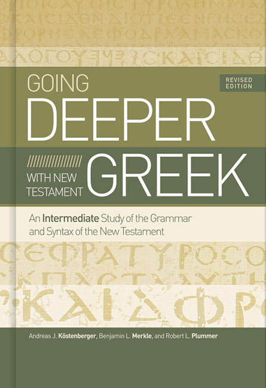
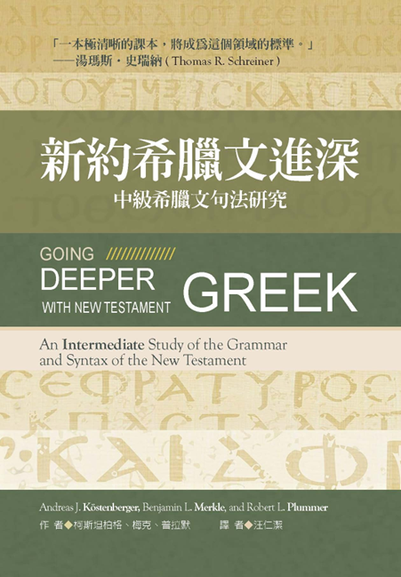

|   封面  |  書目   |
| :---: | --- |
|     |  Köstenberger, Andreas J., Benjamin L. Merkle, and Robert L. Plummer. *Going Deeper with New Testament Greek: An Intermediate Study of the Grammar and Syntax of the New Testamen*t. Revised edition. Nashville, Tennessee: B & H Academic, 2020.   |
| | 柯斯坦柏格 (Andreas J. Kostenberger)、梅克 (Merkle)、普拉默 (Plummer)。《新約希臘文進深：中級希臘文句法研究》。汪仁潔譯。南加州：美國麥種傳道會，2024。|

# 目錄

- 1 希臘語文與文本鑑別學 THE GREEK LANGUAGE & TEXTUAL CRITICISM
	- 1.1 GOING DEEPER
	- 1.2 CHAPTER OBJECTIVES
	- 1.3 HISTORY OF THE GREEK LANGUAGE
	- 1.4 TEXTUAL CRITICISM
	- 1.5 SUMMARY
	- 1.6 PRACTICE EXERCISES
	- 1.7 VOCABULARY
	- 1.8 READING THE NEW TESTAMENT
- [2 主格、呼格、直接受格 NOMINATIVE, VOCATIVE & ACCUSATIVE CASES](Chapter02.md)
	- 2.1 希臘文的格系統 THE GREEK CASE SYSTEM
	- [[Chapter13#13.1 GOING DEEPER]]
	- [第13課#13.1 GOING DEEPER](Chapter13.md#13.1%20GOING%20DEEPER.md)
	- 2.2 主格 NOMINATIVE
		- 2.2.1 主要用法 Major Uses
			- 2.2.1.1 主詞 Subject
			- 2.2.1.2 述詞主格 Predicate Nominative
			- 2.2.1.3 同位句型 Apposition
		- 2.2.2 其他用法
			- 2.2.2.1 稱謂 Address
			- 2.2.2.2 稱號 Appellation
			- 2.2.2.3 獨立 Absolute
			- 2.2.2.4 懸掛主格 Hanging Nominative
	- 2.3 呼格 VOCATIVE
		- 2.3.1 直接的稱呼 Direct Address
	- 2.4 直接受格 ACCUSATIVE
		- 2.4.1 直接受格的名詞用法 Substantival Uses of the Accusative
			- 2.4.1.1 直接受詞 Direct Object
			- 2.4.1.2 同源直接受格 Cognate Accusative
			- 2.4.1.3 雙重直接受格 Double Accusative
			- 2.4.1.4 不定詞的主詞 Subject of Infinitive
			- 2.4.1.5 同位句型 Apposition
		- 2.4.2 直接受格的副詞用法 Adverbial Uses of the Accusative
			- 2.4.2.1 度量 Measure
			- 2.4.2.2 方式 Manner
			- 2.4.2.3 關注 Respect
	- 2.5 SUMMARY
	- 2.6 PRACTICE EXERCISES
	- 2.7 VOCABULARY
	- 2.8 READING THE NEW TESTAMENT
- 3 所有格 GENITIVE CASE
	- 3.1 介紹所有格 INTRODUCTION TO THE GENITIVE CASE
	- 3.2 形容詞用法 ADJECTIVAL USE
		- 3.2.1 描述的 Description
		- 3.2.2 表達屬性的 Attributive
		- 3.2.3 擁有的 Possession
		- 3.2.4 親屬關係的 Relationship
		- 3.2.5 來源的 Source
		- 3.2.6 材料或內容的 Material or Content
			- 3.2.6.1 材料的 Material
			- 3.2.6.2 內容的 Content
		- 3.2.7 部分的 Partitive
	- 3.3 動詞用法 VERBAL USE
		- 3.3.1 主詞所有格 Subjective Genitive
		- 3.3.2 受詞所有格 Objective Genitive
	- 3.4 副詞用法 ADVERBIAL USE
		- 3.4.1 時間或地方 Time or Place
			- 3.4.1.1 時間的 Time
			- 3.4.1.2 地方的 Place
		- 3.4.2 隔開的 Separation
		- 3.4.3 途徑或動作者的 Means or Agency
			- 3.4.3.1 途徑的 Means
			- 3.4.3.2 動作者的 Agency
		- 3.4.4 比較的 Comparison
		- 3.4.5 價錢的 Price
	- 3.5 其他用法 OTHER USES
		- 3.5.1 同位句型的 Apposition
			- 3.5.1.1 單純同位句型的 Simple Apposition
			- 3.5.1.2 附加說明的 Epexegetical
		- 3.5.2 作直接受詞的 Direct Object
	- 3.6 SUMMARY
	- 3.7 PRACTICE EXERCISES
	- 3.8 VOCABULARY
	- 3.9 READING THE NEW TESTAMENT
- 4 間接受格 DATIVE CASE
	- 4.1 介紹間接受格 INTRODUCTION TO THE DATIVE CASE
	- 4.2 單純間接受格 PURE DATIVE
		- 4.2.1 作間接受詞的 Indirect Object
		- 4.2.2 個人利益的 Personal Interest
			- 4.2.2.1 有利的 Advantage
			- 4.2.2.2 不利的 Disadvantage
		- 4.2.3 指涉或專注的 Reference or Respect
		- 4.2.4 擁有的 Possession
	- 4.3 位置間接受格 LOCATIVE DATIVE
		- 4.3.1 地方的 Place
		- 4.3.2 範圍的 Sphere
		- 4.3.3 時間的 Time
	- 4.4 憑藉間接受格 INSTRUMENTAL DATIVE
		- 4.4.1 途徑的 Means
		- 4.4.2 方式的 Manner
		- 4.4.3 動作者的 Agency
		- 4.4.4 關聯的 Association
	- 4.5 其他用法 OTHER USES
		- 4.5.1 原因的 Cause
		- 4.5.2 同源的 Cognate Dative
		- 4.5.3 同位句型的 Apposition
		- 4.5.4 作直接受詞的 Direct Object
	- 4.6 SUMMARY
	- 4.7 PRACTICE EXERCISES
	- 4.8 VOCABULARY
	- 4.9 READING THE NEW TESTAMENT
- 5 冠詞與形容詞 THE ARTICLE & ADJECTIVE
	- 5.1 冠詞 THE ARTICLE
		- 5.1.1 介紹冠詞 Introduction to the Article
		- 5.1.2 冠詞帶實名詞 The Article with Substantives
			- 5.1.2.1 特殊化的冠詞 The Particularizing Article
			- 5.1.2.2 通類的冠詞 The Generic Article
		- 5.1.3 冠詞作代名詞 The Article Functioning as a Pronoun
		- 5.1.4 無冠詞 The Absence of the Article
		- 5.1.5 特殊規則 Special Rules
			- 5.1.5.1 夏普規則 Granville Sharp Rule
			- 5.1.5.2 柯威爾規則 Colwell’s Rule
			- 5.1.5.3 亞波羅準則 Apollonius’s Canon
	- 5.2 形容詞 THE ADJECTIVE
		- 5.2.1 介紹形容詞 Introduction to the Adjective
		- 5.2.2 形容詞的一般用法 General Use of the Adjective
		- 5.2.3 敘述用法 Predicate Use
			- 5.2.3.1 有冠詞 With the Article
				- 5.2.3.1.1 第一位置 (A—T—N) First Position (Adjective-Article-Noun)
				- 5.2.3.1.2 第二位置 (T—N—A) Second Position (Article-Noun-Adjective)
			- 5.2.3.2 沒有冠詞 Without the Article
				- 5.2.3.2.1 第一位置 (A—N) First Position (Adjective-Noun)
				- 5.2.3.2.2 第二位置 (N—A) Second Position (Noun-Adjective)
		- 5.2.4 形容用法 Attributive Use
			- 5.2.4.1 有冠詞 With the Article
				- 5.2.4.1.1 第一位置 (T—A—N) First Position (Article-Adjective-Noun)
				- 5.2.4.1.2 第二位置 (T—N—T—A) Second Position (Article-Noun-Article-Adjective)
				- 5.2.4.1.3 第三位置 (N—T—A) Third Position (Noun-Article-Adjective)
			- 5.2.4.2 沒有冠詞 Without the Article
				- 5.2.4.2.1 第一位置 (A—N) First Position (Adjective-Noun)
				- 5.2.4.2.2 第四位置 (N—A) Fourth Position (Noun-Adjective)
		- 5.2.5 實名詞用法 Substantival Use
		- 5.2.6 副詞用法 Adverbial Use
	- 5.3 形容詞表達種類/程度的用法 The Use of the Adjective to Show Kind/Degree
		- 5.3.1 原級 Positive
		- 5.3.2 比較級 Comparative
		- 5.3.3 最高級 Superlative
			- 5.3.3.1 強化用法 Elative
			- 5.3.3.2 比較級作強化用法 Comparative for Elative
			- 5.3.3.3 最高級作強化用法 Superlative for Elative
		- 5.3.4 特殊情況 Special Cases
			- 5.3.4.1 原級作比較級 Positive for Comparative
			- 5.3.4.2 原級作最高級 Positive for Superlative
			- 5.3.4.3 比較級作最高級 Comparative for Superlative
	- 5.4 SUMMARY
	- 5.5 PRACTICE EXERCISES
	- 5.6 VOCABULARY
	- 5.7 READING THE NEW TESTAMENT
- 6 動詞：概論、語態 & 語氣 VERBS: OVERVIEW, VOICE & MOOD
	- 6.1 介紹 INTRODUCTION
	- 6.2 人稱與數 PERSON & NUMBER
	- 6.3 語態 VOICE
		- 6.3.1 主動語態 Active Voice
			- 6.3.1.1 簡單主動 Simple Active
			- 6.3.1.2 使役主動 Causative Active
			- 6.3.1.3 反身主動 Reflexive Active
		- 6.3.2 關身語態 Middle Voice
			- 6.3.2.1 反身關身 Reflexive Middle
			- 6.3.2.2 特殊利益關身 Special Interest Middle
			- 6.3.2.3 允許〔使役〕關身 Permissive [Causative] Middle
			- 6.3.2.4 關身形主動意 Deponent Middle
		- 6.3.3 被動語態 Passive Voice
			- 6.3.3.1 簡單被動 Simple Passive
			- 6.3.3.2 允許被動 Permissive Passive
			- 6.3.3.3 被動形主動意 Deponent Passive
	- 6.4 語氣 Mood
		- 6.4.1 直說語氣 Indicative Mood
			- 6.4.1.1 明言的直說語氣 Declarative Mood
			- 6.4.1.2 疑問的直說語氣 Interrogative Indicative
			- 6.4.1.3 條件的直說語氣 Conditional Indicative
			- 6.4.1.4 勸慰的直說語氣 Cohortative Indicative
			- 6.4.1.5 潛在的直說語氣 Potential Indicative
		- 6.4.2 假設語氣 Subjunctive Mood
			- 6.4.2.1 附屬子句中的假設語氣 Dependent Clause Subjunctive
				- 6.4.2.1.1 表目的或表結果的子句Purpose or Result Clause
				- 6.4.2.1.2 條件子句 Conditional Clause
				- 6.4.2.1.3 不定關係子句或不定時間子句 Indefinite Relative or Temporal Clause
			- 6.4.2.2 獨立子句中的假設語氣 Independent Clause Subjunctive
				- 6.4.2.2.1 勸告的假設語氣 Hortatory Subjunctive
				- 6.4.2.2.2 考慮的假設語氣 Deliberative Subjunctive
				- 6.4.2.2.3 強烈否定的假設語氣 Emphatic Negation Subjunctive
				- 6.4.2.2.4 禁止的假設語氣 Prohibitory Subjunctive
		- 6.4.3 期望語氣 Optative Mood
			- 6.4.3.1 意願的期望語氣 Voluntative Optative
			- 6.4.3.2 考慮的期望語氣 Deliberative Optative
			- 6.4.3.3 潛在的Optative Potential Optative
		- 6.4.4 命令語氣 Imperative Mood
			- 6.4.4.1 命令 Command
			- 6.4.4.2 禁止 Prohibition
			- 6.4.4.3 請求 Request (請願 Entreaty)
			- 6.4.4.4 允許的命令語氣 Permissive Imperative
			- 6.4.4.5 條件的命令語氣 Conditional Imperative
			- 6.4.4.6 問候 Greeting
	- 6.5 時態與觀點 TENSE & ASPECT
	- 6.6 SUMMARY
	- 6.7 PRACTICE EXERCISES
	- 6.8 VOCABULARY
	- 6.9 READING THE NEW TESTAMENT
- 7 時態與動詞觀點 TENSE & VERBAL ASPECT
	- 7.1 希臘文動詞 THE GREEK VERB
		- 7.1.1 作者對動作的視角——觀點 Author’s Perspective on the Action (Aspect)
			- 7.1.1.1 觀點的定義 Definition of Aspect
			- 7.1.1.2 新約聖經希臘文的觀點 Aspects in NT Greek
			- 7.1.1.3 觀點的構詞 Morphologizing Aspect
			- 7.1.1.4 觀點與論述 Aspect and Discourse
		- 7.1.2 動作的時間 Time of Action
		- 7.1.3 動作的種類 Type of Action
			- 7.1.3.1 字彙的因素 Lexical Factors
			- 7.1.3.2 文法的因素 Grammatical Factors
			- 7.1.3.3 文脈的因素 Contextual Factors
				- 7.1.3.3.1 實例研究：命令語氣 Case Study: Imperatives
			- 7.1.3.4 結論 Conclusion
	- 7.2 SUMMARY
	- 7.3 PRACTICE EXERCISES
	- 7.4 VOCABULARY
	- 7.5 READING THE NEW TESTAMENT
- 8 現在式、不完成式、未來式之直說語氣PRESENT, IMPERFECT & FUTURE INDICATIVES
	- 8.1 GOING DEEPER
	- 8.2 CHAPTER OBJECTIVES
	- 8.3 現在式直說語氣 PRESENT INDICATIVE
		- 8.3.1 進行的現在式 Progressive Present
		- 8.3.2 持續的現在式 Durative Present
		- 8.3.3 重複的現在式 Iterative Present
		- 8.3.4 格言的現在式 Gnomic Present
		- 8.3.5 即時的現在式 Instantaneous Present
		- 8.3.6 歷史的現在式 Historical Present
		- 8.3.7 意向的現在式 Tendential Present
		- 8.3.8 未來的現在式 Futuristic Present
		- 8.3.9 完成的現在式 Perfective Present
	- 8.4 不完成式直說語氣 IMPERFECT INDICATIVE
		- 8.4.1 進行的不完成式 Progressive Imperfect
		- 8.4.2 開端的不完成式 Inceptive Imperfect
		- 8.4.3 重複的不完成式 Iterative Imperfect
		- 8.4.4 意向的不完成式 Tendential Imperfect
	- 8.5 未來式直說語氣 FUTURE INDICATIVE
		- 8.5.1 預測的未來式 Predictive Future
		- 8.5.2 命令的未來式 Imperatival Future
		- 8.5.3 考慮的未來式 Deliberative Future
		- 8.5.4 格言的未來式 Gnomic Future
		- 8.5.5 進行的未來式 Progressive Future
	- 8.6 SUMMARY
	- 8.7 PRACTICE EXERCISES
	- 8.8 VOCABULARY
	- 8.9 READING THE NEW TESTAMENT
- 9 不定過去式、現在完成式、過去成式之直說語氣AORIST, PERFECT & PLUPERFECT INDICATIVES
	- 9.1 GOING DEEPER
	- 9.2 CHAPTER OBJECTIVES
	- 9.3 不定過去式直說語氣 AORIST INDICATIVE
		- 9.3.1 敘事的不定過去式 Constative Aorist
		- 9.3.2 開端的不定過去式 Inceptive Aorist
		- 9.3.3 終結的不定過去式 Culminative Aorist
		- 9.3.4 格言的不定過去式 Gnomic Aorist
		- 9.3.5 書信的不定過去式 Epistolary Aorist
		- 9.3.6 未來的不定過去式 Futuristic Aorist
		- 9.3.7 生動的不定過去式 Dramatic Aorist
	- 9.4 現在完成式直說語氣 PERFECT INDICATIVE
		- 9.4.1 加強的現在完成式 Intensive Perfect
		- 9.4.2 完成的現在完成式 Consummative Perfect
		- 9.4.3 生動的現在完成式 Dramatic Perfect
		- 9.4.4 現在狀態的現在完成式 Present State Perfect
		- 9.4.5 格言的現在完成式 Gnomic Perfect
		- 9.4.6 重複的現在完成式 Iterative Perfect
	- 9.5 過去完成式直說語氣 PLUPERFECT INDICATIVE
		- 9.5.1 加強的過去完成式 Intensive Pluperfect
		- 9.5.2 完成的過去完成式 Consummative Pluperfect
		- 9.5.3 過去狀態的過去完成式 Past State Pluperfect
	- 9.6 SUMMARY
	- 9.7 PRACTICE EXERCISES
	- 9.8 VOCABULARY
	- 9.9 READING THE NEW TESTAMENT
- 10 分詞 PARTICIPLES
	- 10.1 GOING DEEPER
	- 10.2 CHAPTER OBJECTIVES
	- 10.3 分詞的動詞性質 VERBAL QUALITIES OF PARTICIPLES
		- 10.3.1 觀點 Aspect
		- 10.3.2 時間 Time
	- 10.4 形容詞用法的分詞 ADJECTIVAL PARTICIPLES
		- 10.4.1 形容用法的分詞 Attributive Participles
		- 10.4.2 實詞用法的分詞 Substantival Participles
	- 10.5 動詞用法的分詞 VERBAL PARTICIPLES
		- 10.5.1 副詞用法的分詞 Adverbial Participles
			- 10.5.1.1 時間 Temporal
			- 10.5.1.2 完成的觀點 Perfective Aspect
			- 10.5.1.3 未完成的觀點 Imperfective Aspect
			- 10.5.1.4 途徑 Means
			- 10.5.1.5 方式 Manner
			- 10.5.1.6 原因 Cause
			- 10.5.1.7 條件 Condition
			- 10.5.1.8 讓步 Concession
			- 10.5.1.9 目的 Purpose
			- 10.5.1.10 結果 Result
		- 10.5.2 其他動詞用法的分詞
			- 10.5.2.1 附帶狀況 Attendant Circumstance
			- 10.5.2.2 獨立所有格 Genitive Absolute
			- 10.5.2.3 命令 Imperatival
			- 10.5.2.4 贅語 Pleonastic
			- 10.5.2.5 補語 Complementary
			- 10.5.2.6 間述句 Indirect Discourse
		- 10.5.3 迂說的分詞 Periphrastic Participles
			- 10.5.3.1 現在式迂說 Present Periphrastic
			- 10.5.3.2 不完成式迂說 Imperfect Periphrastic
			- 10.5.3.3 未來式迂說 Future Periphrastic
			- 10.5.3.4 現在完成式迂說 Perfect Periphrastic
			- 10.5.3.5 過去完成式迂說 Pluperfect Periphrastic
			- 10.5.3.6 未來完成式迂說 Future Perfect Periphrastic
	- 10.6 SUMMARY
	- 10.7 PRACTICE EXERCISES
	- 10.8 VOCABULARY
	- 10.9 READING THE NEW TESTAMENT
- 11 不定詞 INFINITIVES
	- 11.1 GOING DEEPER
	- 11.2 CHAPTER OBJECTIVES
	- 11.3 INTRODUCTION
	- 11.4 副詞用法的不定詞 ADVERBIAL INFINITIVES
		- 11.4.1 補語 Complementary
		- 11.4.2 目的 Purpose
		- 11.4.3 結果 Result
		- 11.4.4 時間 Temporal
			- 11.4.4.1 之前的時間 Previous Time
			- 11.4.4.2 同時的時間 Contemporaneous Time
			- 11.4.4.3 之後的時間 Subsequent Time
		- 11.4.5 原因 Cause
		- 11.4.6 途徑 Means
	- 11.5 名詞用法的不定詞 SUBSTANTIVAL INFINITIVES
		- 11.5.1 主詞 Subject
		- 11.5.2 直接受詞 Direct Object
		- 11.5.3 間述句 Indirect Discourse
		- 11.5.4 說明 Explanatory (同位句型或附加說明Appositional or Epexegetical)
			- 11.5.4.1 同位句型 Appositional
			- 11.5.4.2 附加說明 Epexegetical
	- 11.6 獨立用法的不定詞 INDEPENDENT INFINITIVES
		- 11.6.1 命令 Imperatival
		- 11.6.2 獨立 Absolute
	- 11.7 SUMMARY
	- 11.8 PRACTICE EXERCISES
	- 11.9 VOCABULARY
	- 11.10 READING THE NEW TESTAMENT
- 12 代名詞、介詞、連接詞、副詞、語助詞 PRONOUNS, PREPOSITIONS, CONJUNCTIONS, ADVERBS & PARTICLES
	- 12.1 GOING DEEPER
	- 12.2 CHAPTER OBJECTIVES
	- 12.3 代名詞 PRONOUNS
		- 12.3.1 人稱代名詞 Personal Pronouns
			- 12.3.1.1 強調的用法 Emphatic Use
			- 12.3.1.2 增強的用法 Intensive Use
			- 12.3.1.3 等同的 (相同的) 用法 Identical ("Same") Use
		- 12.3.2 指示代名詞 Demonstrative Pronouns
			- 12.3.2.1 近距指示代名詞 Near Demonstrative Pronouns
			- 12.3.2.2 遠距指示代名詞 Far Demonstrative Pronouns
		- 12.3.3 關係代名詞 Relative Pronouns
		- 12.3.4 疑問代名詞 Interrogative Pronouns
		- 12.3.5 不定代名詞 Indefinite Pronouns
		- 12.3.6 反身代名詞 Reflexive Pronouns
		- 12.3.7 相互代名詞 Reciprocal Pronouns
		- 12.3.8 代名形容詞 Pronominal Adjectives
	- 12.4 介詞 PREPOSITIONS
		- 12.4.1 介詞片語的功能 Functions of Prepositional Phrases
			- 12.4.1.1 副詞用法 Adverbial
			- 12.4.1.2 形容詞用法 Adjectival
			- 12.4.1.3 名詞用法 Substantival
		- 12.4.2 純介詞的語義範圍 The Semantic Domain of Proper Prepositions
			- 12.4.2.1 ἀνά (13x, 介詞受詞：直接受格)
			- 12.4.2.2 ἀντί (22x, 介詞受詞：所有格)
			- 12.4.2.3 ἀπό (646x, 介詞受詞：所有格)
			- 12.4.2.4 διά (667x, 介詞受詞：所有格，或直接受格)
			- 12.4.2.5 εἰς (1768x, 介詞受詞：直接受格)
			- 12.4.2.6 ἐκ (914x, 介詞受詞：所有格)
			- 12.4.2.7 ἐν (2752x, 介詞受詞：間接受格)
			- 12.4.2.8 ἐπί (890x, 介詞受詞：所有格，或間接受格，或直接受格)
			- 12.4.2.9 κατά (473x, 介詞受詞：所有格，或直接受格
			- 12.4.2.10 μετά (469x, 介詞受詞：所有格，或直接受格)
			- 12.4.2.11 παρά (194x, 介詞受詞：所有格，或間接受格，或直接受格)
			- 12.4.2.12 περί (333x, 介詞受詞：所有格，或直接受格)
			- 12.4.2.13 πρό (47x, 介詞受詞：所有格)
			- 12.4.2.14 πρός (700x, 介詞受詞：所有格，或間接受格，或直接受格
			- 12.4.2.15 σύν (128x, 介詞受詞：間接受格)
			- 12.4.2.16 ὑπέρ (150x, 介詞受詞：所有格，或直接受格)
			- 12.4.2.17 ὑπό (220x, 介詞受詞：所有格，或直接受格)
		- 12.4.3 不純介詞的語義範圍 The Semantic Domain of Improper Prepositions
	- 12.5 連接詞 CONJUNCTIONS
		- 12.5.1 對等連接詞 Coordinating Conjunctions
		- 12.5.2 從屬連接詞 Subordinating Conjunctions
	- 12.6 副詞 ADVERBS
		- 12.6.1 副詞修飾動詞 Adverbs Modifying Verbs
			- 12.6.1.1 副詞修飾直說語氣動詞 Adverbs Modifying Indicative Verbs
			- 12.6.1.2 副詞修飾非直說語氣動詞 Adverbs Modifying Non-Indicative Verbs
			- 12.6.1.3 副詞修飾副詞和形容詞 Adverbs Modifying Adverbs and Adjectives
		- 12.6.2 副詞有什麼功用？ How is the Adverb Functioning?
			- 12.6.2.1 時間的副詞 (何時？) Adverbs of Time (When?)
			- 12.6.2.2 強度或程度的副詞 (到何種程度？多少？) Adverbs of Intensity，或 Degree (To What Degree? How Much?)
			- 12.6.2.3 方式的副詞 (如何？以什麼方式？) Adverbs of Manner (How? In What Way?)
			- 12.6.2.4 地方的副詞 (何處？) Adverbs of Place (Where?)
			- 12.6.2.5 副詞作為名詞或形容詞 Adverbs Functioning as Nouns，或 Adjectives
	- 12.7 語助詞 PARTICLES
		- 12.7.1 否定的語助詞 Particles of Negation
		- 12.7.2 表語氣的語助詞 Particles of Mood
		- 12.7.3 連接的語助詞 Particles of Connection
		- 12.7.4 增強的語助詞 Particles of Intensification
		- 12.7.5 表注意的語助詞 Particles of Attention (感嘆詞 Interjections)
	- 12.8 SUMMARY
	- 12.9 PRACTICE EXERCISES
	- 12.10 VOCABULARY
	- 12.11 READING THE NEW TESTAMENT
- 13 句子、圖析、論述分析 SENTENCES, DIAGRAMMING & DISCOURSE ANALYSIS
	- 13.1 GOING DEEPER
	- 13.2 CHAPTER OBJECTIVES
	- 13.3 希臘文的句子 GREEK SENTENCES
		- 13.3.1 句子的組成部分 The Components of Sentences
			- 13.3.1.1 單字 Word
			- 13.3.1.2 片語 Phrase
				- 13.3.1.2.1 介詞片語 Prepositional Phrase
				- 13.3.1.2.2 名詞片語 Noun Phrase
				- 13.3.1.2.3 副詞片語 Adverbial Phrase
				- 13.3.1.2.4 形容詞片語 Adjectival Phrase
				- 13.3.1.2.5 動詞片語 Verbal Phrase
			- 13.3.1.3 子句 Clause
				- 13.3.1.3.1 獨立子句 Independent Clause
				- 13.3.1.3.2 附屬子句 Dependent Clause
				- 13.3.1.3.3 條件子句 Conditional Clause
		- 13.3.2 依據組成部分的句子類型 Type of Sentences According to Components
			- 13.3.2.1 簡單句 Simple Sentence
			- 13.3.2.2 複合句 Compound Sentence
			- 13.3.2.3 複雜句 Complex Sentence
			- 13.3.2.4 聯繫句 Copulative Sentence
		- 13.3.3 依據功能的句子類型 Type of Sentences According to Function
			- 13.3.3.1 明言的 Declarative
			- 13.3.3.2 疑問的 Interogative
			- 13.3.3.3 命令的 Imperative
			- 13.3.3.4 感嘆的 Exclamatory
		- 13.3.4 句子中的字序 Word Order within Sentences
		- 13.3.5 分析文法與文學結構 Analyzing Grammatical and Literary Structure
			- 13.3.5.1 線狀圖析 Line Diagramming
			- 13.3.5.2 追溯論點 (弧線法與支線法) Tracing the Argument (Arcing and Bracketing)
			- 13.3.5.3 短語圖析 Phrase Diagrams
			- 13.3.5.4 論述分析 Discourse Analysis
				- 13.3.5.4.1 論述界線 Discourse Boundaries
				- 13.3.5.4.2 論述之凸顯 Prominence
				- 13.3.5.4.3 論述之連貫一致 Cohesion
	- 13.4 SUMMARY
	- 13.5 PRACTICE EXERCISES
	- 13.6 VOCABULARY
	- 13.7 READING THE NEW TESTAMENT
- 14 字義研究 WORD STUDIES
	- 14.1 GOING DEEPER
	- 14.2 CHAPTER OBJECTIVES
	- 14.3 GREEK WORD STUDIES
	- 14.4 CONCLUSION
	- 14.5 SUMMARY
	- 14.6 PRACTICE EXERCISES
- 15 繼續研讀希臘文 CONTINUING WITH GREEK
	- 15.1 INTRODUCTION
	- 15.2 CHAPTER OBJECTIVES
	- 15.3 START WHERE YOU ARE
	- 15.4 GEAR FOR THE JOURNEY
	- 15.5 A LIFETIME JOURNEY
	- 15.6 STRAYING FROM THE ROAD
	- 15.7 INSPIRING QUOTES: STUDYING THE GREEK NEW TESTAMENT

