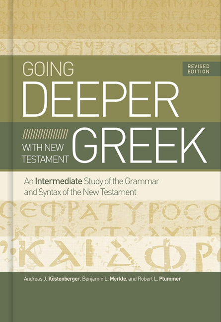
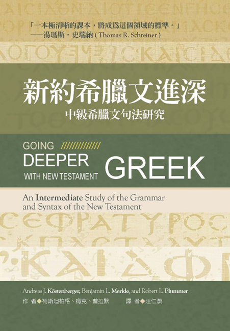

|   封面  |  書目   |
| :---: | --- |
|     |  Köstenberger, Andreas J., Benjamin L. Merkle, and Robert L. Plummer. *Going Deeper with New Testament Greek: An Intermediate Study of the Grammar and Syntax of the New Testamen*t. Revised edition. Nashville, Tennessee: B & H Academic, 2020.   |
| | 柯斯坦柏格 (Andreas J. Kostenberger)、梅克 (Merkle)、普拉默 (Plummer)。《新約希臘文進深：中級希臘文句法研究》。汪仁潔譯。南加州：美國麥種傳道會，2024。|

# 目錄

- 1 希臘語文與文本鑑別學 THE GREEK LANGUAGE & TEXTUAL CRITICISM
	- 1.1 GOING DEEPER
	- 1.2 CHAPTER OBJECTIVES
	- 1.3 HISTORY OF THE GREEK LANGUAGE
	- 1.4 TEXTUAL CRITICISM
	- 1.5 SUMMARY
	- 1.6 PRACTICE EXERCISES
	- 1.7 VOCABULARY
	- 1.8 READING THE NEW TESTAMENT
- [2 主格、呼格、直接受格 NOMINATIVE, VOCATIVE & ACCUSATIVE CASES](Chapter02.md)
	- [2.1 GOING DEEPER](Chapter02#2.1%20GOING%20DEEPER)
	- [2.2 CHAPTER OBJECTIVES](Chapter02#2.2%20CHAPTER%20OBJECTIVES)
	- [2.3 希臘文的格系統 THE GREEK CASE SYSTEM](Chapter02#2.3%20%E5%B8%8C%E8%87%98%E6%96%87%E7%9A%84%E6%A0%BC%E7%B3%BB%E7%B5%B1%20THE%20GREEK%20CASE%20SYSTEM)
	- [2.4 主格 NOMINATIVE](Chapter02#2.4%20%E4%B8%BB%E6%A0%BC%20NOMINATIVE)
		- [2.4.1 主要用法 Major Uses](Chapter02#2.4.1%20%E4%B8%BB%E8%A6%81%E7%94%A8%E6%B3%95%20Major%20Uses)
			- [2.4.1.1 主詞 Subject](Chapter02#2.4.1.1%20%E4%B8%BB%E8%A9%9E%20Subject)
			- [2.4.1.2 述詞主格 Predicate Nominative](Chapter02#2.4.1.2%20%E8%BF%B0%E8%A9%9E%E4%B8%BB%E6%A0%BC%20Predicate%20Nominative)
			- [2.4.1.3 同位句型 Apposition](Chapter02#2.4.1.3%20%E5%90%8C%E4%BD%8D%E5%8F%A5%E5%9E%8B%20Apposition)
		- [2.4.2 其他用法](Chapter02#2.4.2%20%E5%85%B6%E4%BB%96%E7%94%A8%E6%B3%95)
			- [2.4.2.1 稱謂 Address](Chapter02#2.4.2.1%20%E7%A8%B1%E8%AC%82%20Address)
			- [2.4.2.2 稱號 Appellation](Chapter02#2.4.2.2%20%E7%A8%B1%E8%99%9F%20Appellation)
			- [2.4.2.3 獨立 Absolute](Chapter02#2.4.2.3%20%E7%8D%A8%E7%AB%8B%20Absolute)
			- [2.4.2.4 懸掛主格 Hanging Nominative](Chapter02#2.4.2.4%20%E6%87%B8%E6%8E%9B%E4%B8%BB%E6%A0%BC%20Hanging%20Nominative)
	- [2.5 呼格 VOCATIVE](Chapter02#2.5%20%E5%91%BC%E6%A0%BC%20VOCATIVE)
		- [2.5.1 直接的稱呼 Direct Address](Chapter02#2.5.1%20%E7%9B%B4%E6%8E%A5%E7%9A%84%E7%A8%B1%E5%91%BC%20Direct%20Address)
	- [2.6 直接受格 ACCUSATIVE](Chapter02#2.6%20%E7%9B%B4%E6%8E%A5%E5%8F%97%E6%A0%BC%20ACCUSATIVE)
		- [2.6.1 直接受格的名詞用法 Substantival Uses of the Accusative](Chapter02#2.6.1%20%E7%9B%B4%E6%8E%A5%E5%8F%97%E6%A0%BC%E7%9A%84%E5%90%8D%E8%A9%9E%E7%94%A8%E6%B3%95%20Substantival%20Uses%20of%20the%20Accusative)
			- [2.6.1.1 直接受詞 Direct Object](Chapter02#2.6.1.1%20%E7%9B%B4%E6%8E%A5%E5%8F%97%E8%A9%9E%20Direct%20Object)
			- [2.6.1.2 同源直接受格 Cognate Accusative](Chapter02#2.6.1.2%20%E5%90%8C%E6%BA%90%E7%9B%B4%E6%8E%A5%E5%8F%97%E6%A0%BC%20Cognate%20Accusative)
			- [2.6.1.3 雙重直接受格 Double Accusative](Chapter02#2.6.1.3%20%E9%9B%99%E9%87%8D%E7%9B%B4%E6%8E%A5%E5%8F%97%E6%A0%BC%20Double%20Accusative)
			- [2.6.1.4 不定詞的主詞 Subject of Infinitive](Chapter02#2.6.1.4%20%E4%B8%8D%E5%AE%9A%E8%A9%9E%E7%9A%84%E4%B8%BB%E8%A9%9E%20Subject%20of%20Infinitive)
			- [2.6.1.5 同位句型 Apposition](Chapter02#2.6.1.5%20%E5%90%8C%E4%BD%8D%E5%8F%A5%E5%9E%8B%20Apposition)
		- [2.6.2 直接受格的副詞用法 Adverbial Uses of the Accusative](Chapter02#2.6.2%20%E7%9B%B4%E6%8E%A5%E5%8F%97%E6%A0%BC%E7%9A%84%E5%89%AF%E8%A9%9E%E7%94%A8%E6%B3%95%20Adverbial%20Uses%20of%20the%20Accusative)
			- [2.6.2.1 度量 Measure](Chapter02#2.6.2.1%20%E5%BA%A6%E9%87%8F%20Measure)
			- [2.6.2.2 方式 Manner](Chapter02#2.6.2.2%20%E6%96%B9%E5%BC%8F%20Manner)
			- [2.6.2.3 關注 Respect](Chapter02#2.6.2.3%20%E9%97%9C%E6%B3%A8%20Respect)
	- [2.7 SUMMARY](Chapter02#2.7%20SUMMARY)
	- [2.8 PRACTICE EXERCISES](Chapter02#2.8%20PRACTICE%20EXERCISES)
	- [2.9 VOCABULARY](Chapter02#2.9%20VOCABULARY)
	- [2.10 READING THE NEW TESTAMENT](Chapter02#2.10%20READING%20THE%20NEW%20TESTAMENT)
- [3 所有格 GENITIVE CASE](Chapter03.md)
	- [3.1 GOING DEEPER](Chapter03#3.1%20GOING%20DEEPER)
	- [3.2 CHAPTER OBJECTIVES](Chapter03#3.2%20CHAPTER%20OBJECTIVES)
	- [3.3 介紹所有格 INTRODUCTION TO THE GENITIVE CASE](Chapter03#3.3%20%E4%BB%8B%E7%B4%B9%E6%89%80%E6%9C%89%E6%A0%BC%20INTRODUCTION%20TO%20THE%20GENITIVE%20CASE)
	- [3.4 形容詞用法 ADJECTIVAL USE](Chapter03#3.4%20%E5%BD%A2%E5%AE%B9%E8%A9%9E%E7%94%A8%E6%B3%95%20ADJECTIVAL%20USE)
		- [3.4.1 描述的 Description](Chapter03#3.4.1%20%E6%8F%8F%E8%BF%B0%E7%9A%84%20Description)
		- [3.4.2 表達屬性的 Attributive](Chapter03#3.4.2%20%E8%A1%A8%E9%81%94%E5%B1%AC%E6%80%A7%E7%9A%84%20Attributive)
		- [3.4.3 擁有的 Possession](Chapter03#3.4.3%20%E6%93%81%E6%9C%89%E7%9A%84%20Possession)
		- [3.4.4 親屬關係的 Relationship](Chapter03#3.4.4%20%E8%A6%AA%E5%B1%AC%E9%97%9C%E4%BF%82%E7%9A%84%20Relationship)
		- [3.4.5 來源的 Source](Chapter03#3.4.5%20%E4%BE%86%E6%BA%90%E7%9A%84%20Source)
		- [3.4.6 材料或內容的 Material or Content](Chapter03#3.4.6%20%E6%9D%90%E6%96%99%E6%88%96%E5%85%A7%E5%AE%B9%E7%9A%84%20Material%20or%20Content)
			- [3.4.6.1 材料的 Material](Chapter03#3.4.6.1%20%E6%9D%90%E6%96%99%E7%9A%84%20Material)
			- [3.4.6.2 內容的 Content](Chapter03#3.4.6.2%20%E5%85%A7%E5%AE%B9%E7%9A%84%20Content)
		- [3.4.7 部分的 Partitive](Chapter03#3.4.7%20%E9%83%A8%E5%88%86%E7%9A%84%20Partitive)
	- [3.5 動詞用法 VERBAL USE](Chapter03#3.5%20%E5%8B%95%E8%A9%9E%E7%94%A8%E6%B3%95%20VERBAL%20USE)
		- [3.5.1 主詞所有格 Subjective Genitive](Chapter03#3.5.1%20%E4%B8%BB%E8%A9%9E%E6%89%80%E6%9C%89%E6%A0%BC%20Subjective%20Genitive)
		- [3.5.2 受詞所有格 Objective Genitive](Chapter03#3.5.2%20%E5%8F%97%E8%A9%9E%E6%89%80%E6%9C%89%E6%A0%BC%20Objective%20Genitive)
	- [3.6 副詞用法 ADVERBIAL USE](Chapter03#3.6%20%E5%89%AF%E8%A9%9E%E7%94%A8%E6%B3%95%20ADVERBIAL%20USE)
		- [3.6.1 時間或地方 Time or Place](Chapter03#3.6.1%20%E6%99%82%E9%96%93%E6%88%96%E5%9C%B0%E6%96%B9%20Time%20or%20Place)
			- [3.6.1.1 時間的 Time](Chapter03#3.6.1.1%20%E6%99%82%E9%96%93%E7%9A%84%20Time)
			- [3.6.1.2 地方的 Place](Chapter03#3.6.1.2%20%E5%9C%B0%E6%96%B9%E7%9A%84%20Place)
		- [3.6.2 隔開的 Separation](Chapter03#3.6.2%20%E9%9A%94%E9%96%8B%E7%9A%84%20Separation)
		- [3.6.3 途徑或動作者的 Means or Agency](Chapter03#3.6.3%20%E9%80%94%E5%BE%91%E6%88%96%E5%8B%95%E4%BD%9C%E8%80%85%E7%9A%84%20Means%20or%20Agency)
			- [3.6.3.1 途徑的 Means](Chapter03#3.6.3.1%20%E9%80%94%E5%BE%91%E7%9A%84%20Means)
			- [3.6.3.2 動作者的 Agency](Chapter03#3.6.3.2%20%E5%8B%95%E4%BD%9C%E8%80%85%E7%9A%84%20Agency)
		- [3.6.4 比較的 Comparison](Chapter03#3.6.4%20%E6%AF%94%E8%BC%83%E7%9A%84%20Comparison)
		- [3.6.5 價錢的 Price](Chapter03#3.6.5%20%E5%83%B9%E9%8C%A2%E7%9A%84%20Price)
	- [3.7 其他用法 OTHER USES](Chapter03#3.7%20%E5%85%B6%E4%BB%96%E7%94%A8%E6%B3%95%20OTHER%20USES)
		- [3.7.1 同位句型的 Apposition](Chapter03#3.7.1%20%E5%90%8C%E4%BD%8D%E5%8F%A5%E5%9E%8B%E7%9A%84%20Apposition)
			- [3.7.1.1 單純同位句型的 Simple Apposition](Chapter03#3.7.1.1%20%E5%96%AE%E7%B4%94%E5%90%8C%E4%BD%8D%E5%8F%A5%E5%9E%8B%E7%9A%84%20Simple%20Apposition)
			- [3.7.1.2 附加說明的 Epexegetical](Chapter03#3.7.1.2%20%E9%99%84%E5%8A%A0%E8%AA%AA%E6%98%8E%E7%9A%84%20Epexegetical)
		- [3.7.2 作直接受詞的 Direct Object](Chapter03#3.7.2%20%E4%BD%9C%E7%9B%B4%E6%8E%A5%E5%8F%97%E8%A9%9E%E7%9A%84%20Direct%20Object)
	- [3.8 SUMMARY](Chapter03#3.8%20SUMMARY)
	- [3.9 PRACTICE EXERCISES](Chapter03#3.9%20PRACTICE%20EXERCISES)
	- [3.10 VOCABULARY](Chapter03#3.10%20VOCABULARY)
	- [3.11 READING THE NEW TESTAMENT](Chapter03#3.11%20READING%20THE%20NEW%20TESTAMENT)
- [4 間接受格 DATIVE CASE](Chapter04.md)
	- [4.1 GOING DEEPER](Chapter04#4.1%20GOING%20DEEPER)
	- [4.2 CHAPTER OBJECTIVES](Chapter04#4.2%20CHAPTER%20OBJECTIVES)
	- [4.3 介紹間接受格 INTRODUCTION TO THE DATIVE CASE](Chapter04#4.3%20%E4%BB%8B%E7%B4%B9%E9%96%93%E6%8E%A5%E5%8F%97%E6%A0%BC%20INTRODUCTION%20TO%20THE%20DATIVE%20CASE)
	- [4.4 單純間接受格 PURE DATIVE](Chapter04#4.4%20%E5%96%AE%E7%B4%94%E9%96%93%E6%8E%A5%E5%8F%97%E6%A0%BC%20PURE%20DATIVE)
		- [4.4.1 作間接受詞的 Indirect Object](Chapter04#4.4.1%20%E4%BD%9C%E9%96%93%E6%8E%A5%E5%8F%97%E8%A9%9E%E7%9A%84%20Indirect%20Object)
		- [4.4.2 個人利益的 Personal Interest](Chapter04#4.4.2%20%E5%80%8B%E4%BA%BA%E5%88%A9%E7%9B%8A%E7%9A%84%20Personal%20Interest)
			- [4.4.2.1 有利的 Advantage](Chapter04#4.4.2.1%20%E6%9C%89%E5%88%A9%E7%9A%84%20Advantage)
			- [4.4.2.2 不利的 Disadvantage](Chapter04#4.4.2.2%20%E4%B8%8D%E5%88%A9%E7%9A%84%20Disadvantage)
		- [4.4.3 指涉或專注的 Reference or Respect](Chapter04#4.4.3%20%E6%8C%87%E6%B6%89%E6%88%96%E5%B0%88%E6%B3%A8%E7%9A%84%20Reference%20or%20Respect)
		- [4.4.4 擁有的 Possession](Chapter04#4.4.4%20%E6%93%81%E6%9C%89%E7%9A%84%20Possession)
	- [4.5 位置間接受格 LOCATIVE DATIVE](Chapter04#4.5%20%E4%BD%8D%E7%BD%AE%E9%96%93%E6%8E%A5%E5%8F%97%E6%A0%BC%20LOCATIVE%20DATIVE)
		- [4.5.1 地方的 Place](Chapter04#4.5.1%20%E5%9C%B0%E6%96%B9%E7%9A%84%20Place)
		- [4.5.2 範圍的 Sphere](Chapter04#4.5.2%20%E7%AF%84%E5%9C%8D%E7%9A%84%20Sphere)
		- [4.5.3 時間的 Time](Chapter04#4.5.3%20%E6%99%82%E9%96%93%E7%9A%84%20Time)
	- [4.6 憑藉間接受格 INSTRUMENTAL DATIVE](Chapter04#4.6%20%E6%86%91%E8%97%89%E9%96%93%E6%8E%A5%E5%8F%97%E6%A0%BC%20INSTRUMENTAL%20DATIVE)
		- [4.6.1 途徑的 Means](Chapter04#4.6.1%20%E9%80%94%E5%BE%91%E7%9A%84%20Means)
		- [4.6.2 方式的 Manner](Chapter04#4.6.2%20%E6%96%B9%E5%BC%8F%E7%9A%84%20Manner)
		- [4.6.3 動作者的 Agency](Chapter04#4.6.3%20%E5%8B%95%E4%BD%9C%E8%80%85%E7%9A%84%20Agency)
		- [4.6.4 關聯的 Association](Chapter04#4.6.4%20%E9%97%9C%E8%81%AF%E7%9A%84%20Association)
	- [4.7 其他用法 OTHER USES](Chapter04#4.7%20%E5%85%B6%E4%BB%96%E7%94%A8%E6%B3%95%20OTHER%20USES)
		- [4.7.1 原因的 Cause](Chapter04#4.7.1%20%E5%8E%9F%E5%9B%A0%E7%9A%84%20Cause)
		- [4.7.2 同源的 Cognate Dative](Chapter04#4.7.2%20%E5%90%8C%E6%BA%90%E7%9A%84%20Cognate%20Dative)
		- [4.7.3 同位句型的 Apposition](Chapter04#4.7.3%20%E5%90%8C%E4%BD%8D%E5%8F%A5%E5%9E%8B%E7%9A%84%20Apposition)
		- [4.7.4 作直接受詞的 Direct Object](Chapter04#4.7.4%20%E4%BD%9C%E7%9B%B4%E6%8E%A5%E5%8F%97%E8%A9%9E%E7%9A%84%20Direct%20Object)
	- [4.8 SUMMARY](Chapter04#4.8%20SUMMARY)
	- [4.9 PRACTICE EXERCISES](Chapter04#4.9%20PRACTICE%20EXERCISES)
	- [4.10 VOCABULARY](Chapter04#4.10%20VOCABULARY)
	- [4.11 READING THE NEW TESTAMENT](Chapter04#4.11%20READING%20THE%20NEW%20TESTAMENT)
- [5 冠詞與形容詞 THE ARTICLE & ADJECTIVE](Chapter05.md)
	- [5.1 GOING DEEPER](Chapter05#5.1%20GOING%20DEEPER)
	- [5.2 CHAPTER OBJECTIVES](Chapter05#5.2%20CHAPTER%20OBJECTIVES)
	- [5.3 冠詞 THE ARTICLE](Chapter05#5.3%20%E5%86%A0%E8%A9%9E%20THE%20ARTICLE)
		- [5.3.1 介紹冠詞 Introduction to the Article](Chapter05#5.3.1%20%E4%BB%8B%E7%B4%B9%E5%86%A0%E8%A9%9E%20Introduction%20to%20the%20Article)
		- [5.3.2 冠詞帶實名詞 The Article with Substantives](Chapter05#5.3.2%20%E5%86%A0%E8%A9%9E%E5%B8%B6%E5%AF%A6%E5%90%8D%E8%A9%9E%20The%20Article%20with%20Substantives)
			- [5.3.2.1 特殊化的冠詞 The Particularizing Article](Chapter05#5.3.2.1%20%E7%89%B9%E6%AE%8A%E5%8C%96%E7%9A%84%E5%86%A0%E8%A9%9E%20The%20Particularizing%20Article)
			- [5.3.2.2 通類的冠詞 The Generic Article](Chapter05#5.3.2.2%20%E9%80%9A%E9%A1%9E%E7%9A%84%E5%86%A0%E8%A9%9E%20The%20Generic%20Article)
		- [5.3.3 冠詞作代名詞 The Article Functioning as a Pronoun](Chapter05#5.3.3%20%E5%86%A0%E8%A9%9E%E4%BD%9C%E4%BB%A3%E5%90%8D%E8%A9%9E%20The%20Article%20Functioning%20as%20a%20Pronoun)
		- [5.3.4 無冠詞 The Absence of the Article](Chapter05#5.3.4%20%E7%84%A1%E5%86%A0%E8%A9%9E%20The%20Absence%20of%20the%20Article)
		- [5.3.5 特殊規則 Special Rules](Chapter05#5.3.5%20%E7%89%B9%E6%AE%8A%E8%A6%8F%E5%89%87%20Special%20Rules)
			- [5.3.5.1 夏普規則 Granville Sharp Rule](Chapter05#5.3.5.1%20%E5%A4%8F%E6%99%AE%E8%A6%8F%E5%89%87%20Granville%20Sharp%20Rule)
			- [5.3.5.2 柯威爾規則 Colwell’s Rule](Chapter05#5.3.5.2%20%E6%9F%AF%E5%A8%81%E7%88%BE%E8%A6%8F%E5%89%87%20Colwell%E2%80%99s%20Rule)
			- [5.3.5.3 亞波羅準則 Apollonius’s Canon](Chapter05#5.3.5.3%20%E4%BA%9E%E6%B3%A2%E7%BE%85%E6%BA%96%E5%89%87%20Apollonius%E2%80%99s%20Canon)
	- [5.4 形容詞 THE ADJECTIVE](Chapter05#5.4%20%E5%BD%A2%E5%AE%B9%E8%A9%9E%20THE%20ADJECTIVE)
		- [5.4.1 介紹形容詞 Introduction to the Adjective](Chapter05#5.4.1%20%E4%BB%8B%E7%B4%B9%E5%BD%A2%E5%AE%B9%E8%A9%9E%20Introduction%20to%20the%20Adjective)
		- [5.4.2 形容詞的一般用法 General Use of the Adjective](Chapter05#5.4.2%20%E5%BD%A2%E5%AE%B9%E8%A9%9E%E7%9A%84%E4%B8%80%E8%88%AC%E7%94%A8%E6%B3%95%20General%20Use%20of%20the%20Adjective)
		- [5.4.3 敘述用法 Predicate Use](Chapter05#5.4.3%20%E6%95%98%E8%BF%B0%E7%94%A8%E6%B3%95%20Predicate%20Use)
			- [5.4.3.1 有冠詞 With the Article](Chapter05#5.4.3.1%20%E6%9C%89%E5%86%A0%E8%A9%9E%20With%20the%20Article)
				- [5.4.3.1.1 第一位置 (A—T—N) First Position (Adjective-Article-Noun)](Chapter05#5.4.3.1.1%20%E7%AC%AC%E4%B8%80%E4%BD%8D%E7%BD%AE%20\(A%E2%80%94T%E2%80%94N\)%20First%20Position%20\(Adjective-Article-Noun\))
				- [5.4.3.1.2 第二位置 (T—N—A) Second Position (Article-Noun-Adjective)](Chapter05#5.4.3.1.2%20%E7%AC%AC%E4%BA%8C%E4%BD%8D%E7%BD%AE%20\(T%E2%80%94N%E2%80%94A\)%20Second%20Position%20\(Article-Noun-Adjective\))
			- [5.4.3.2 沒有冠詞 Without the Article](Chapter05#5.4.3.2%20%E6%B2%92%E6%9C%89%E5%86%A0%E8%A9%9E%20Without%20the%20Article)
				- [5.4.3.2.1 第一位置 (A—N) First Position (Adjective-Noun)](Chapter05#5.4.3.2.1%20%E7%AC%AC%E4%B8%80%E4%BD%8D%E7%BD%AE%20\(A%E2%80%94N\)%20First%20Position%20\(Adjective-Noun\))
				- [5.4.3.2.2 第二位置 (N—A) Second Position (Noun-Adjective)](Chapter05#5.4.3.2.2%20%E7%AC%AC%E4%BA%8C%E4%BD%8D%E7%BD%AE%20\(N%E2%80%94A\)%20Second%20Position%20\(Noun-Adjective\))
		- [5.4.4 形容用法 Attributive Use](Chapter05#5.4.4%20%E5%BD%A2%E5%AE%B9%E7%94%A8%E6%B3%95%20Attributive%20Use)
			- [5.4.4.1 有冠詞 With the Article](Chapter05#5.4.4.1%20%E6%9C%89%E5%86%A0%E8%A9%9E%20With%20the%20Article)
				- [5.4.4.1.1 第一位置 (T—A—N) First Position (Article-Adjective-Noun)](Chapter05#5.4.4.1.1%20%E7%AC%AC%E4%B8%80%E4%BD%8D%E7%BD%AE%20\(T%E2%80%94A%E2%80%94N\)%20First%20Position%20\(Article-Adjective-Noun\))
				- [5.4.4.1.2 第二位置 (T—N—T—A) Second Position (Article-Noun-Article-Adjective)](Chapter05#5.4.4.1.2%20%E7%AC%AC%E4%BA%8C%E4%BD%8D%E7%BD%AE%20\(T%E2%80%94N%E2%80%94T%E2%80%94A\)%20Second%20Position%20\(Article-Noun-Article-Adjective\))
				- [5.4.4.1.3 第三位置 (N—T—A) Third Position (Noun-Article-Adjective)](Chapter05#5.4.4.1.3%20%E7%AC%AC%E4%B8%89%E4%BD%8D%E7%BD%AE%20\(N%E2%80%94T%E2%80%94A\)%20Third%20Position%20\(Noun-Article-Adjective\))
			- [5.4.4.2 沒有冠詞 Without the Article](Chapter05#5.4.4.2%20%E6%B2%92%E6%9C%89%E5%86%A0%E8%A9%9E%20Without%20the%20Article)
				- [5.4.4.2.1 第一位置 (A—N) First Position (Adjective-Noun)](Chapter05#5.4.4.2.1%20%E7%AC%AC%E4%B8%80%E4%BD%8D%E7%BD%AE%20\(A%E2%80%94N\)%20First%20Position%20\(Adjective-Noun\))
				- [5.4.4.2.2 第四位置 (N—A) Fourth Position (Noun-Adjective)](Chapter05#5.4.4.2.2%20%E7%AC%AC%E5%9B%9B%E4%BD%8D%E7%BD%AE%20\(N%E2%80%94A\)%20Fourth%20Position%20\(Noun-Adjective\))
		- [5.4.5 實名詞用法 Substantival Use](Chapter05#5.4.5%20%E5%AF%A6%E5%90%8D%E8%A9%9E%E7%94%A8%E6%B3%95%20Substantival%20Use)
		- [5.4.6 副詞用法 Adverbial Use](Chapter05#5.4.6%20%E5%89%AF%E8%A9%9E%E7%94%A8%E6%B3%95%20Adverbial%20Use)
	- [5.5 形容詞表達種類/程度的用法 The Use of the Adjective to Show Kind/Degree](Chapter05#5.5%20%E5%BD%A2%E5%AE%B9%E8%A9%9E%E8%A1%A8%E9%81%94%E7%A8%AE%E9%A1%9E/%E7%A8%8B%E5%BA%A6%E7%9A%84%E7%94%A8%E6%B3%95%20The%20Use%20of%20the%20Adjective%20to%20Show%20Kind/Degree)
		- [5.5.1 原級 Positive](Chapter05#5.5.1%20%E5%8E%9F%E7%B4%9A%20Positive)
		- [5.5.2 比較級 Comparative](Chapter05#5.5.2%20%E6%AF%94%E8%BC%83%E7%B4%9A%20Comparative)
		- [5.5.3 最高級 Superlative](Chapter05#5.5.3%20%E6%9C%80%E9%AB%98%E7%B4%9A%20Superlative)
			- [5.5.3.1 強化用法 Elative](Chapter05#5.5.3.1%20%E5%BC%B7%E5%8C%96%E7%94%A8%E6%B3%95%20Elative)
			- [5.5.3.2 比較級作強化用法 Comparative for Elative](Chapter05#5.5.3.2%20%E6%AF%94%E8%BC%83%E7%B4%9A%E4%BD%9C%E5%BC%B7%E5%8C%96%E7%94%A8%E6%B3%95%20Comparative%20for%20Elative)
			- [5.5.3.3 最高級作強化用法 Superlative for Elative](Chapter05#5.5.3.3%20%E6%9C%80%E9%AB%98%E7%B4%9A%E4%BD%9C%E5%BC%B7%E5%8C%96%E7%94%A8%E6%B3%95%20Superlative%20for%20Elative)
		- [5.5.4 特殊情況 Special Cases](Chapter05#5.5.4%20%E7%89%B9%E6%AE%8A%E6%83%85%E6%B3%81%20Special%20Cases)
			- [5.5.4.1 原級作比較級 Positive for Comparative](Chapter05#5.5.4.1%20%E5%8E%9F%E7%B4%9A%E4%BD%9C%E6%AF%94%E8%BC%83%E7%B4%9A%20Positive%20for%20Comparative)
			- [5.5.4.2 原級作最高級 Positive for Superlative](Chapter05#5.5.4.2%20%E5%8E%9F%E7%B4%9A%E4%BD%9C%E6%9C%80%E9%AB%98%E7%B4%9A%20Positive%20for%20Superlative)
			- [5.5.4.3 比較級作最高級 Comparative for Superlative](Chapter05#5.5.4.3%20%E6%AF%94%E8%BC%83%E7%B4%9A%E4%BD%9C%E6%9C%80%E9%AB%98%E7%B4%9A%20Comparative%20for%20Superlative)
	- [5.6 SUMMARY](Chapter05#5.6%20SUMMARY)
	- [5.7 PRACTICE EXERCISES](Chapter05#5.7%20PRACTICE%20EXERCISES)
	- [5.8 VOCABULARY](Chapter05#5.8%20VOCABULARY)
	- [5.9 READING THE NEW TESTAMENT](Chapter05#5.9%20READING%20THE%20NEW%20TESTAMENT)
- [6 動詞：概論、語態 & 語氣 VERBS: OVERVIEW, VOICE & MOOD](Chapter06.md)
	- [6.1 GOING DEEPER](Chapter06#6.1%20GOING%20DEEPER)
	- [6.2 CHAPTER OBJECTIVES](Chapter06#6.2%20CHAPTER%20OBJECTIVES)
	- [6.3 介紹 INTRODUCTION](Chapter06#6.3%20%E4%BB%8B%E7%B4%B9%20INTRODUCTION)
	- [6.4 人稱與數 PERSON & NUMBER](Chapter06#6.4%20%E4%BA%BA%E7%A8%B1%E8%88%87%E6%95%B8%20PERSON%20&%20NUMBER)
	- [6.5 語態 VOICE](Chapter06#6.5%20%E8%AA%9E%E6%85%8B%20VOICE)
		- [6.5.1 主動語態 Active Voice](Chapter06#6.5.1%20%E4%B8%BB%E5%8B%95%E8%AA%9E%E6%85%8B%20Active%20Voice)
			- [6.5.1.1 簡單主動 Simple Active](Chapter06#6.5.1.1%20%E7%B0%A1%E5%96%AE%E4%B8%BB%E5%8B%95%20Simple%20Active)
			- [6.5.1.2 使役主動 Causative Active](Chapter06#6.5.1.2%20%E4%BD%BF%E5%BD%B9%E4%B8%BB%E5%8B%95%20Causative%20Active)
			- [6.5.1.3 反身主動 Reflexive Active](Chapter06#6.5.1.3%20%E5%8F%8D%E8%BA%AB%E4%B8%BB%E5%8B%95%20Reflexive%20Active)
		- [6.5.2 關身語態 Middle Voice](Chapter06#6.5.2%20%E9%97%9C%E8%BA%AB%E8%AA%9E%E6%85%8B%20Middle%20Voice)
			- [6.5.2.1 反身關身 Reflexive Middle](Chapter06#6.5.2.1%20%E5%8F%8D%E8%BA%AB%E9%97%9C%E8%BA%AB%20Reflexive%20Middle)
			- [6.5.2.2 特殊利益關身 Special Interest Middle](Chapter06#6.5.2.2%20%E7%89%B9%E6%AE%8A%E5%88%A9%E7%9B%8A%E9%97%9C%E8%BA%AB%20Special%20Interest%20Middle)
			- [6.5.2.3 允許〔使役〕關身 Permissive [Causative] Middle](Chapter06#6.5.2.3%20%E5%85%81%E8%A8%B1%E3%80%94%E4%BD%BF%E5%BD%B9%E3%80%95%E9%97%9C%E8%BA%AB%20Permissive%20[Causative]%20Middle)
			- [6.5.2.4 關身形主動意 Deponent Middle](Chapter06#6.5.2.4%20%E9%97%9C%E8%BA%AB%E5%BD%A2%E4%B8%BB%E5%8B%95%E6%84%8F%20Deponent%20Middle)
		- [6.5.3 被動語態 Passive Voice](Chapter06#6.5.3%20%E8%A2%AB%E5%8B%95%E8%AA%9E%E6%85%8B%20Passive%20Voice)
			- [6.5.3.1 簡單被動 Simple Passive](Chapter06#6.5.3.1%20%E7%B0%A1%E5%96%AE%E8%A2%AB%E5%8B%95%20Simple%20Passive)
			- [6.5.3.2 允許被動 Permissive Passive](Chapter06#6.5.3.2%20%E5%85%81%E8%A8%B1%E8%A2%AB%E5%8B%95%20Permissive%20Passive)
			- [6.5.3.3 被動形主動意 Deponent Passive](Chapter06#6.5.3.3%20%E8%A2%AB%E5%8B%95%E5%BD%A2%E4%B8%BB%E5%8B%95%E6%84%8F%20Deponent%20Passive)
	- [6.6 語氣 Mood](Chapter06#6.6%20%E8%AA%9E%E6%B0%A3%20Mood)
		- [6.6.1 直說語氣 Indicative Mood](Chapter06#6.6.1%20%E7%9B%B4%E8%AA%AA%E8%AA%9E%E6%B0%A3%20Indicative%20Mood)
			- [6.6.1.1 明言的直說語氣 Declarative Mood](Chapter06#6.6.1.1%20%E6%98%8E%E8%A8%80%E7%9A%84%E7%9B%B4%E8%AA%AA%E8%AA%9E%E6%B0%A3%20Declarative%20Mood)
			- [6.6.1.2 疑問的直說語氣 Interrogative Indicative](Chapter06#6.6.1.2%20%E7%96%91%E5%95%8F%E7%9A%84%E7%9B%B4%E8%AA%AA%E8%AA%9E%E6%B0%A3%20Interrogative%20Indicative)
			- [6.6.1.3 條件的直說語氣 Conditional Indicative](Chapter06#6.6.1.3%20%E6%A2%9D%E4%BB%B6%E7%9A%84%E7%9B%B4%E8%AA%AA%E8%AA%9E%E6%B0%A3%20Conditional%20Indicative)
			- [6.6.1.4 勸慰的直說語氣 Cohortative Indicative](Chapter06#6.6.1.4%20%E5%8B%B8%E6%85%B0%E7%9A%84%E7%9B%B4%E8%AA%AA%E8%AA%9E%E6%B0%A3%20Cohortative%20Indicative)
			- [6.6.1.5 潛在的直說語氣 Potential Indicative](Chapter06#6.6.1.5%20%E6%BD%9B%E5%9C%A8%E7%9A%84%E7%9B%B4%E8%AA%AA%E8%AA%9E%E6%B0%A3%20Potential%20Indicative)
		- [6.6.2 假設語氣 Subjunctive Mood](Chapter06#6.6.2%20%E5%81%87%E8%A8%AD%E8%AA%9E%E6%B0%A3%20Subjunctive%20Mood)
			- [6.6.2.1 附屬子句中的假設語氣 Dependent Clause Subjunctive](Chapter06#6.6.2.1%20%E9%99%84%E5%B1%AC%E5%AD%90%E5%8F%A5%E4%B8%AD%E7%9A%84%E5%81%87%E8%A8%AD%E8%AA%9E%E6%B0%A3%20Dependent%20Clause%20Subjunctive)
				- [6.6.2.1.1 表目的或表結果的子句Purpose or Result Clause](Chapter06#6.6.2.1.1%20%E8%A1%A8%E7%9B%AE%E7%9A%84%E6%88%96%E8%A1%A8%E7%B5%90%E6%9E%9C%E7%9A%84%E5%AD%90%E5%8F%A5Purpose%20or%20Result%20Clause)
				- [6.6.2.1.2 條件子句 Conditional Clause](Chapter06#6.6.2.1.2%20%E6%A2%9D%E4%BB%B6%E5%AD%90%E5%8F%A5%20Conditional%20Clause)
				- [6.6.2.1.3 不定關係子句或不定時間子句 Indefinite Relative or Temporal Clause](Chapter06#6.6.2.1.3%20%E4%B8%8D%E5%AE%9A%E9%97%9C%E4%BF%82%E5%AD%90%E5%8F%A5%E6%88%96%E4%B8%8D%E5%AE%9A%E6%99%82%E9%96%93%E5%AD%90%E5%8F%A5%20Indefinite%20Relative%20or%20Temporal%20Clause)
			- [6.6.2.2 獨立子句中的假設語氣 Independent Clause Subjunctive](Chapter06#6.6.2.2%20%E7%8D%A8%E7%AB%8B%E5%AD%90%E5%8F%A5%E4%B8%AD%E7%9A%84%E5%81%87%E8%A8%AD%E8%AA%9E%E6%B0%A3%20Independent%20Clause%20Subjunctive)
				- [6.6.2.2.1 勸告的假設語氣 Hortatory Subjunctive](Chapter06#6.6.2.2.1%20%E5%8B%B8%E5%91%8A%E7%9A%84%E5%81%87%E8%A8%AD%E8%AA%9E%E6%B0%A3%20Hortatory%20Subjunctive)
				- [6.6.2.2.2 考慮的假設語氣 Deliberative Subjunctive](Chapter06#6.6.2.2.2%20%E8%80%83%E6%85%AE%E7%9A%84%E5%81%87%E8%A8%AD%E8%AA%9E%E6%B0%A3%20Deliberative%20Subjunctive)
				- [6.6.2.2.3 強烈否定的假設語氣 Emphatic Negation Subjunctive](Chapter06#6.6.2.2.3%20%E5%BC%B7%E7%83%88%E5%90%A6%E5%AE%9A%E7%9A%84%E5%81%87%E8%A8%AD%E8%AA%9E%E6%B0%A3%20Emphatic%20Negation%20Subjunctive)
				- [6.6.2.2.4 禁止的假設語氣 Prohibitory Subjunctive](Chapter06#6.6.2.2.4%20%E7%A6%81%E6%AD%A2%E7%9A%84%E5%81%87%E8%A8%AD%E8%AA%9E%E6%B0%A3%20Prohibitory%20Subjunctive)
		- [6.6.3 期望語氣 Optative Mood](Chapter06#6.6.3%20%E6%9C%9F%E6%9C%9B%E8%AA%9E%E6%B0%A3%20Optative%20Mood)
			- [6.6.3.1 意願的期望語氣 Voluntative Optative](Chapter06#6.6.3.1%20%E6%84%8F%E9%A1%98%E7%9A%84%E6%9C%9F%E6%9C%9B%E8%AA%9E%E6%B0%A3%20Voluntative%20Optative)
			- [6.6.3.2 考慮的期望語氣 Deliberative Optative](Chapter06#6.6.3.2%20%E8%80%83%E6%85%AE%E7%9A%84%E6%9C%9F%E6%9C%9B%E8%AA%9E%E6%B0%A3%20Deliberative%20Optative)
			- [6.6.3.3 潛在的Optative Potential Optative](Chapter06#6.6.3.3%20%E6%BD%9B%E5%9C%A8%E7%9A%84Optative%20Potential%20Optative)
		- [6.6.4 命令語氣 Imperative Mood](Chapter06#6.6.4%20%E5%91%BD%E4%BB%A4%E8%AA%9E%E6%B0%A3%20Imperative%20Mood)
			- [6.6.4.1 命令 Command](Chapter06#6.6.4.1%20%E5%91%BD%E4%BB%A4%20Command)
			- [6.6.4.2 禁止 Prohibition](Chapter06#6.6.4.2%20%E7%A6%81%E6%AD%A2%20Prohibition)
			- [6.6.4.3 請求 Request (請願 Entreaty)](Chapter06#6.6.4.3%20%E8%AB%8B%E6%B1%82%20Request%20\(%E8%AB%8B%E9%A1%98%20Entreaty\))
			- [6.6.4.4 允許的命令語氣 Permissive Imperative](Chapter06#6.6.4.4%20%E5%85%81%E8%A8%B1%E7%9A%84%E5%91%BD%E4%BB%A4%E8%AA%9E%E6%B0%A3%20Permissive%20Imperative)
			- [6.6.4.5 條件的命令語氣 Conditional Imperative](Chapter06#6.6.4.5%20%E6%A2%9D%E4%BB%B6%E7%9A%84%E5%91%BD%E4%BB%A4%E8%AA%9E%E6%B0%A3%20Conditional%20Imperative)
			- [6.6.4.6 問候 Greeting](Chapter06#6.6.4.6%20%E5%95%8F%E5%80%99%20Greeting)
	- [6.7 時態與觀點 TENSE & ASPECT](Chapter06#6.7%20%E6%99%82%E6%85%8B%E8%88%87%E8%A7%80%E9%BB%9E%20TENSE%20&%20ASPECT)
	- [6.8 SUMMARY](Chapter06#6.8%20SUMMARY)
	- [6.9 PRACTICE EXERCISES](Chapter06#6.9%20PRACTICE%20EXERCISES)
	- [6.10 VOCABULARY](Chapter06#6.10%20VOCABULARY)
	- [6.11 READING THE NEW TESTAMENT](Chapter06#6.11%20READING%20THE%20NEW%20TESTAMENT)
- [7 時態與動詞觀點 TENSE & VERBAL ASPECT](Chapter07.md)
	- [7.1 GOING DEEPER](Chapter07#7.1%20GOING%20DEEPER)
	- [7.2 CHAPTER OBJECTIVES](Chapter07#7.2%20CHAPTER%20OBJECTIVES)
	- [7.3 希臘文動詞 THE GREEK VERB](Chapter07#7.3%20%E5%B8%8C%E8%87%98%E6%96%87%E5%8B%95%E8%A9%9E%20THE%20GREEK%20VERB)
		- [7.3.1 作者對動作的視角——觀點 Author’s Perspective on the Action (Aspect)](Chapter07#7.3.1%20%E4%BD%9C%E8%80%85%E5%B0%8D%E5%8B%95%E4%BD%9C%E7%9A%84%E8%A6%96%E8%A7%92%E2%80%94%E2%80%94%E8%A7%80%E9%BB%9E%20Author%E2%80%99s%20Perspective%20on%20the%20Action%20\(Aspect\))
			- [7.3.1.1 觀點的定義 Definition of Aspect](Chapter07#7.3.1.1%20%E8%A7%80%E9%BB%9E%E7%9A%84%E5%AE%9A%E7%BE%A9%20Definition%20of%20Aspect)
			- [7.3.1.2 新約聖經希臘文的觀點 Aspects in NT Greek](Chapter07#7.3.1.2%20%E6%96%B0%E7%B4%84%E8%81%96%E7%B6%93%E5%B8%8C%E8%87%98%E6%96%87%E7%9A%84%E8%A7%80%E9%BB%9E%20Aspects%20in%20NT%20Greek)
			- [7.3.1.3 觀點的構詞 Morphologizing Aspect](Chapter07#7.3.1.3%20%E8%A7%80%E9%BB%9E%E7%9A%84%E6%A7%8B%E8%A9%9E%20Morphologizing%20Aspect)
			- [7.3.1.4 觀點與論述 Aspect and Discourse](Chapter07#7.3.1.4%20%E8%A7%80%E9%BB%9E%E8%88%87%E8%AB%96%E8%BF%B0%20Aspect%20and%20Discourse)
		- [7.3.2 動作的時間 Time of Action](Chapter07#7.3.2%20%E5%8B%95%E4%BD%9C%E7%9A%84%E6%99%82%E9%96%93%20Time%20of%20Action)
		- [7.3.3 動作的種類 Type of Action](Chapter07#7.3.3%20%E5%8B%95%E4%BD%9C%E7%9A%84%E7%A8%AE%E9%A1%9E%20Type%20of%20Action)
			- [7.3.3.1 字彙的因素 Lexical Factors](Chapter07#7.3.3.1%20%E5%AD%97%E5%BD%99%E7%9A%84%E5%9B%A0%E7%B4%A0%20Lexical%20Factors)
			- [7.3.3.2 文法的因素 Grammatical Factors](Chapter07#7.3.3.2%20%E6%96%87%E6%B3%95%E7%9A%84%E5%9B%A0%E7%B4%A0%20Grammatical%20Factors)
			- [7.3.3.3 文脈的因素 Contextual Factors](Chapter07#7.3.3.3%20%E6%96%87%E8%84%88%E7%9A%84%E5%9B%A0%E7%B4%A0%20Contextual%20Factors)
				- [7.3.3.3.1 實例研究：命令語氣 Case Study: Imperatives](Chapter07#7.3.3.3.1%20%E5%AF%A6%E4%BE%8B%E7%A0%94%E7%A9%B6%EF%BC%9A%E5%91%BD%E4%BB%A4%E8%AA%9E%E6%B0%A3%20Case%20Study:%20Imperatives)
			- [7.3.3.4 結論 Conclusion](Chapter07#7.3.3.4%20%E7%B5%90%E8%AB%96%20Conclusion)
	- [7.4 SUMMARY](Chapter07#7.4%20SUMMARY)
	- [7.5 PRACTICE EXERCISES](Chapter07#7.5%20PRACTICE%20EXERCISES)
	- [7.6 VOCABULARY](Chapter07#7.6%20VOCABULARY)
	- [7.7 READING THE NEW TESTAMENT](Chapter07#7.7%20READING%20THE%20NEW%20TESTAMENT)
- [8 現在式、不完成式、未來式之直說語氣PRESENT, IMPERFECT & FUTURE INDICATIVES](Chapter08.md)
	- [8.1 GOING DEEPER](Chapter08#8.1%20GOING%20DEEPER)
	- [8.2 CHAPTER OBJECTIVES](Chapter08#8.2%20CHAPTER%20OBJECTIVES)
	- [8.3 現在式直說語氣 PRESENT INDICATIVE](Chapter08#8.3%20%E7%8F%BE%E5%9C%A8%E5%BC%8F%E7%9B%B4%E8%AA%AA%E8%AA%9E%E6%B0%A3%20PRESENT%20INDICATIVE)
		- [8.3.1 進行的現在式 Progressive Present](Chapter08#8.3.1%20%E9%80%B2%E8%A1%8C%E7%9A%84%E7%8F%BE%E5%9C%A8%E5%BC%8F%20Progressive%20Present)
		- [8.3.2 持續的現在式 Durative Present](Chapter08#8.3.2%20%E6%8C%81%E7%BA%8C%E7%9A%84%E7%8F%BE%E5%9C%A8%E5%BC%8F%20Durative%20Present)
		- [8.3.3 重複的現在式 Iterative Present](Chapter08#8.3.3%20%E9%87%8D%E8%A4%87%E7%9A%84%E7%8F%BE%E5%9C%A8%E5%BC%8F%20Iterative%20Present)
		- [8.3.4 格言的現在式 Gnomic Present](Chapter08#8.3.4%20%E6%A0%BC%E8%A8%80%E7%9A%84%E7%8F%BE%E5%9C%A8%E5%BC%8F%20Gnomic%20Present)
		- [8.3.5 即時的現在式 Instantaneous Present](Chapter08#8.3.5%20%E5%8D%B3%E6%99%82%E7%9A%84%E7%8F%BE%E5%9C%A8%E5%BC%8F%20Instantaneous%20Present)
		- [8.3.6 歷史的現在式 Historical Present](Chapter08#8.3.6%20%E6%AD%B7%E5%8F%B2%E7%9A%84%E7%8F%BE%E5%9C%A8%E5%BC%8F%20Historical%20Present)
		- [8.3.7 意向的現在式 Tendential Present](Chapter08#8.3.7%20%E6%84%8F%E5%90%91%E7%9A%84%E7%8F%BE%E5%9C%A8%E5%BC%8F%20Tendential%20Present)
		- [8.3.8 未來的現在式 Futuristic Present](Chapter08#8.3.8%20%E6%9C%AA%E4%BE%86%E7%9A%84%E7%8F%BE%E5%9C%A8%E5%BC%8F%20Futuristic%20Present)
		- [8.3.9 完成的現在式 Perfective Present](Chapter08#8.3.9%20%E5%AE%8C%E6%88%90%E7%9A%84%E7%8F%BE%E5%9C%A8%E5%BC%8F%20Perfective%20Present)
	- [8.4 不完成式直說語氣 IMPERFECT INDICATIVE](Chapter08#8.4%20%E4%B8%8D%E5%AE%8C%E6%88%90%E5%BC%8F%E7%9B%B4%E8%AA%AA%E8%AA%9E%E6%B0%A3%20IMPERFECT%20INDICATIVE)
		- [8.4.1 進行的不完成式 Progressive Imperfect](Chapter08#8.4.1%20%E9%80%B2%E8%A1%8C%E7%9A%84%E4%B8%8D%E5%AE%8C%E6%88%90%E5%BC%8F%20Progressive%20Imperfect)
		- [8.4.2 開端的不完成式 Inceptive Imperfect](Chapter08#8.4.2%20%E9%96%8B%E7%AB%AF%E7%9A%84%E4%B8%8D%E5%AE%8C%E6%88%90%E5%BC%8F%20Inceptive%20Imperfect)
		- [8.4.3 重複的不完成式 Iterative Imperfect](Chapter08#8.4.3%20%E9%87%8D%E8%A4%87%E7%9A%84%E4%B8%8D%E5%AE%8C%E6%88%90%E5%BC%8F%20Iterative%20Imperfect)
		- [8.4.4 意向的不完成式 Tendential Imperfect](Chapter08#8.4.4%20%E6%84%8F%E5%90%91%E7%9A%84%E4%B8%8D%E5%AE%8C%E6%88%90%E5%BC%8F%20Tendential%20Imperfect)
	- [8.5 未來式直說語氣 FUTURE INDICATIVE](Chapter08#8.5%20%E6%9C%AA%E4%BE%86%E5%BC%8F%E7%9B%B4%E8%AA%AA%E8%AA%9E%E6%B0%A3%20FUTURE%20INDICATIVE)
		- [8.5.1 預測的未來式 Predictive Future](Chapter08#8.5.1%20%E9%A0%90%E6%B8%AC%E7%9A%84%E6%9C%AA%E4%BE%86%E5%BC%8F%20Predictive%20Future)
		- [8.5.2 命令的未來式 Imperatival Future](Chapter08#8.5.2%20%E5%91%BD%E4%BB%A4%E7%9A%84%E6%9C%AA%E4%BE%86%E5%BC%8F%20Imperatival%20Future)
		- [8.5.3 考慮的未來式 Deliberative Future](Chapter08#8.5.3%20%E8%80%83%E6%85%AE%E7%9A%84%E6%9C%AA%E4%BE%86%E5%BC%8F%20Deliberative%20Future)
		- [8.5.4 格言的未來式 Gnomic Future](Chapter08#8.5.4%20%E6%A0%BC%E8%A8%80%E7%9A%84%E6%9C%AA%E4%BE%86%E5%BC%8F%20Gnomic%20Future)
		- [8.5.5 進行的未來式 Progressive Future](Chapter08#8.5.5%20%E9%80%B2%E8%A1%8C%E7%9A%84%E6%9C%AA%E4%BE%86%E5%BC%8F%20Progressive%20Future)
	- [8.6 SUMMARY](Chapter08#8.6%20SUMMARY)
	- [8.7 PRACTICE EXERCISES](Chapter08#8.7%20PRACTICE%20EXERCISES)
	- [8.8 VOCABULARY](Chapter08#8.8%20VOCABULARY)
	- [8.9 READING THE NEW TESTAMENT](Chapter08#8.9%20READING%20THE%20NEW%20TESTAMENT)
- [9 不定過去式、現在完成式、過去成式之直說語氣AORIST, PERFECT & PLUPERFECT INDICATIVES](Chapter09.md)
	- [9.1 GOING DEEPER](Chapter08#9.1%20GOING%20DEEPER)
	- [9.2 CHAPTER OBJECTIVES](Chapter08#9.2%20CHAPTER%20OBJECTIVES)
	- [9.3 不定過去式直說語氣 AORIST INDICATIVE](Chapter08#9.3%20%E4%B8%8D%E5%AE%9A%E9%81%8E%E5%8E%BB%E5%BC%8F%E7%9B%B4%E8%AA%AA%E8%AA%9E%E6%B0%A3%20AORIST%20INDICATIVE)
		- [9.3.1 敘事的不定過去式 Constative Aorist](Chapter08#9.3.1%20%E6%95%98%E4%BA%8B%E7%9A%84%E4%B8%8D%E5%AE%9A%E9%81%8E%E5%8E%BB%E5%BC%8F%20Constative%20Aorist)
		- [9.3.2 開端的不定過去式 Inceptive Aorist](Chapter08#9.3.2%20%E9%96%8B%E7%AB%AF%E7%9A%84%E4%B8%8D%E5%AE%9A%E9%81%8E%E5%8E%BB%E5%BC%8F%20Inceptive%20Aorist)
		- [9.3.3 終結的不定過去式 Culminative Aorist](Chapter08#9.3.3%20%E7%B5%82%E7%B5%90%E7%9A%84%E4%B8%8D%E5%AE%9A%E9%81%8E%E5%8E%BB%E5%BC%8F%20Culminative%20Aorist)
		- [9.3.4 格言的不定過去式 Gnomic Aorist](Chapter08#9.3.4%20%E6%A0%BC%E8%A8%80%E7%9A%84%E4%B8%8D%E5%AE%9A%E9%81%8E%E5%8E%BB%E5%BC%8F%20Gnomic%20Aorist)
		- [9.3.5 書信的不定過去式 Epistolary Aorist](Chapter08#9.3.5%20%E6%9B%B8%E4%BF%A1%E7%9A%84%E4%B8%8D%E5%AE%9A%E9%81%8E%E5%8E%BB%E5%BC%8F%20Epistolary%20Aorist)
		- [9.3.6 未來的不定過去式 Futuristic Aorist](Chapter08#9.3.6%20%E6%9C%AA%E4%BE%86%E7%9A%84%E4%B8%8D%E5%AE%9A%E9%81%8E%E5%8E%BB%E5%BC%8F%20Futuristic%20Aorist)
		- [9.3.7 生動的不定過去式 Dramatic Aorist](Chapter08#9.3.7%20%E7%94%9F%E5%8B%95%E7%9A%84%E4%B8%8D%E5%AE%9A%E9%81%8E%E5%8E%BB%E5%BC%8F%20Dramatic%20Aorist)
	- [9.4 現在完成式直說語氣 PERFECT INDICATIVE](Chapter08#9.4%20%E7%8F%BE%E5%9C%A8%E5%AE%8C%E6%88%90%E5%BC%8F%E7%9B%B4%E8%AA%AA%E8%AA%9E%E6%B0%A3%20PERFECT%20INDICATIVE)
		- [9.4.1 加強的現在完成式 Intensive Perfect](Chapter08#9.4.1%20%E5%8A%A0%E5%BC%B7%E7%9A%84%E7%8F%BE%E5%9C%A8%E5%AE%8C%E6%88%90%E5%BC%8F%20Intensive%20Perfect)
		- [9.4.2 完成的現在完成式 Consummative Perfect](Chapter08#9.4.2%20%E5%AE%8C%E6%88%90%E7%9A%84%E7%8F%BE%E5%9C%A8%E5%AE%8C%E6%88%90%E5%BC%8F%20Consummative%20Perfect)
		- [9.4.3 生動的現在完成式 Dramatic Perfect](Chapter08#9.4.3%20%E7%94%9F%E5%8B%95%E7%9A%84%E7%8F%BE%E5%9C%A8%E5%AE%8C%E6%88%90%E5%BC%8F%20Dramatic%20Perfect)
		- [9.4.4 現在狀態的現在完成式 Present State Perfect](Chapter08#9.4.4%20%E7%8F%BE%E5%9C%A8%E7%8B%80%E6%85%8B%E7%9A%84%E7%8F%BE%E5%9C%A8%E5%AE%8C%E6%88%90%E5%BC%8F%20Present%20State%20Perfect)
		- [9.4.5 格言的現在完成式 Gnomic Perfect](Chapter08#9.4.5%20%E6%A0%BC%E8%A8%80%E7%9A%84%E7%8F%BE%E5%9C%A8%E5%AE%8C%E6%88%90%E5%BC%8F%20Gnomic%20Perfect)
		- [9.4.6 重複的現在完成式 Iterative Perfect](Chapter08#9.4.6%20%E9%87%8D%E8%A4%87%E7%9A%84%E7%8F%BE%E5%9C%A8%E5%AE%8C%E6%88%90%E5%BC%8F%20Iterative%20Perfect)
	- [9.5 過去完成式直說語氣 PLUPERFECT INDICATIVE](Chapter08#9.5%20%E9%81%8E%E5%8E%BB%E5%AE%8C%E6%88%90%E5%BC%8F%E7%9B%B4%E8%AA%AA%E8%AA%9E%E6%B0%A3%20PLUPERFECT%20INDICATIVE)
		- [9.5.1 加強的過去完成式 Intensive Pluperfect](Chapter08#9.5.1%20%E5%8A%A0%E5%BC%B7%E7%9A%84%E9%81%8E%E5%8E%BB%E5%AE%8C%E6%88%90%E5%BC%8F%20Intensive%20Pluperfect)
		- [9.5.2 完成的過去完成式 Consummative Pluperfect](Chapter08#9.5.2%20%E5%AE%8C%E6%88%90%E7%9A%84%E9%81%8E%E5%8E%BB%E5%AE%8C%E6%88%90%E5%BC%8F%20Consummative%20Pluperfect)
		- [9.5.3 過去狀態的過去完成式 Past State Pluperfect](Chapter08#9.5.3%20%E9%81%8E%E5%8E%BB%E7%8B%80%E6%85%8B%E7%9A%84%E9%81%8E%E5%8E%BB%E5%AE%8C%E6%88%90%E5%BC%8F%20Past%20State%20Pluperfect)
	- [9.6 SUMMARY](Chapter08#9.6%20SUMMARY)
	- [9.7 PRACTICE EXERCISES](Chapter08#9.7%20PRACTICE%20EXERCISES)
	- [9.8 VOCABULARY](Chapter08#9.8%20VOCABULARY)
	- [9.9 READING THE NEW TESTAMENT](Chapter08#9.9%20READING%20THE%20NEW%20TESTAMENT)
- [10 分詞 PARTICIPLES](Chapter10.md)
	- [10.1 GOING DEEPER](Chapter10#10.1%20GOING%20DEEPER)
	- [10.2 CHAPTER OBJECTIVES](Chapter10#10.2%20CHAPTER%20OBJECTIVES)
	- [10.3 分詞的動詞性質 VERBAL QUALITIES OF PARTICIPLES](Chapter10#10.3%20%E5%88%86%E8%A9%9E%E7%9A%84%E5%8B%95%E8%A9%9E%E6%80%A7%E8%B3%AA%20VERBAL%20QUALITIES%20OF%20PARTICIPLES)
		- [10.3.1 觀點 Aspect](Chapter10#10.3.1%20%E8%A7%80%E9%BB%9E%20Aspect)
		- [10.3.2 時間 Time](Chapter10#10.3.2%20%E6%99%82%E9%96%93%20Time)
	- [10.4 形容詞用法的分詞 ADJECTIVAL PARTICIPLES](Chapter10#10.4%20%E5%BD%A2%E5%AE%B9%E8%A9%9E%E7%94%A8%E6%B3%95%E7%9A%84%E5%88%86%E8%A9%9E%20ADJECTIVAL%20PARTICIPLES)
		- [10.4.1 形容用法的分詞 Attributive Participles](Chapter10#10.4.1%20%E5%BD%A2%E5%AE%B9%E7%94%A8%E6%B3%95%E7%9A%84%E5%88%86%E8%A9%9E%20Attributive%20Participles)
		- [10.4.2 實詞用法的分詞 Substantival Participles](Chapter10#10.4.2%20%E5%AF%A6%E8%A9%9E%E7%94%A8%E6%B3%95%E7%9A%84%E5%88%86%E8%A9%9E%20Substantival%20Participles)
	- [10.5 動詞用法的分詞 VERBAL PARTICIPLES](Chapter10#10.5%20%E5%8B%95%E8%A9%9E%E7%94%A8%E6%B3%95%E7%9A%84%E5%88%86%E8%A9%9E%20VERBAL%20PARTICIPLES)
		- [10.5.1 副詞用法的分詞 Adverbial Participles](Chapter10#10.5.1%20%E5%89%AF%E8%A9%9E%E7%94%A8%E6%B3%95%E7%9A%84%E5%88%86%E8%A9%9E%20Adverbial%20Participles)
			- [10.5.1.1 時間 Temporal](Chapter10#10.5.1.1%20%E6%99%82%E9%96%93%20Temporal)
			- [10.5.1.2 完成的觀點 Perfective Aspect](Chapter10#10.5.1.2%20%E5%AE%8C%E6%88%90%E7%9A%84%E8%A7%80%E9%BB%9E%20Perfective%20Aspect)
			- [10.5.1.3 未完成的觀點 Imperfective Aspect](Chapter10#10.5.1.3%20%E6%9C%AA%E5%AE%8C%E6%88%90%E7%9A%84%E8%A7%80%E9%BB%9E%20Imperfective%20Aspect)
			- [10.5.1.4 途徑 Means](Chapter10#10.5.1.4%20%E9%80%94%E5%BE%91%20Means)
			- [10.5.1.5 方式 Manner](Chapter10#10.5.1.5%20%E6%96%B9%E5%BC%8F%20Manner)
			- [10.5.1.6 原因 Cause](Chapter10#10.5.1.6%20%E5%8E%9F%E5%9B%A0%20Cause)
			- [10.5.1.7 條件 Condition](Chapter10#10.5.1.7%20%E6%A2%9D%E4%BB%B6%20Condition)
			- [10.5.1.8 讓步 Concession](Chapter10#10.5.1.8%20%E8%AE%93%E6%AD%A5%20Concession)
			- [10.5.1.9 目的 Purpose](Chapter10#10.5.1.9%20%E7%9B%AE%E7%9A%84%20Purpose)
			- [10.5.1.10 結果 Result](Chapter10#10.5.1.10%20%E7%B5%90%E6%9E%9C%20Result)
		- [10.5.2 其他動詞用法的分詞](Chapter10#10.5.2%20%E5%85%B6%E4%BB%96%E5%8B%95%E8%A9%9E%E7%94%A8%E6%B3%95%E7%9A%84%E5%88%86%E8%A9%9E)
			- [10.5.2.1 附帶狀況 Attendant Circumstance](Chapter10#10.5.2.1%20%E9%99%84%E5%B8%B6%E7%8B%80%E6%B3%81%20Attendant%20Circumstance)
			- [10.5.2.2 獨立所有格 Genitive Absolute](Chapter10#10.5.2.2%20%E7%8D%A8%E7%AB%8B%E6%89%80%E6%9C%89%E6%A0%BC%20Genitive%20Absolute)
			- [10.5.2.3 命令 Imperatival](Chapter10#10.5.2.3%20%E5%91%BD%E4%BB%A4%20Imperatival)
			- [10.5.2.4 贅語 Pleonastic](Chapter10#10.5.2.4%20%E8%B4%85%E8%AA%9E%20Pleonastic)
			- [10.5.2.5 補語 Complementary](Chapter10#10.5.2.5%20%E8%A3%9C%E8%AA%9E%20Complementary)
			- [10.5.2.6 間述句 Indirect Discourse](Chapter10#10.5.2.6%20%E9%96%93%E8%BF%B0%E5%8F%A5%20Indirect%20Discourse)
		- [10.5.3 迂說的分詞 Periphrastic Participles](Chapter10#10.5.3%20%E8%BF%82%E8%AA%AA%E7%9A%84%E5%88%86%E8%A9%9E%20Periphrastic%20Participles)
			- [10.5.3.1 現在式迂說 Present Periphrastic](Chapter10#10.5.3.1%20%E7%8F%BE%E5%9C%A8%E5%BC%8F%E8%BF%82%E8%AA%AA%20Present%20Periphrastic)
			- [10.5.3.2 不完成式迂說 Imperfect Periphrastic](Chapter10#10.5.3.2%20%E4%B8%8D%E5%AE%8C%E6%88%90%E5%BC%8F%E8%BF%82%E8%AA%AA%20Imperfect%20Periphrastic)
			- [10.5.3.3 未來式迂說 Future Periphrastic](Chapter10#10.5.3.3%20%E6%9C%AA%E4%BE%86%E5%BC%8F%E8%BF%82%E8%AA%AA%20Future%20Periphrastic)
			- [10.5.3.4 現在完成式迂說 Perfect Periphrastic](Chapter10#10.5.3.4%20%E7%8F%BE%E5%9C%A8%E5%AE%8C%E6%88%90%E5%BC%8F%E8%BF%82%E8%AA%AA%20Perfect%20Periphrastic)
			- [10.5.3.5 過去完成式迂說 Pluperfect Periphrastic](Chapter10#10.5.3.5%20%E9%81%8E%E5%8E%BB%E5%AE%8C%E6%88%90%E5%BC%8F%E8%BF%82%E8%AA%AA%20Pluperfect%20Periphrastic)
			- [10.5.3.6 未來完成式迂說 Future Perfect Periphrastic](Chapter10#10.5.3.6%20%E6%9C%AA%E4%BE%86%E5%AE%8C%E6%88%90%E5%BC%8F%E8%BF%82%E8%AA%AA%20Future%20Perfect%20Periphrastic)
	- [10.6 SUMMARY](Chapter10#10.6%20SUMMARY)
	- [10.7 PRACTICE EXERCISES](Chapter10#10.7%20PRACTICE%20EXERCISES)
	- [10.8 VOCABULARY](Chapter10#10.8%20VOCABULARY)
	- [10.9 READING THE NEW TESTAMENT](Chapter10#10.9%20READING%20THE%20NEW%20TESTAMENT))
- [11 不定詞 INFINITIVES](Chapter11.md)
	- [11.1 GOING DEEPER](Chapter11#11.1%20GOING%20DEEPER)
	- [11.2 CHAPTER OBJECTIVES](Chapter11#11.2%20CHAPTER%20OBJECTIVES)
	- [11.3 INTRODUCTION](Chapter11#11.3%20INTRODUCTION)
	- [11.4 副詞用法的不定詞 ADVERBIAL INFINITIVES](Chapter11#11.4%20%E5%89%AF%E8%A9%9E%E7%94%A8%E6%B3%95%E7%9A%84%E4%B8%8D%E5%AE%9A%E8%A9%9E%20ADVERBIAL%20INFINITIVES)
		- [11.4.1 補語 Complementary](Chapter11#11.4.1%20%E8%A3%9C%E8%AA%9E%20Complementary)
		- [11.4.2 目的 Purpose](Chapter11#11.4.2%20%E7%9B%AE%E7%9A%84%20Purpose)
		- [11.4.3 結果 Result](Chapter11#11.4.3%20%E7%B5%90%E6%9E%9C%20Result)
		- [11.4.4 時間 Temporal](Chapter11#11.4.4%20%E6%99%82%E9%96%93%20Temporal)
			- [11.4.4.1 之前的時間 Previous Time](Chapter11#11.4.4.1%20%E4%B9%8B%E5%89%8D%E7%9A%84%E6%99%82%E9%96%93%20Previous%20Time)
			- [11.4.4.2 同時的時間 Contemporaneous Time](Chapter11#11.4.4.2%20%E5%90%8C%E6%99%82%E7%9A%84%E6%99%82%E9%96%93%20Contemporaneous%20Time)
			- [11.4.4.3 之後的時間 Subsequent Time](Chapter11#11.4.4.3%20%E4%B9%8B%E5%BE%8C%E7%9A%84%E6%99%82%E9%96%93%20Subsequent%20Time)
		- [11.4.5 原因 Cause](Chapter11#11.4.5%20%E5%8E%9F%E5%9B%A0%20Cause)
		- [11.4.6 途徑 Means](Chapter11#11.4.6%20%E9%80%94%E5%BE%91%20Means)
	- [11.5 名詞用法的不定詞 SUBSTANTIVAL INFINITIVES](Chapter11#11.5%20%E5%90%8D%E8%A9%9E%E7%94%A8%E6%B3%95%E7%9A%84%E4%B8%8D%E5%AE%9A%E8%A9%9E%20SUBSTANTIVAL%20INFINITIVES)
		- [11.5.1 主詞 Subject](Chapter11#11.5.1%20%E4%B8%BB%E8%A9%9E%20Subject)
		- [11.5.2 直接受詞 Direct Object](Chapter11#11.5.2%20%E7%9B%B4%E6%8E%A5%E5%8F%97%E8%A9%9E%20Direct%20Object)
		- [11.5.3 間述句 Indirect Discourse](Chapter11#11.5.3%20%E9%96%93%E8%BF%B0%E5%8F%A5%20Indirect%20Discourse)
		- [11.5.4 說明 Explanatory (同位句型或附加說明Appositional or Epexegetical)](Chapter11#11.5.4%20%E8%AA%AA%E6%98%8E%20Explanatory%20\(%E5%90%8C%E4%BD%8D%E5%8F%A5%E5%9E%8B%E6%88%96%E9%99%84%E5%8A%A0%E8%AA%AA%E6%98%8EAppositional%20or%20Epexegetical\))
			- [11.5.4.1 同位句型 Appositional](Chapter11#11.5.4.1%20%E5%90%8C%E4%BD%8D%E5%8F%A5%E5%9E%8B%20Appositional)
			- [11.5.4.2 附加說明 Epexegetical](Chapter11#11.5.4.2%20%E9%99%84%E5%8A%A0%E8%AA%AA%E6%98%8E%20Epexegetical)
	- [11.6 獨立用法的不定詞 INDEPENDENT INFINITIVES](Chapter11#11.6%20%E7%8D%A8%E7%AB%8B%E7%94%A8%E6%B3%95%E7%9A%84%E4%B8%8D%E5%AE%9A%E8%A9%9E%20INDEPENDENT%20INFINITIVES)
		- [11.6.1 命令 Imperatival](Chapter11#11.6.1%20%E5%91%BD%E4%BB%A4%20Imperatival)
		- [11.6.2 獨立 Absolute](Chapter11#11.6.2%20%E7%8D%A8%E7%AB%8B%20Absolute)
	- [11.7 SUMMARY](Chapter11#11.7%20SUMMARY)
	- [11.8 PRACTICE EXERCISES](Chapter11#11.8%20PRACTICE%20EXERCISES)
	- [11.9 VOCABULARY](Chapter11#11.9%20VOCABULARY)
	- [11.10 READING THE NEW TESTAMENT](Chapter11#11.10%20READING%20THE%20NEW%20TESTAMENT)
- [12 代名詞、介詞、連接詞、副詞、語助詞 PRONOUNS, PREPOSITIONS, CONJUNCTIONS, ADVERBS & PARTICLES](Chapter12.md)
	- [12.1 GOING DEEPER](Chapter12#12.1%20GOING%20DEEPER)
	- [12.2 CHAPTER OBJECTIVES](Chapter12#12.2%20CHAPTER%20OBJECTIVES)
	- [12.3 代名詞 PRONOUNS](Chapter12#12.3%20%E4%BB%A3%E5%90%8D%E8%A9%9E%20PRONOUNS)
		- [12.3.1 人稱代名詞 Personal Pronouns](Chapter12#12.3.1%20%E4%BA%BA%E7%A8%B1%E4%BB%A3%E5%90%8D%E8%A9%9E%20Personal%20Pronouns)
			- [12.3.1.1 強調的用法 Emphatic Use](Chapter12#12.3.1.1%20%E5%BC%B7%E8%AA%BF%E7%9A%84%E7%94%A8%E6%B3%95%20Emphatic%20Use)
			- [12.3.1.2 增強的用法 Intensive Use](Chapter12#12.3.1.2%20%E5%A2%9E%E5%BC%B7%E7%9A%84%E7%94%A8%E6%B3%95%20Intensive%20Use)
			- [12.3.1.3 等同的 (相同的) 用法 Identical ("Same") Use](Chapter12#12.3.1.3%20%E7%AD%89%E5%90%8C%E7%9A%84%20\(%E7%9B%B8%E5%90%8C%E7%9A%84\)%20%E7%94%A8%E6%B3%95%20Identical%20\(%22Same%22\)%20Use)
		- [12.3.2 指示代名詞 Demonstrative Pronouns](Chapter12#12.3.2%20%E6%8C%87%E7%A4%BA%E4%BB%A3%E5%90%8D%E8%A9%9E%20Demonstrative%20Pronouns)
			- [12.3.2.1 近距指示代名詞 Near Demonstrative Pronouns](Chapter12#12.3.2.1%20%E8%BF%91%E8%B7%9D%E6%8C%87%E7%A4%BA%E4%BB%A3%E5%90%8D%E8%A9%9E%20Near%20Demonstrative%20Pronouns)
			- [12.3.2.2 遠距指示代名詞 Far Demonstrative Pronouns](Chapter12#12.3.2.2%20%E9%81%A0%E8%B7%9D%E6%8C%87%E7%A4%BA%E4%BB%A3%E5%90%8D%E8%A9%9E%20Far%20Demonstrative%20Pronouns)
		- [12.3.3 關係代名詞 Relative Pronouns](Chapter12#12.3.3%20%E9%97%9C%E4%BF%82%E4%BB%A3%E5%90%8D%E8%A9%9E%20Relative%20Pronouns)
		- [12.3.4 疑問代名詞 Interrogative Pronouns](Chapter12#12.3.4%20%E7%96%91%E5%95%8F%E4%BB%A3%E5%90%8D%E8%A9%9E%20Interrogative%20Pronouns)
		- [12.3.5 不定代名詞 Indefinite Pronouns](Chapter12#12.3.5%20%E4%B8%8D%E5%AE%9A%E4%BB%A3%E5%90%8D%E8%A9%9E%20Indefinite%20Pronouns)
		- [12.3.6 反身代名詞 Reflexive Pronouns](Chapter12#12.3.6%20%E5%8F%8D%E8%BA%AB%E4%BB%A3%E5%90%8D%E8%A9%9E%20Reflexive%20Pronouns)
		- [12.3.7 相互代名詞 Reciprocal Pronouns](Chapter12#12.3.7%20%E7%9B%B8%E4%BA%92%E4%BB%A3%E5%90%8D%E8%A9%9E%20Reciprocal%20Pronouns)
		- [12.3.8 代名形容詞 Pronominal Adjectives](Chapter12#12.3.8%20%E4%BB%A3%E5%90%8D%E5%BD%A2%E5%AE%B9%E8%A9%9E%20Pronominal%20Adjectives)
	- [12.4 介詞 PREPOSITIONS](Chapter12#12.4%20%E4%BB%8B%E8%A9%9E%20PREPOSITIONS)
		- [12.4.1 介詞片語的功能 Functions of Prepositional Phrases](Chapter12#12.4.1%20%E4%BB%8B%E8%A9%9E%E7%89%87%E8%AA%9E%E7%9A%84%E5%8A%9F%E8%83%BD%20Functions%20of%20Prepositional%20Phrases)
			- [12.4.1.1 副詞用法 Adverbial](Chapter12#12.4.1.1%20%E5%89%AF%E8%A9%9E%E7%94%A8%E6%B3%95%20Adverbial)
			- [12.4.1.2 形容詞用法 Adjectival](Chapter12#12.4.1.2%20%E5%BD%A2%E5%AE%B9%E8%A9%9E%E7%94%A8%E6%B3%95%20Adjectival)
			- [12.4.1.3 名詞用法 Substantival](Chapter12#12.4.1.3%20%E5%90%8D%E8%A9%9E%E7%94%A8%E6%B3%95%20Substantival)
		- [12.4.2 純介詞的語義範圍 The Semantic Domain of Proper Prepositions](Chapter12#12.4.2%20%E7%B4%94%E4%BB%8B%E8%A9%9E%E7%9A%84%E8%AA%9E%E7%BE%A9%E7%AF%84%E5%9C%8D%20The%20Semantic%20Domain%20of%20Proper%20Prepositions)
			- [12.4.2.1 ἀνά (13x, 介詞受詞：直接受格)](Chapter12#12.4.2.1%20%E1%BC%80%CE%BD%CE%AC%20\(13x,%20%E4%BB%8B%E8%A9%9E%E5%8F%97%E8%A9%9E%EF%BC%9A%E7%9B%B4%E6%8E%A5%E5%8F%97%E6%A0%BC\))
			- [12.4.2.2 ἀντί (22x, 介詞受詞：所有格)](Chapter12#12.4.2.2%20%E1%BC%80%CE%BD%CF%84%CE%AF%20\(22x,%20%E4%BB%8B%E8%A9%9E%E5%8F%97%E8%A9%9E%EF%BC%9A%E6%89%80%E6%9C%89%E6%A0%BC\))
			- [12.4.2.3 ἀπό (646x, 介詞受詞：所有格)](Chapter12#12.4.2.3%20%E1%BC%80%CF%80%CF%8C%20\(646x,%20%E4%BB%8B%E8%A9%9E%E5%8F%97%E8%A9%9E%EF%BC%9A%E6%89%80%E6%9C%89%E6%A0%BC\))
			- [12.4.2.4 διά (667x, 介詞受詞：所有格，或直接受格)](Chapter12#12.4.2.4%20%CE%B4%CE%B9%CE%AC%20\(667x,%20%E4%BB%8B%E8%A9%9E%E5%8F%97%E8%A9%9E%EF%BC%9A%E6%89%80%E6%9C%89%E6%A0%BC%EF%BC%8C%E6%88%96%E7%9B%B4%E6%8E%A5%E5%8F%97%E6%A0%BC\))
			- [12.4.2.5 εἰς (1768x, 介詞受詞：直接受格)](Chapter12#12.4.2.5%20%CE%B5%E1%BC%B0%CF%82%20\(1768x,%20%E4%BB%8B%E8%A9%9E%E5%8F%97%E8%A9%9E%EF%BC%9A%E7%9B%B4%E6%8E%A5%E5%8F%97%E6%A0%BC\))
			- [12.4.2.6 ἐκ (914x, 介詞受詞：所有格)](Chapter12#12.4.2.6%20%E1%BC%90%CE%BA%20\(914x,%20%E4%BB%8B%E8%A9%9E%E5%8F%97%E8%A9%9E%EF%BC%9A%E6%89%80%E6%9C%89%E6%A0%BC\))
			- [12.4.2.7 ἐν (2752x, 介詞受詞：間接受格)](Chapter12#12.4.2.7%20%E1%BC%90%CE%BD%20\(2752x,%20%E4%BB%8B%E8%A9%9E%E5%8F%97%E8%A9%9E%EF%BC%9A%E9%96%93%E6%8E%A5%E5%8F%97%E6%A0%BC\))
			- [12.4.2.8 ἐπί (890x, 介詞受詞：所有格，或間接受格，或直接受格)](Chapter12#12.4.2.8%20%E1%BC%90%CF%80%CE%AF%20\(890x,%20%E4%BB%8B%E8%A9%9E%E5%8F%97%E8%A9%9E%EF%BC%9A%E6%89%80%E6%9C%89%E6%A0%BC%EF%BC%8C%E6%88%96%E9%96%93%E6%8E%A5%E5%8F%97%E6%A0%BC%EF%BC%8C%E6%88%96%E7%9B%B4%E6%8E%A5%E5%8F%97%E6%A0%BC\))
			- [12.4.2.9 κατά (473x, 介詞受詞：所有格，或直接受格](Chapter12#12.4.2.9%20%CE%BA%CE%B1%CF%84%CE%AC%20\(473x,%20%E4%BB%8B%E8%A9%9E%E5%8F%97%E8%A9%9E%EF%BC%9A%E6%89%80%E6%9C%89%E6%A0%BC%EF%BC%8C%E6%88%96%E7%9B%B4%E6%8E%A5%E5%8F%97%E6%A0%BC)
			- [12.4.2.10 μετά (469x, 介詞受詞：所有格，或直接受格)](Chapter12#12.4.2.10%20%CE%BC%CE%B5%CF%84%CE%AC%20\(469x,%20%E4%BB%8B%E8%A9%9E%E5%8F%97%E8%A9%9E%EF%BC%9A%E6%89%80%E6%9C%89%E6%A0%BC%EF%BC%8C%E6%88%96%E7%9B%B4%E6%8E%A5%E5%8F%97%E6%A0%BC\))
			- [12.4.2.11 παρά (194x, 介詞受詞：所有格，或間接受格，或直接受格)](Chapter12#12.4.2.11%20%CF%80%CE%B1%CF%81%CE%AC%20\(194x,%20%E4%BB%8B%E8%A9%9E%E5%8F%97%E8%A9%9E%EF%BC%9A%E6%89%80%E6%9C%89%E6%A0%BC%EF%BC%8C%E6%88%96%E9%96%93%E6%8E%A5%E5%8F%97%E6%A0%BC%EF%BC%8C%E6%88%96%E7%9B%B4%E6%8E%A5%E5%8F%97%E6%A0%BC\))
			- [12.4.2.12 περί (333x, 介詞受詞：所有格，或直接受格)](Chapter12#12.4.2.12%20%CF%80%CE%B5%CF%81%CE%AF%20\(333x,%20%E4%BB%8B%E8%A9%9E%E5%8F%97%E8%A9%9E%EF%BC%9A%E6%89%80%E6%9C%89%E6%A0%BC%EF%BC%8C%E6%88%96%E7%9B%B4%E6%8E%A5%E5%8F%97%E6%A0%BC\))
			- [12.4.2.13 πρό (47x, 介詞受詞：所有格)](Chapter12#12.4.2.13%20%CF%80%CF%81%CF%8C%20\(47x,%20%E4%BB%8B%E8%A9%9E%E5%8F%97%E8%A9%9E%EF%BC%9A%E6%89%80%E6%9C%89%E6%A0%BC\))
			- [12.4.2.14 πρός (700x, 介詞受詞：所有格，或間接受格，或直接受格](Chapter12#12.4.2.14%20%CF%80%CF%81%CF%8C%CF%82%20\(700x,%20%E4%BB%8B%E8%A9%9E%E5%8F%97%E8%A9%9E%EF%BC%9A%E6%89%80%E6%9C%89%E6%A0%BC%EF%BC%8C%E6%88%96%E9%96%93%E6%8E%A5%E5%8F%97%E6%A0%BC%EF%BC%8C%E6%88%96%E7%9B%B4%E6%8E%A5%E5%8F%97%E6%A0%BC)
			- [12.4.2.15 σύν (128x, 介詞受詞：間接受格)](Chapter12#12.4.2.15%20%CF%83%CF%8D%CE%BD%20\(128x,%20%E4%BB%8B%E8%A9%9E%E5%8F%97%E8%A9%9E%EF%BC%9A%E9%96%93%E6%8E%A5%E5%8F%97%E6%A0%BC\))
			- [12.4.2.16 ὑπέρ (150x, 介詞受詞：所有格，或直接受格)](Chapter12#12.4.2.16%20%E1%BD%91%CF%80%CE%AD%CF%81%20\(150x,%20%E4%BB%8B%E8%A9%9E%E5%8F%97%E8%A9%9E%EF%BC%9A%E6%89%80%E6%9C%89%E6%A0%BC%EF%BC%8C%E6%88%96%E7%9B%B4%E6%8E%A5%E5%8F%97%E6%A0%BC\))
			- [12.4.2.17 ὑπό (220x, 介詞受詞：所有格，或直接受格)](Chapter12#12.4.2.17%20%E1%BD%91%CF%80%CF%8C%20\(220x,%20%E4%BB%8B%E8%A9%9E%E5%8F%97%E8%A9%9E%EF%BC%9A%E6%89%80%E6%9C%89%E6%A0%BC%EF%BC%8C%E6%88%96%E7%9B%B4%E6%8E%A5%E5%8F%97%E6%A0%BC\))
		- [12.4.3 不純介詞的語義範圍 The Semantic Domain of Improper Prepositions](Chapter12#12.4.3%20%E4%B8%8D%E7%B4%94%E4%BB%8B%E8%A9%9E%E7%9A%84%E8%AA%9E%E7%BE%A9%E7%AF%84%E5%9C%8D%20The%20Semantic%20Domain%20of%20Improper%20Prepositions)
	- [12.5 連接詞 CONJUNCTIONS](Chapter12#12.5%20%E9%80%A3%E6%8E%A5%E8%A9%9E%20CONJUNCTIONS)
		- [12.5.1 對等連接詞 Coordinating Conjunctions](Chapter12#12.5.1%20%E5%B0%8D%E7%AD%89%E9%80%A3%E6%8E%A5%E8%A9%9E%20Coordinating%20Conjunctions)
		- [12.5.2 從屬連接詞 Subordinating Conjunctions](Chapter12#12.5.2%20%E5%BE%9E%E5%B1%AC%E9%80%A3%E6%8E%A5%E8%A9%9E%20Subordinating%20Conjunctions)
	- [12.6 副詞 ADVERBS](Chapter12#12.6%20%E5%89%AF%E8%A9%9E%20ADVERBS)
		- [12.6.1 副詞修飾什麼？ What Is the Adverb Modifying?](Chapter12#12.6.1%20%E5%89%AF%E8%A9%9E%E4%BF%AE%E9%A3%BE%E4%BB%80%E9%BA%BC%EF%BC%9F%20What%20Is%20the%20Adverb%20Modifying?)
			- [12.6.1.1 副詞修飾動詞 Adverbs Modifying Verbs](Chapter12#12.6.1.1%20%E5%89%AF%E8%A9%9E%E4%BF%AE%E9%A3%BE%E5%8B%95%E8%A9%9E%20Adverbs%20Modifying%20Verbs)
			- [12.6.1.2 副詞修飾直說語氣動詞 Adverbs Modifying Indicative Verbs](Chapter12#12.6.1.2%20%E5%89%AF%E8%A9%9E%E4%BF%AE%E9%A3%BE%E7%9B%B4%E8%AA%AA%E8%AA%9E%E6%B0%A3%E5%8B%95%E8%A9%9E%20Adverbs%20Modifying%20Indicative%20Verbs)
			- [12.6.1.3 副詞修飾非直說語氣動詞 Adverbs Modifying Non-Indicative Verbs](Chapter12#12.6.1.3%20%E5%89%AF%E8%A9%9E%E4%BF%AE%E9%A3%BE%E9%9D%9E%E7%9B%B4%E8%AA%AA%E8%AA%9E%E6%B0%A3%E5%8B%95%E8%A9%9E%20Adverbs%20Modifying%20Non-Indicative%20Verbs)
			- [12.6.1.4 副詞修飾副詞和形容詞 Adverbs Modifying Adverbs and Adjectives](Chapter12#12.6.1.4%20%E5%89%AF%E8%A9%9E%E4%BF%AE%E9%A3%BE%E5%89%AF%E8%A9%9E%E5%92%8C%E5%BD%A2%E5%AE%B9%E8%A9%9E%20Adverbs%20Modifying%20Adverbs%20and%20Adjectives)
		- [12.6.2 副詞有什麼功用？ How is the Adverb Functioning?](Chapter12#12.6.2%20%E5%89%AF%E8%A9%9E%E6%9C%89%E4%BB%80%E9%BA%BC%E5%8A%9F%E7%94%A8%EF%BC%9F%20How%20is%20the%20Adverb%20Functioning?)
			- [12.6.2.1 時間的副詞 (何時？) Adverbs of Time (When?)](Chapter12#12.6.2.1%20%E6%99%82%E9%96%93%E7%9A%84%E5%89%AF%E8%A9%9E%20\(%E4%BD%95%E6%99%82%EF%BC%9F\)%20Adverbs%20of%20Time%20\(When?\))
			- [12.6.2.2 強度或程度的副詞 (到何種程度？多少？) Adverbs of Intensity，或 Degree (To What Degree? How Much?)](Chapter12#12.6.2.2%20%E5%BC%B7%E5%BA%A6%E6%88%96%E7%A8%8B%E5%BA%A6%E7%9A%84%E5%89%AF%E8%A9%9E%20\(%E5%88%B0%E4%BD%95%E7%A8%AE%E7%A8%8B%E5%BA%A6%EF%BC%9F%E5%A4%9A%E5%B0%91%EF%BC%9F\)%20Adverbs%20of%20Intensity%EF%BC%8C%E6%88%96%20Degree%20\(To%20What%20Degree?%20How%20Much?\))
			- [12.6.2.3 方式的副詞 (如何？以什麼方式？) Adverbs of Manner (How? In What Way?)](Chapter12#12.6.2.3%20%E6%96%B9%E5%BC%8F%E7%9A%84%E5%89%AF%E8%A9%9E%20\(%E5%A6%82%E4%BD%95%EF%BC%9F%E4%BB%A5%E4%BB%80%E9%BA%BC%E6%96%B9%E5%BC%8F%EF%BC%9F\)%20Adverbs%20of%20Manner%20\(How?%20In%20What%20Way?\))
			- [12.6.2.4 地方的副詞 (何處？) Adverbs of Place (Where?)](Chapter12#12.6.2.4%20%E5%9C%B0%E6%96%B9%E7%9A%84%E5%89%AF%E8%A9%9E%20\(%E4%BD%95%E8%99%95%EF%BC%9F\)%20Adverbs%20of%20Place%20\(Where?\))
			- [12.6.2.5 副詞作為名詞或形容詞 Adverbs Functioning as Nouns，或 Adjectives](Chapter12#12.6.2.5%20%E5%89%AF%E8%A9%9E%E4%BD%9C%E7%82%BA%E5%90%8D%E8%A9%9E%E6%88%96%E5%BD%A2%E5%AE%B9%E8%A9%9E%20Adverbs%20Functioning%20as%20Nouns%EF%BC%8C%E6%88%96%20Adjectives)
	- [12.7 語助詞 PARTICLES](Chapter12#12.7%20%E8%AA%9E%E5%8A%A9%E8%A9%9E%20PARTICLES)
		- [12.7.1 否定的語助詞 Particles of Negation](Chapter12#12.7.1%20%E5%90%A6%E5%AE%9A%E7%9A%84%E8%AA%9E%E5%8A%A9%E8%A9%9E%20Particles%20of%20Negation)
		- [12.7.2 表語氣的語助詞 Particles of Mood](Chapter12#12.7.2%20%E8%A1%A8%E8%AA%9E%E6%B0%A3%E7%9A%84%E8%AA%9E%E5%8A%A9%E8%A9%9E%20Particles%20of%20Mood)
		- [12.7.3 連接的語助詞 Particles of Connection](Chapter12#12.7.3%20%E9%80%A3%E6%8E%A5%E7%9A%84%E8%AA%9E%E5%8A%A9%E8%A9%9E%20Particles%20of%20Connection)
		- [12.7.4 增強的語助詞 Particles of Intensification](Chapter12#12.7.4%20%E5%A2%9E%E5%BC%B7%E7%9A%84%E8%AA%9E%E5%8A%A9%E8%A9%9E%20Particles%20of%20Intensification)
		- [12.7.5 表注意的語助詞 Particles of Attention (感嘆詞 Interjections)](Chapter12#12.7.5%20%E8%A1%A8%E6%B3%A8%E6%84%8F%E7%9A%84%E8%AA%9E%E5%8A%A9%E8%A9%9E%20Particles%20of%20Attention%20\(%E6%84%9F%E5%98%86%E8%A9%9E%20Interjections\))
	- [12.8 SUMMARY](Chapter12#12.8%20SUMMARY)
	- [12.9 PRACTICE EXERCISES](Chapter12#12.9%20PRACTICE%20EXERCISES)
	- [12.10 VOCABULARY](Chapter12#12.10%20VOCABULARY)
	- [12.11 READING THE NEW TESTAMENT](Chapter12#12.11%20READING%20THE%20NEW%20TESTAMENT)
- [13 句子、圖析、論述分析 SENTENCES, DIAGRAMMING & DISCOURSE ANALYSIS](Chapter13.md)
	- [13.1 GOING DEEPER](Chapter13#13.1%20GOING%20DEEPER)
	- [13.2 CHAPTER OBJECTIVES](Chapter13#13.2%20CHAPTER%20OBJECTIVES)
	- [13.3 希臘文的句子 GREEK SENTENCES](Chapter13#13.3%20%E5%B8%8C%E8%87%98%E6%96%87%E7%9A%84%E5%8F%A5%E5%AD%90%20GREEK%20SENTENCES)
		- [13.3.1 句子的組成部分 The Components of Sentences](Chapter13#13.3.1%20%E5%8F%A5%E5%AD%90%E7%9A%84%E7%B5%84%E6%88%90%E9%83%A8%E5%88%86%20The%20Components%20of%20Sentences)
			- [13.3.1.1 單字 Word](Chapter13#13.3.1.1%20%E5%96%AE%E5%AD%97%20Word)
			- [13.3.1.2 片語 Phrase](Chapter13#13.3.1.2%20%E7%89%87%E8%AA%9E%20Phrase)
				- [13.3.1.2.1 介詞片語 Prepositional Phrase](Chapter13#13.3.1.2.1%20%E4%BB%8B%E8%A9%9E%E7%89%87%E8%AA%9E%20Prepositional%20Phrase)
				- [13.3.1.2.2 名詞片語 Noun Phrase](Chapter13#13.3.1.2.2%20%E5%90%8D%E8%A9%9E%E7%89%87%E8%AA%9E%20Noun%20Phrase)
				- [13.3.1.2.3 副詞片語 Adverbial Phrase](Chapter13#13.3.1.2.3%20%E5%89%AF%E8%A9%9E%E7%89%87%E8%AA%9E%20Adverbial%20Phrase)
				- [13.3.1.2.4 形容詞片語 Adjectival Phrase](Chapter13#13.3.1.2.4%20%E5%BD%A2%E5%AE%B9%E8%A9%9E%E7%89%87%E8%AA%9E%20Adjectival%20Phrase)
				- [13.3.1.2.5 動詞片語 Verbal Phrase](Chapter13#13.3.1.2.5%20%E5%8B%95%E8%A9%9E%E7%89%87%E8%AA%9E%20Verbal%20Phrase)
			- [13.3.1.3 子句 Clause](Chapter13#13.3.1.3%20%E5%AD%90%E5%8F%A5%20Clause)
				- [13.3.1.3.1 獨立子句 Independent Clause](Chapter13#13.3.1.3.1%20%E7%8D%A8%E7%AB%8B%E5%AD%90%E5%8F%A5%20Independent%20Clause)
				- [13.3.1.3.2 附屬子句 Dependent Clause](Chapter13#13.3.1.3.2%20%E9%99%84%E5%B1%AC%E5%AD%90%E5%8F%A5%20Dependent%20Clause)
				- [13.3.1.3.3 條件子句 Conditional Clause](Chapter13#13.3.1.3.3%20%E6%A2%9D%E4%BB%B6%E5%AD%90%E5%8F%A5%20Conditional%20Clause)
		- [13.3.2 依據組成部分的句子類型 Type of Sentences According to Components](Chapter13#13.3.2%20%E4%BE%9D%E6%93%9A%E7%B5%84%E6%88%90%E9%83%A8%E5%88%86%E7%9A%84%E5%8F%A5%E5%AD%90%E9%A1%9E%E5%9E%8B%20Type%20of%20Sentences%20According%20to%20Components)
			- [13.3.2.1 簡單句 Simple Sentence](Chapter13#13.3.2.1%20%E7%B0%A1%E5%96%AE%E5%8F%A5%20Simple%20Sentence)
			- [13.3.2.2 複合句 Compound Sentence](Chapter13#13.3.2.2%20%E8%A4%87%E5%90%88%E5%8F%A5%20Compound%20Sentence)
			- [13.3.2.3 複雜句 Complex Sentence](Chapter13#13.3.2.3%20%E8%A4%87%E9%9B%9C%E5%8F%A5%20Complex%20Sentence)
			- [13.3.2.4 聯繫句 Copulative Sentence](Chapter13#13.3.2.4%20%E8%81%AF%E7%B9%AB%E5%8F%A5%20Copulative%20Sentence)
		- [13.3.3 依據功能的句子類型 Type of Sentences According to Function](Chapter13#13.3.3%20%E4%BE%9D%E6%93%9A%E5%8A%9F%E8%83%BD%E7%9A%84%E5%8F%A5%E5%AD%90%E9%A1%9E%E5%9E%8B%20Type%20of%20Sentences%20According%20to%20Function)
			- [13.3.3.1 明言的 Declarative](Chapter13#13.3.3.1%20%E6%98%8E%E8%A8%80%E7%9A%84%20Declarative)
			- [13.3.3.2 疑問的 Interogative](Chapter13#13.3.3.2%20%E7%96%91%E5%95%8F%E7%9A%84%20Interogative)
			- [13.3.3.3 命令的 Imperative](Chapter13#13.3.3.3%20%E5%91%BD%E4%BB%A4%E7%9A%84%20Imperative)
			- [13.3.3.4 感嘆的 Exclamatory](Chapter13#13.3.3.4%20%E6%84%9F%E5%98%86%E7%9A%84%20Exclamatory)
		- [13.3.4 句子中的字序 Word Order within Sentences](Chapter13#13.3.4%20%E5%8F%A5%E5%AD%90%E4%B8%AD%E7%9A%84%E5%AD%97%E5%BA%8F%20Word%20Order%20within%20Sentences)
		- [13.3.5 分析文法與文學結構 Analyzing Grammatical and Literary Structure](Chapter13#13.3.5%20%E5%88%86%E6%9E%90%E6%96%87%E6%B3%95%E8%88%87%E6%96%87%E5%AD%B8%E7%B5%90%E6%A7%8B%20Analyzing%20Grammatical%20and%20Literary%20Structure)
			- [13.3.5.1 線狀圖析 Line Diagramming](Chapter13#13.3.5.1%20%E7%B7%9A%E7%8B%80%E5%9C%96%E6%9E%90%20Line%20Diagramming)
			- [13.3.5.2 追溯論點 (弧線法與支線法) Tracing the Argument (Arcing and Bracketing)](Chapter13#13.3.5.2%20%E8%BF%BD%E6%BA%AF%E8%AB%96%E9%BB%9E%20\(%E5%BC%A7%E7%B7%9A%E6%B3%95%E8%88%87%E6%94%AF%E7%B7%9A%E6%B3%95\)%20Tracing%20the%20Argument%20\(Arcing%20and%20Bracketing\))
			- [13.3.5.3 短語圖析 Phrase Diagrams](Chapter13#13.3.5.3%20%E7%9F%AD%E8%AA%9E%E5%9C%96%E6%9E%90%20Phrase%20Diagrams)
			- [13.3.5.4 論述分析 Discourse Analysis](Chapter13#13.3.5.4%20%E8%AB%96%E8%BF%B0%E5%88%86%E6%9E%90%20Discourse%20Analysis)
				- [13.3.5.4.1 論述界線 Discourse Boundaries](Chapter13#13.3.5.4.1%20%E8%AB%96%E8%BF%B0%E7%95%8C%E7%B7%9A%20Discourse%20Boundaries)
				- [13.3.5.4.2 論述之凸顯 Prominence](Chapter13#13.3.5.4.2%20%E8%AB%96%E8%BF%B0%E4%B9%8B%E5%87%B8%E9%A1%AF%20Prominence)
				- [13.3.5.4.3 論述之連貫一致 Cohesion](Chapter13#13.3.5.4.3%20%E8%AB%96%E8%BF%B0%E4%B9%8B%E9%80%A3%E8%B2%AB%E4%B8%80%E8%87%B4%20Cohesion)
	- [13.4 SUMMARY](Chapter13#13.4%20SUMMARY)
	- [13.5 PRACTICE EXERCISES](Chapter13#13.5%20PRACTICE%20EXERCISES)
	- [13.6 VOCABULARY](Chapter13#13.6%20VOCABULARY)
	- [13.7 READING THE NEW TESTAMENT](Chapter13#13.7%20READING%20THE%20NEW%20TESTAMENT)
- 14 字義研究 WORD STUDIES
	- 14.1 GOING DEEPER
	- 14.2 CHAPTER OBJECTIVES
	- 14.3 GREEK WORD STUDIES
	- 14.4 CONCLUSION
	- 14.5 SUMMARY
	- 14.6 PRACTICE EXERCISES
- 15 繼續研讀希臘文 CONTINUING WITH GREEK
	- 15.1 INTRODUCTION
	- 15.2 CHAPTER OBJECTIVES
	- 15.3 START WHERE YOU ARE
	- 15.4 GEAR FOR THE JOURNEY
	- 15.5 A LIFETIME JOURNEY
	- 15.6 STRAYING FROM THE ROAD
	- 15.7 INSPIRING QUOTES: STUDYING THE GREEK NEW TESTAMENT

