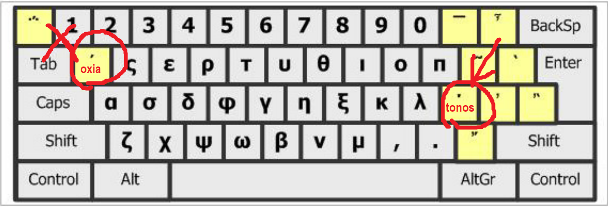

### 記得要把 oxia 改成 tonos

source: [Greek Unicode duplicated vowels - The Digital Classicist Wiki](https://wiki.digitalclassicist.org/Greek_Unicode_duplicated_vowels)

> The latest versions of Unicode (as of 2016) have now formally deprecated and removed the vowel+oxia combinations from the Greek extended range, leaving only the vowel+tonos from the basic Greek and Coptic range.

---

### tonos vs. oxia ?
#### software
- Logos SBL GNT: tonos
- STEPBible: tonos
- Accordance : combining characters
- Bibleworks10 : oxia

#### 鍵盤輸入法
- [Tyndale Keyboard](https://www.stepbible.org/downloads.jsp) 
	- 只能輸出 pre-composed character with oxia (e.g. ά =\u1F71)，不能用
	- customize 之後就可以用了 😀
- [Logos Greek Keyboard](https://www.logos.com/product/53264/original-languages-keyboards-for-windows) 
	- 只能輸出 combining characters (e.g. ά = \u03B1+\u0301)，不能用
- Microsoft Polytonic
	- 可以輸出 tonos (ά U+03AC) 和 oxia (ά U+1F71) 的 pre-composed character，記得要用 tonos ！
	- 
	- 

### Macro
>
{"type":"replace","args":{"replaceAll":true,"searchPattern":"\u1F71","replacePattern":"\u03AC"}},
{"type":"replace","args":{"replaceAll":true,"searchPattern":"\u1F73","replacePattern":"\u03AD"}},
{"type":"replace","args":{"replaceAll":true,"searchPattern":"\u1F75","replacePattern":"\u03AE"}},
{"type":"replace","args":{"replaceAll":true,"searchPattern":"\u1F77","replacePattern":"\u03AF"}},
{"type":"replace","args":{"replaceAll":true,"searchPattern":"\u1F79","replacePattern":"\u03CC"}},
{"type":"replace","args":{"replaceAll":true,"searchPattern":"\u1F7B","replacePattern":"\u03CD"}},
{"type":"replace","args":{"replaceAll":true,"searchPattern":"\u1F7D","replacePattern":"\u03CE"}},
{"type":"replace","args":{"replaceAll":true,"searchPattern":"\u1FBB","replacePattern":"\u0386"}},
{"type":"replace","args":{"replaceAll":true,"searchPattern":"\u1FC9","replacePattern":"\u0388"}},
{"type":"replace","args":{"replaceAll":true,"searchPattern":"\u1FCB","replacePattern":"\u0389"}},
{"type":"replace","args":{"replaceAll":true,"searchPattern":"\u1FDB","replacePattern":"\u038A"}},
{"type":"replace","args":{"replaceAll":true,"searchPattern":"\u1FF9","replacePattern":"\u038C"}},
{"type":"replace","args":{"replaceAll":true,"searchPattern":"\u1FEB","replacePattern":"\u038E"}},
{"type":"replace","args":{"replaceAll":true,"searchPattern":"\u1FFB","replacePattern":"\u038F"}},
{"type":"replace","args":{"replaceAll":true,"searchPattern":"\u1FD3","replacePattern":"\u0390"}},
{"type":"replace","args":{"replaceAll":true,"searchPattern":"\u1FE3","replacePattern":"\u03B0"}},
