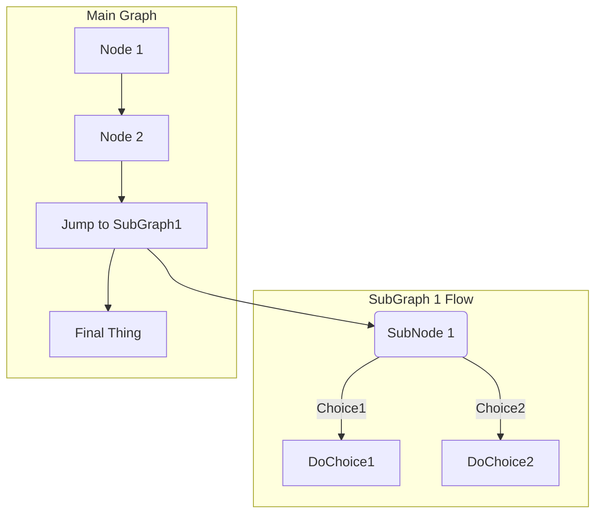
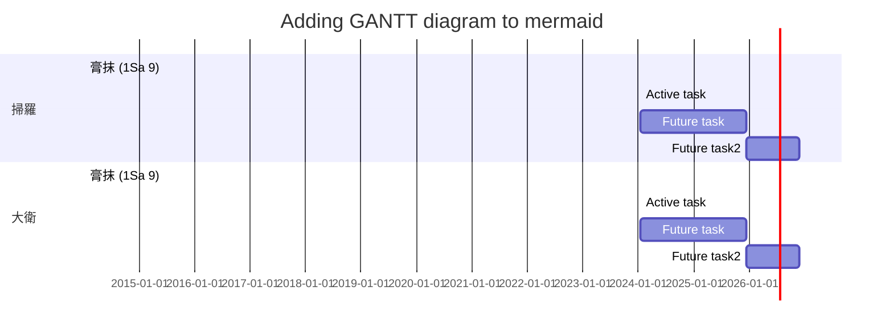

---
puppeteer:
  displayHeaderFooter: true
  printBackground: true
  margin: { 
      top: "2cm",
      right: "2cm",
      bottom: "2cm",
      left: "2cm"
  }
---
<div dir="rtl">
שֹׁ֥חַד לָֽקְחוּ־בָ֖ךְ לְמַ֣עַן שְׁפָךְ־דָּ֑ם נֶ֧שֶׁךְ וְתַרְבִּ֣ית לָקַ֗חַתְּ וַתְּבַצְּעִ֤י רֵעַ֙יִךְ֙ בַּעֹ֔שֶׁק וְאֹתִ֣י שָׁכַ֔חַתְּ נְאֻ֖ם אֲדֹנָ֥י יְהוִֽה׃</div>
<div dir="ltr">
sdcsdcdsc 6
</div>


# 標題 1
## level 2
### level 3
#### 4
##### 5
###### 6

[TOC]


---

**粗體**  
*斜體*  
__*斜粗體*__  
==hight light==  
<mark>hight light</mark>

---
`code`


### HTML 特殊
<div style="page-break-after: always;"></div>

<div  style='text-align: left;'>靠左對齊</div>
<div  style='text-align: right;'>
- 靠右對齊
- dscdscdsc
</div>

<p style="text-align:left;">靠左對齊<span style="float:right;">靠右對齊</span></p>

--- 

### Ruby
<RUBY><ruby><ruby>ἀλλὰ<rt>Nevertheless</rt></ruby><rt>ἀλλά</rt></ruby><rt>CONJ</rt></RUBY> <RUBY><ruby><ruby>ἐβασίλευσεν<rt>reigned</rt></ruby><rt>βασιλεύω</rt></ruby><rt>V-AAI-3S</rt></RUBY> <RUBY><ruby><ruby>ὁ<rt>‑</rt></ruby><rt>ὁ</rt></ruby><rt>T-NSM</rt></RUBY> <RUBY><ruby><ruby>θάνατος<rt>death</rt></ruby><rt>θάνατος</rt></ruby><rt>N-NSM</rt></RUBY> <RUBY><ruby><ruby>ἀλλὰ<rt>Nevertheless</rt></ruby><rt>ἀλλά</rt></ruby><rt>CONJ</rt></RUBY> <RUBY><ruby><ruby>ἐβασίλευσεν<rt>reigned</rt></ruby><rt>βασιλεύω</rt></ruby><rt>V-AAI-3S</rt></RUBY> <RUBY><ruby><ruby>ὁ<rt>‑</rt></ruby><rt>ὁ</rt></ruby><rt>T-NSM</rt></RUBY> <RUBY><ruby><ruby>θάνατος<rt>death</rt></ruby><rt>θάνατος</rt></ruby><rt>N-NSM</rt></RUBY> <RUBY><ruby><ruby>ἀλλὰ<rt>Nevertheless</rt></ruby><rt>ἀλλά</rt></ruby><rt>CONJ</rt></RUBY> <RUBY><ruby><ruby>ἐβασίλευσεν<rt>reigned</rt></ruby><rt>βασιλεύω</rt></ruby><rt>V-AAI-3S</rt></RUBY> <RUBY><ruby><ruby>ὁ<rt>‑</rt></ruby><rt>ὁ</rt></ruby><rt>T-NSM</rt></RUBY> <RUBY><ruby><ruby>θάνατος<rt>death</rt></ruby><rt>θάνατος</rt></ruby><rt>N-NSM</rt></RUBY> <RUBY><ruby><ruby>ἀλλὰ<rt>Nevertheless</rt></ruby><rt>ἀλλά</rt></ruby><rt>CONJ</rt></RUBY> <RUBY><ruby><ruby>ἐβασίλευσεν<rt>reigned</rt></ruby><rt>βασιλεύω</rt></ruby><rt>V-AAI-3S</rt></RUBY> <RUBY><ruby><ruby>ὁ<rt>‑</rt></ruby><rt>ὁ</rt></ruby><rt>T-NSM</rt></RUBY> <RUBY><ruby><ruby>θάνατος<rt>death</rt></ruby><rt>θάνατος</rt></ruby><rt>N-NSM</rt></RUBY> 

---
### px ⇔ pt (Windows)
windows default = 96 DPI
72 pt = 1 inch = 96 px

Points|Pixels
---|---
9pt|12px
10pt|13px
10.5pt|14px
11pt|15px
12pt|16px
13pt|17px
14pt|19px
16pt|22px
18pt|24px
20pt|26px
22pt|29px
24pt|32px
26pt|35px
28pt|37px
30pt|40px
### 特殊符號
用 Windows 鍵 + . 

| Unicode | result | UniCode | result |
| ------- | ------ | ------- | ------ |
| U00AB   | «      | U00BB   | »      |
| U25C2   | ◂      | U25B8   | ▸      |
| U2190   | ←      | U2192   | →      |
| U21D2   | ⇒     | U21D0    | ⇐     |
| U2235   | ∵      | U2234   | ∴      |
| U00A7   | §      | U2015   | ―      |
| U21B5   | ↵      |

### 引用

> 文字下標<sub>a</sub>
>> 雙重引用上標<sup>b</sup>

---
## 註腳

本文帶註腳<sup id="a1">[1](#%5Ea344fd)</sup>


註腳[^1]


The PDF link should work[^3]

## References
[^1]: But right now I think they are just colored pieces of text
[^2]: I've only seen this kind of feature work in PDFs created via Acrobat Reader.
[^3]: Should it work? I think yes[^1], unless it needs something proprietary to work[^2]

## 連結
[[
[其他文章連結](IGNT/IGNT-01.md)：IGNT/01.md

[其他文章內的段落](IGNT/IGNT-01.md#11-%E4%B8%89%E5%80%8B%E5%8B%95%E8%A9%9E%E8%A7%80%E9%BB%9E-The-Three-Verbal-Aspects)：1.1 三個動詞觀點 (The Three Verbal Aspects)

[本文內的段落](#bottom)：bottom
[qq](#%5E88f4c1)


## 表格
| Markdown Engine              | Align Center | Align right |
| :--------------------------- | :----------: | ----------: |
| *Still*                      |  `renders`   |  **nicely** |
| 1                            |      2       |           3 |
| <li>item1</li><li>item2</li> |      5       |           6 |


## 清單
1. 大點自動編號 (同一段落內)
   1. 小點
      1. 小小點
		  1. ssd
			  1. sddd
      1. 小小點
      2. sdscsd
   2. 小點
   3. sdcsdcsd
1. 大點自動編號 (同一段落內)

- 大點
	- 小點
		- 小小點
			- sss
		- 小小點
	- 小點
- 大點
  
----

## 可折疊區塊
<details>
   
  <summary>進階資訊</summary>
  
  ### Heading
  
  1. A numbered
  2. list
     * With some
     * Sub bullets
     
</details>

------
## 註腳

<sup id="f1">1</sup> 註腳內容 [↵](#a1) 05793f ^a344fd


- [HOME](rr.md)
- [回目錄](rr.md)


## vscode markdown-to-pdf
```
---
puppeteer:
 landscape: false
 format: "A4"
 displayHeaderFooter: true
 margin: {
 top: "1.5cm", bottom: "1.5cm", left: "1.5cm", right: "1.5cm"}
 headerTemplate: "<div style='font-size: 9px; margin-left: 1cm;'>中台神學院</div> <div style='font-size: 9px; margin-left: auto;'> <b><span class='title'></span></b></div> <div style='font-size: 9px; margin-left: auto; margin-right: 1cm;'> <span class='date'></span></div>"
 footerTemplate: "<div style='font-size: 9px; margin-left:auto; margin-right:1cm;'> <span class='pageNumber'></span> / <span class='totalPages'></span></div>"
 printBackground: true
---
```


# GitLab Extension


A footnote reference tag looks like this: [^1]

This reference tag is a mix of letters and numbers. [^footnote-42]

## mermaid diagrams






[^1]: This is the text inside a footnote.

[^footnote-42]: This is another footnote.


## bottom

^88f4c1
