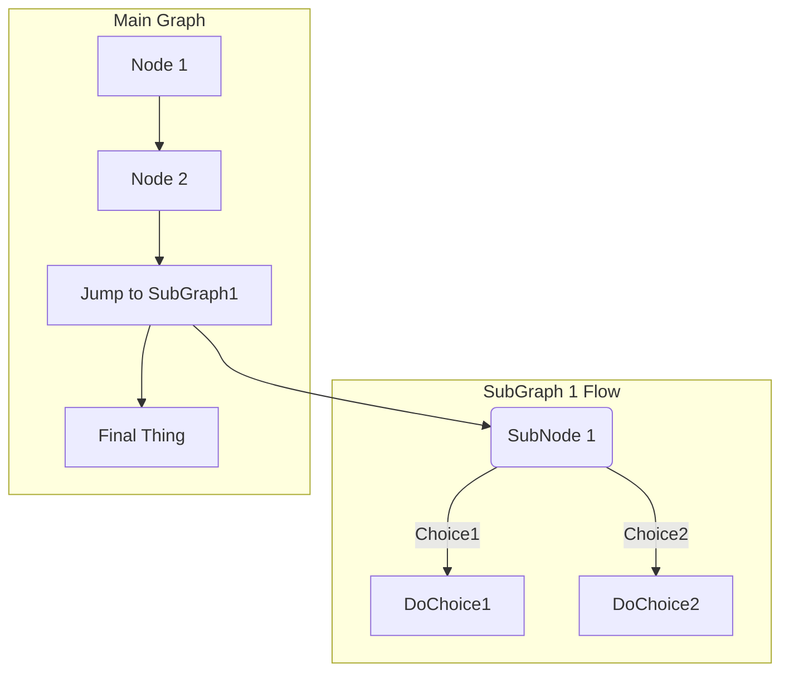
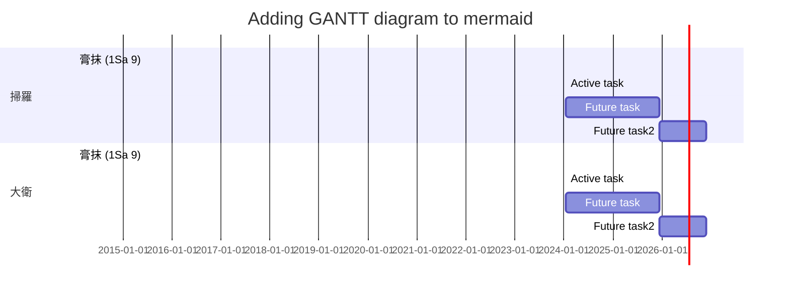

## CSS Ruby Tricks


## vscode

```json
{
    "workbench.startupEditor": "newUntitledFile",
    "git.enableSmartCommit": true,
    "explorer.confirmDelete": false,
    "editor.minimap.enabled": false,
    "workbench.colorTheme": "Visual Studio Dark",
    "markdown-pdf.breaks": true,
    "editor.renderWhitespace": "all",
    "markdown.extension.toc.levels": "2..5",
    "markdown-pdf.quality": 0,
    "markdown-pdf.footerTemplate": "<div style=\"font-size:9px; margin-left:1cm;\"></div>",
    "markdown-pdf.headerTemplate": "<div style=\"font-size:9px; margin-left:1cm;\"><span class='title'></span></div> <div style=\"font-size:9px; margin-left:auto; margin-right:1cm;\"><span class='pageNumber'></span>/<span class='totalPages'></span></div>",
    "MarkdownPaste.path": "./images/",
    "editor.maxTokenizationLineLength": 200000,
    "editor.renderControlCharacters": true,
    "window.menuBarVisibility": "default",
    "workbench.statusBar.visible": true,
    "markdown.preview.scrollEditorWithPreview": false,
    "markdown.preview.scrollPreviewWithEditor": false,
    "workbench.editor.enablePreview": false,
    "editor.insertSpaces": false,
    "markdown-preview-enhanced.scrollSync": false,
    "editor.largeFileOptimizations": false,
    "security.workspace.trust.untrustedFiles": "open",
    "markdown-preview-enhanced.previewTheme": "github-light.css",
    "editormacros": {
        "interlinear": {
            "type": "multiple",
            "args": {
                "macros": [
                    {
                        "type": "replace",
                        "args": {
                            "regex": true,
                            "replaceAll": true,
                            "searchPattern": "<rt>(... )([0-9])",
                            "replacePattern": "\n- <rt>$2"
                        }
                    },
                    {
                        "type": "replace",
                        "args": {
                            "regex": true,
                            "replaceAll": true,
                            "searchPattern": "<RUBY><ruby><ruby>καὶ",
                            "replacePattern": "\n- <RUBY><ruby><ruby>καὶ"
                        }
                    },
                    {
                        "type": "replace",
                        "args": {
                            "regex": true,
                            "replaceAll": true,
                            "searchPattern": "<RUBY><ruby><ruby>ἵνα",
                            "replacePattern": "\n- <RUBY><ruby><ruby>ἵνα"
                        }
                    },
                    {
                        "type": "replace",
                        "args": {
                            "regex": true,
                            "replaceAll": true,
                            "searchPattern": "<RUBY><ruby><ruby>ὅτι",
                            "replacePattern": "\n- <RUBY><ruby><ruby>ὅτι"
                        }
                    },
                    {
                        "type": "replace",
                        "args": {
                            "regex": true,
                            "replaceAll": true,
                            "searchPattern": "<RUBY><ruby><ruby>ἐὰν",
                            "replacePattern": "\n- <RUBY><ruby><ruby>ἐὰν"
                        }
                    },
                    {
                        "type": "replace",
                        "args": {
                            "regex": true,
                            "replaceAll": true,
                            "searchPattern": "<RUBY><ruby><ruby>ὡς",
                            "replacePattern": "\n- <RUBY><ruby><ruby>ὡς"
                        }
                    },
                    {
                        "type": "replace",
                        "args": {
                            "regex": true,
                            "replaceAll": true,
                            "searchPattern": "<RUBY><ruby><ruby>ἀλλ᾽",
                            "replacePattern": "\n- <RUBY><ruby><ruby>ἀλλ᾽"
                        }
                    }
                ]
            }
        }
    }
}
```

---

## puppeteer

puppeteer:
  displayHeaderFooter: true
  printBackground: true
  margin: { 
      top: "2cm",
      right: "2cm",
      bottom: "2cm",
      left: "2cm"
  }
  
  
---

## html

<div dir="rtl">
שֹׁ֥חַד לָֽקְחוּ־בָ֖ךְ לְמַ֣עַן שְׁפָךְ־דָּ֑ם נֶ֧שֶׁךְ וְתַרְבִּ֣ית לָקַ֗חַתְּ וַתְּבַצְּעִ֤י רֵעַ֙יִךְ֙ בַּעֹ֔שֶׁק וְאֹתִ֣י שָׁכַ֔חַתְּ נְאֻ֖ם אֲדֹנָ֥י יְהוִֽה׃
</div>


<div dir="ltr">
sdcsdcdsc 6
</div>


<div style="page-break-after: always;"></div>

<div  style='text-align: left;'>靠左對齊</div>
<div  style='text-align: right;'>
- 靠右對齊
- dscdscdsc
</div>

<p style="text-align:left;">靠左對齊<span style="float:right;">靠右對齊</span></p>

---

## Markdown

# 標題 1
## level 2
### level 3
#### 4
##### 5
###### 6

[TOC]


<mark class='verb'>粗體</mark>  
<em>斜體</em>  
__<em>斜粗體</em>__  
<mark>hight light</mark>  
<mark>hight light</mark>

---
`code`


---
### px ⇔ pt (Windows)
windows default = 96 DPI
72 pt = 1 inch = 96 px

Points|Pixels
---|---
9pt|12px
10pt|13px
11pt|15px
12pt|16px
13pt|17px
14pt|19px
16pt|22px
18pt|24px
20pt|26px
22pt|29px
24pt|32px
26pt|35px
28pt|37px
30pt|40px

### 引用

> 文字下標<sub>a</sub>
>› 雙重引用上標<sup>b</sup>

---
## 註腳

本文帶註腳<sup id="a1">[1](#%5Ea344fd)</sup>


註腳[^1]


The PDF link should work[^3]

## References
[^1]: But right now I think they are just colored pieces of text
[^2]: I've only seen this kind of feature work in PDFs created via Acrobat Reader.
[^3]: Should it work? I think yes[^1], unless it needs something proprietary to work[^2]

## 連結
[[
[其他文章連結](IGNT/IGNT-01.md)：IGNT/01.md

[其他文章內的段落](IGNT/IGNT-01.md#11-%E4%B8%89%E5%80%8B%E5%8B%95%E8%A9%9E%E8%A7%80%E9%BB%9E-The-Three-Verbal-Aspects)：1.1 三個動詞觀點 (The Three Verbal Aspects)

[本文內的段落](#bottom)：bottom
[qq](#%5E88f4c1)


## 表格
| Markdown Engine              | Align Center | Align right |
| :--------------------------- | :----------: | ----------: |
| <em>Still</em>                      |  `renders`   |  <mark class='verb'>nicely</mark> |
| 1                            |      2       |           3 |
| <li>item1</li><li>item2</li> |      5       |           6 |


## 清單
1. 大點自動編號 (同一段落內)
   1. 小點
      1. 小小點
		  1. ssd
			  1. sddd
      1. 小小點
      2. sdscsd
   2. 小點
   3. sdcsdcsd
1. 大點自動編號 (同一段落內)

- 大點
	- 小點
		- 小小點
			- sss
		- 小小點
	- 小點
- 大點
  
----

## 可折疊區塊
Here are a few words on my thought about the movie <details><summary>Deadpool</summary> it was so **well** shot and a movie I just can't wait to see again.</details>


<details><summary>**Collapse / Expand**</summary> 	
	Content goes here, something like <br> 
	
	1. **Something** <br> 
	
	2. So**met**hing <br> 
	
	3. Something.. <br> 
	
</details>

------

## 註腳

<sup id="f1">1</sup> 註腳內容 [↵](#a1) 05793f ^a344fd


- [HOME](README.md)
- [回目錄](README.md)


## vscode markdown-to-pdf
```
---
puppeteer:
 landscape: false
 format: "A4"
 displayHeaderFooter: true
 margin: {
 top: "1.5cm", bottom: "1.5cm", left: "1.5cm", right: "1.5cm"}
 headerTemplate: "<div style='font-size: 9px; margin-left: 1cm;'>中台神學院</div> <div style='font-size: 9px; margin-left: auto;'> <b><span class='title'></span></b></div> <div style='font-size: 9px; margin-left: auto; margin-right: 1cm;'> <span class='date'></span></div>"
 footerTemplate: "<div style='font-size: 9px; margin-left:auto; margin-right:1cm;'> <span class='pageNumber'></span> / <span class='totalPages'></span></div>"
 printBackground: true
---
```


## mermaid diagrams






[^1]: This is the text inside a footnote.

[^footnote-42]: This is another footnote.
